> 原文：[一个安全工程师的2019](https://feei.cn/a-security-engineer-2019/)

公众号注册有一段时间了，一直没有一个很好的契机写写文字。习惯了借助有特殊意义的时间去做一些改变，趁着元旦请了几天假出国放松下，新的一年回过头总会发现时间飞逝的同时伴随着很多感慨，在慢节奏下记录这些感慨汇总成2019的点点滴滴。

{/* truncate */}

## 老赛道与新征程

作为蘑菇街第一个安全工程师，陪伴蘑菇街从创业阶段走向美国nasdaq上市，参与了几乎所有安全能力建设，从最开始的带安全产品研发到后面带整个安全团队，从做数字证书真切的感受到安全带给用户的价值，建设堡垒机时体会到安全卡口的优势巨大，到黑白盒漏洞扫描器（Vulture、PortScan、Cobra、GSIL、ESD）时感受自动化魅力以及深刻理解安全产品的三大核心指标：效率、覆盖率和准确性、入网与终端安全（GuGu）让更安全和好体验是可以兼得、主机采集和监控（HIDS）和应用运行间防护（RASP）让对抗更加纵深、情报系统（Dylan）让你拥有快人一步的应急响应、统一网关应用防火墙（WAF）让你把大部分自动化和无效Payload拒之门外、SIEM让你通过各个角落的细微变化发现异常、人机识别让你知道自动化的攻击流量如此大手段如此专业等等。

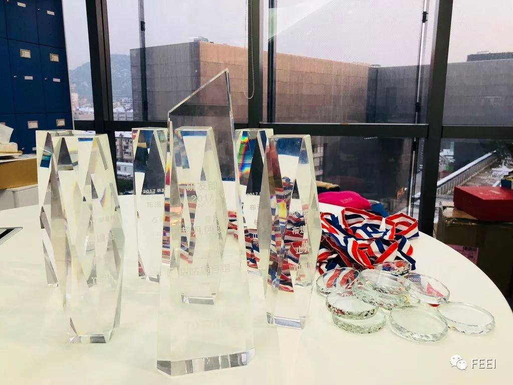
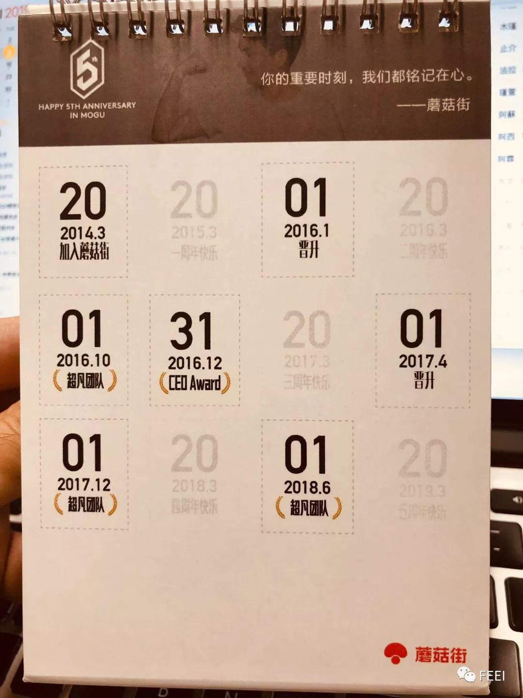

*蘑菇街期间团队得到的一部分奖项*

我们拿到了CEO大奖和多次超凡团队，现在回过头很难想象一个以业务为先的电商公司能把一年最重要的奖项给到安全团队和安全项目。足以体现当我们坚持做我们认为正确的事情时，结果是会被大家所认可的。蘑菇街让我从一个白帽子转变为安全研发，再从安全研发转变为整体安全建设，整体能力在短短几年间有了巨大进步。

几年前猪猪侠去阿里云安全团队的时候推荐我过去，肖力打电话和我说40%网站都在阿里云上，保护这么多客户的安全未来大有可为，可后来因为种种原因还是留在了蘑菇街，那时的蘑菇街有高速成长的业务、熟悉的环境、靠谱的同事，最重要的是可以按照自己思路去做事。

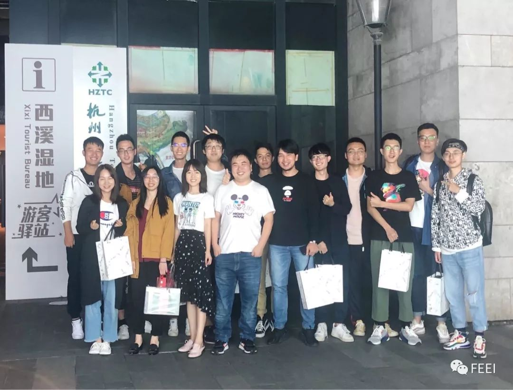

*MOGU安全，还有几位没有来*

再一次抉择已是今年，不同往日，此时公司业务遇到瓶颈，陆续有同事离开也有新人进来，我也开始会焦虑、会纠结、会暴躁，压力大时每次手一薅就有十来根头发掉下来。我还能为蘑菇街带来什么？我还能为自己创造什么价值？当前阶段公司没有我会有什么变化吗？现阶段的蘑菇街安全水平远高于同体量的公司，再深入建设的投入产出不够明显。而我自己也需要一个更大的平台去创造更大的价值。虽然还能继续朝着自己期望的方向做事，但安全建设上的挑战不大，当一个做技术同学为公司业绩担忧时是最可怕的。（PS现在的蘑菇街业务转型很成功，从内容电商到带货直播，祝福老东家）

刚好这时候认识了0101，他告诉我蚂蚁金服正在组建网商银行安全团队，不像上次那样，这次集齐了天时地利人和进入了蚂蚁金服，换工作和找女朋友一样，熟人介绍比中介介绍要好、你们要都单身都在寻找对象、你们要互相看得上且双方条件匹配、她的好让你可以长久在一起、最好是在一个城市因为异地恋比较困难。

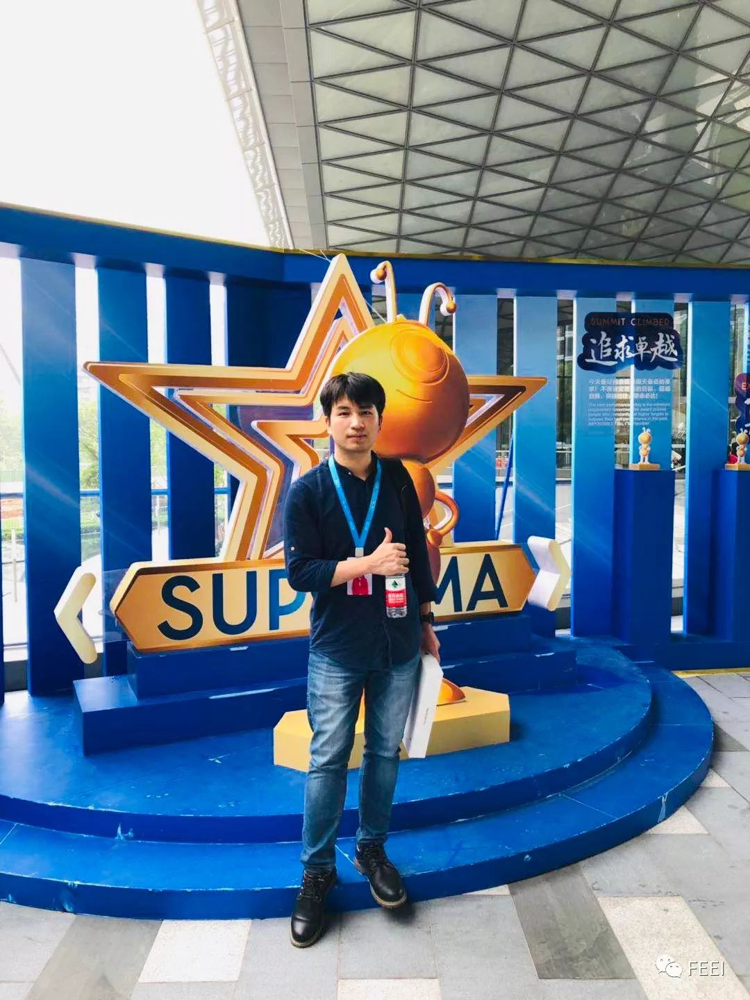

*入职蚂蚁金服的第一天*

天时，当在蘑菇街遇到的问题已经不是我努力能改变的，不得不开始考虑其它机会，我期望一份平台足够大、安全天然强需求、团队成员靠谱的机会，而刚好蚂蚁金服组建的网商银行安全团队全部符合。

地利，从狭义上来讲，在看机会的时候，和杭州几家独角兽公司聊过也拿到offer，会发现在杭州地利的优势被阿里系占的让其它公司毫无余地，这对阿里来说是优势可对于在阿里工作的同学来说是劣势。从广义上来讲，我历史经验特别契合新组建的安全团队需求。

人和，0101是一位性格非常好且在蚂蚁有快十年安全建设经验的老人，我们之间安全理念不谋而合，同时现有团队里还有我之前团队同学，整个团队是新建设的，不存在任何历史包袱。另外在此过程中也离不开各位圈内好友的帮忙，特别感谢下猪猪侠推荐的阿里云和聂君推荐的腾讯，也感谢肖力和Coolc两位老板的信任。

### 蚂蚁金服群星荟萃

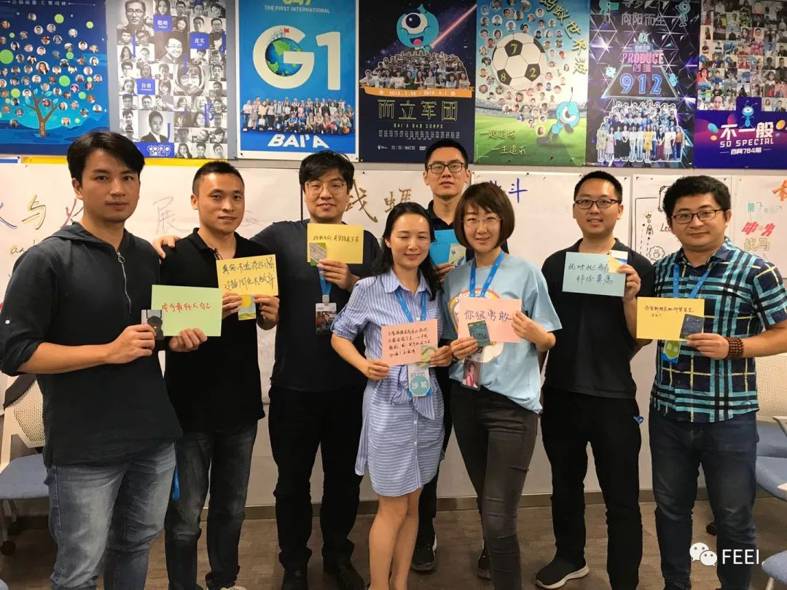

*百阿降落伞班战蚂小组*

当在现有圈子里经历的事越多时越难有让你震撼的事，去参加一些会议或和人交流能有一些启发性的想法已经很难得了，多数时间我都在自己摸索或推导出一些事情。而在蚂蚁的新人入职培训百年阿里中，我遇到了来自各个公司的牛人，他们在各个领域独当一面，每个人的背景和经历都丰富多彩。以前总觉得自己遇到瓶颈，当你看到百阿讲师把研发团队、运营团队、产品团队、算法团队甚至财务团队都带过一遍，并且都拿到很好的结果时，你才知道自己在行业里做的那点事和她的差距有多大了。

阿里系各公司内部信息是互通的，你可以和阿里巴巴集团安全的同学交流应用安全技术，也可以和阿里云安全的同学交流云安全。来了之后发现从事安全相关的人居然这么多，原来平时经常见到的圈内ID很多都在阿里巴巴。在这里你会发现已经看不到瓶颈了，不断而来的挑战推着你向前走。

### 行业探索者还是跟随者

以前觉得企业安全建设那些事情自己已经能手到擒来，但换个大环境怎么从零高效高质的安全水位提升？当有几百个漏洞散落在各个部门中，怎么高效推动修复？以前很多事情都可以根据经验口口相传，但当人多了之后所有的经验导致的标准不统一就会被视为不专业，如何把减少因为各人经验差异导致的结果差异？以前各个方向做到比同体量公司好就不错了，现在你就是行业第一怎么再向前突破？以前的做法Cover住了90%的风险，后面你遇到的每个问题都是全新的挑战甚至行业难题，如何在ROI可控的前提下进一步去解决这些风险？以前针对成本高的攻击手段先放着，毕竟还有一堆更容易搞的厂商，但现在你可能被各种组织盯着搞，任何一个供应链攻击、定向持续攻击、0day攻击甚至物理攻击等等，如何做到0漏过防御检测和响应？在云安全、可信网络、可信计算、大数据等方向的安全上，如何能完美落地并持续运营好？全流程自动化、精细化安全运营如何做？

我们解决了很多难题，但更多困难挑战还在后面。但我们毫不畏惧，无论是平台还是业务规模都足够大，银行、贷款、花呗、借呗等业务都和钱强相关，从上到下对安全的重视和支持都足够好。虽然是一个新团队，但背后有整个蚂蚁金服大安全的支撑，团队每个同学也都有很不错的成绩，整个安全团队目前也是天时地利人和的状态。（插个广告，我们长期招聘各方向各层级安全专家，如果你有兴趣加入我们，可以私信联系我）

### 行业信息透明互通

19年受邀参加了首席安全官论坛、补天白帽大会、世界信息安全大会和企业信息安全峰会分享了一些观点和蚂蚁金服/网商银行的安全经验做法，同时也跟很多家公司做了深入正式/非正式的交流。

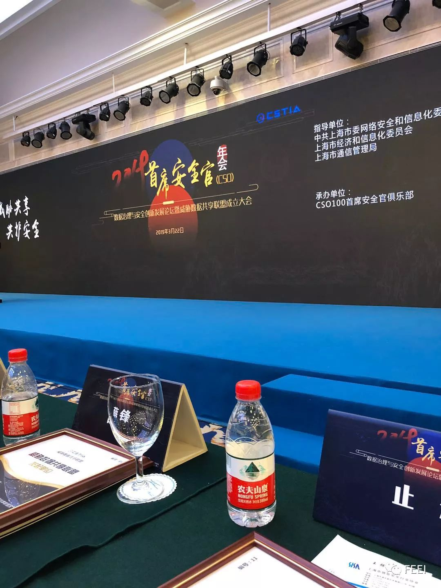
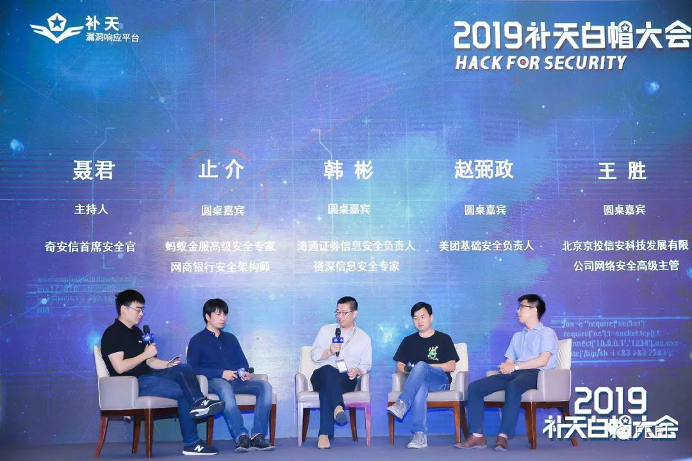

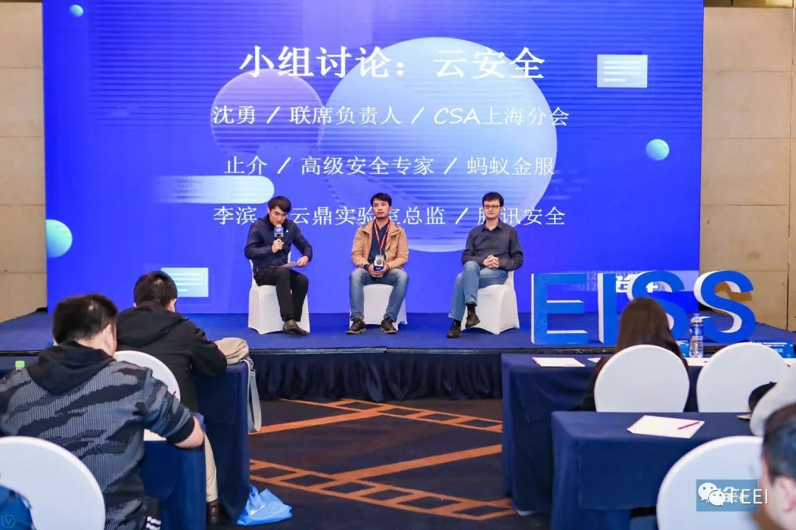

*2019首席安全官年会*

以前阿里系安全对外给人感觉太神秘了，除了私下和里面同学交流外很难看到有对外的分享。就像安全在公司内部不能依靠神秘感来做事一样，和外部多交流并为行业贡献一些好的做法切实有用的信息，在2020年是一个很重要的事情，整个行业的安全水位都提升才能让整个行业更加健康。

## 生活加点盐

再说说生活方面吧，来了蚂蚁之后客观来说生活时间确实减少了很多，很少能和以前那样周末两天窝在家里不踏出房子一步了，但也更加珍惜并会去充分利用各种假期。

讲讲今年生活中最让我感到开心和重要的几件事。

### 人生不只是眼前苟且，还有诗和远方

完成了第二次长途自驾，从头到尾一个人开8天3000+公里完成新疆北环线自驾，和18年大西北环线用时和路程都比较接近，2020年将继续来一次长途自驾，暂定新疆南环线或川藏线。

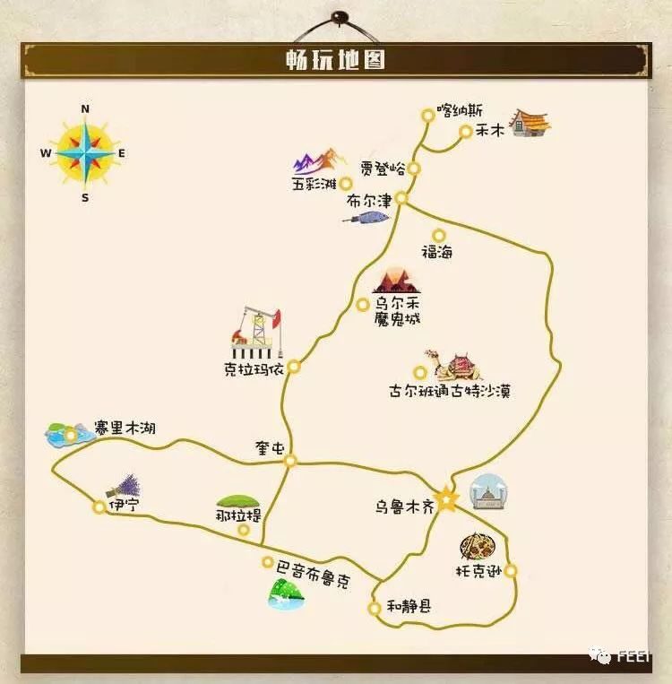

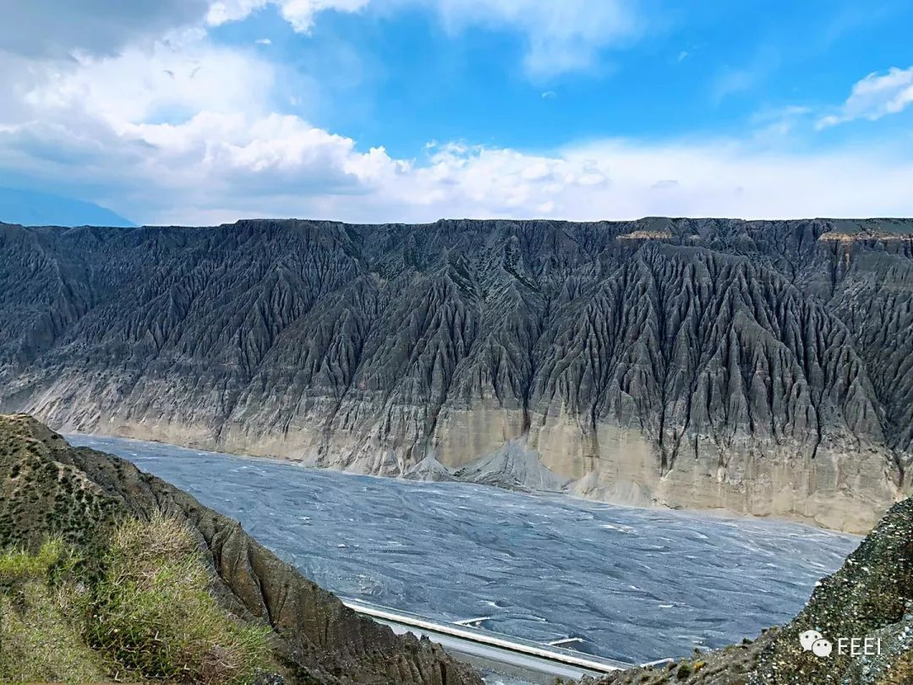

探索未知世界的旅程，会遇见美食、美景和美人，去感受雪山、湖泊、草原、戈壁、沙漠以及各地风土人情，现在回看那些照片和视频带来的震撼让自己内心还久久不能平静。当我有一天不工作了，我想我会开上牧马人把世界走一遭，各个地方都留下了我的足迹。

另外每年常规国外休闲游去了曼谷，加上这次已经是第三次去泰国了，在泰国每个人都很友善，都带着真诚的笑容，生活节奏慢很多，性价比也很很高，休闲的第一选择。团建去的菲律宾长滩岛，海上项目比之前去的其它海岛性价比要高一些。另外借着出差顺便逛了下香港，那时候废青还没那么夸张。

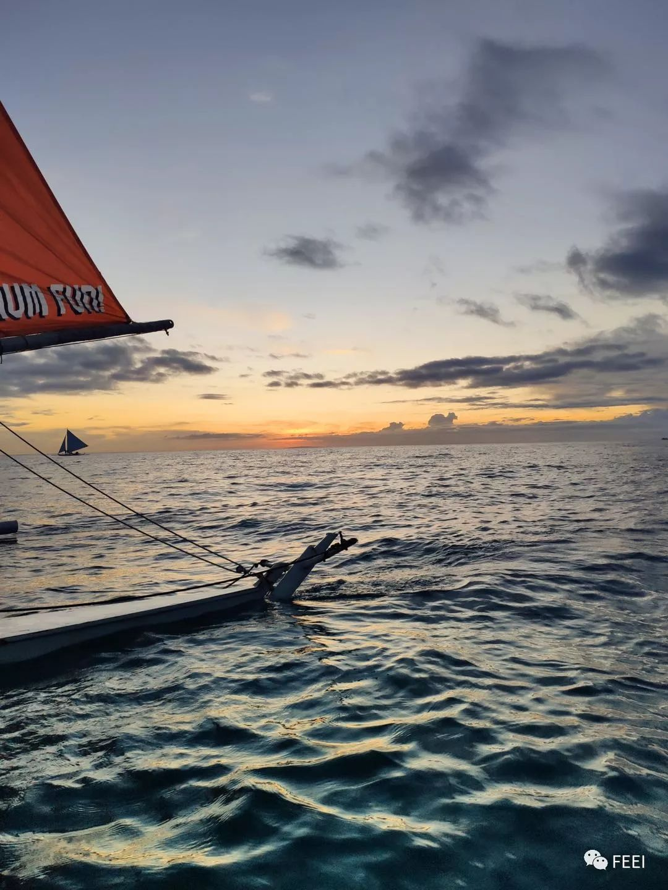
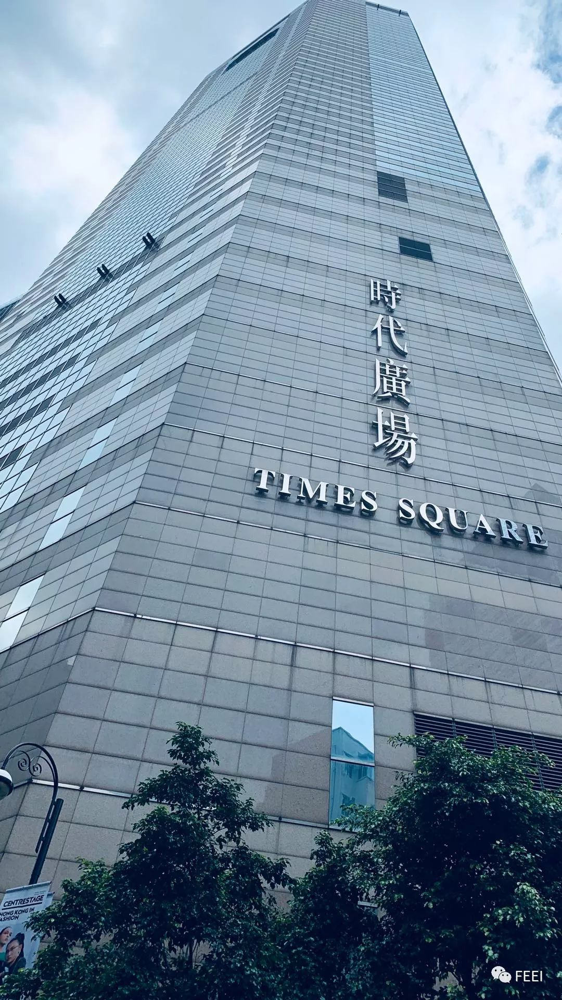

*长滩岛的落日太美了*

### 面对生活吧

Joychou、Wilson、Mt三位朋友都在今年结婚了，在现场时眼眶湿润了好几次，找到一个互相喜欢且无论贫穷富贵还是疾病健康都愿意陪着自己一起渡过的人是多么的幸福。

周末一有时间就会去朋友家蹭饭，说来也奇怪去蹭饭的几个朋友男主都会做饭还都挺好吃的，想想如果以后每天再也不用吃食堂或者外卖，能吃到那么好吃的菜是一件多么幸福的事情啊。

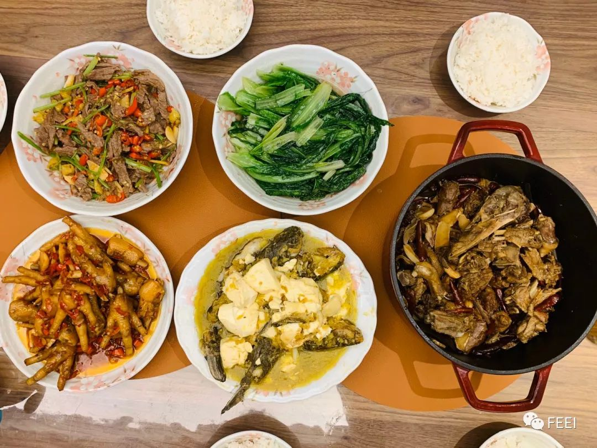

*这里的每道菜味道都非常好*

虽然还经常被说年轻，但看看那些96年甚至还有00后的都长大了，才发现自己年纪真的不小了，我这个年纪在老家还没结婚会把老人急死，邻居可能都在议论是不是要打一辈子光棍。好在我比较独立爸妈也比较开明，另外可这个事情也急不来，我能怎么办，除了在这里写出来让各位朋友帮我留意下。

大房子买了两年了一直没装修，为啥？穷。真的是买得起装不起，用的东西不是最好的，每样东西单看都不贵，乘上面积就很夸张了，大面积装修太费钱了。你能信敲墙敲了快两万块？一个房子需要十台中央空调？19年五月开始，要到20年5月结束？这装修的钱我可以在武汉全款买一套了。

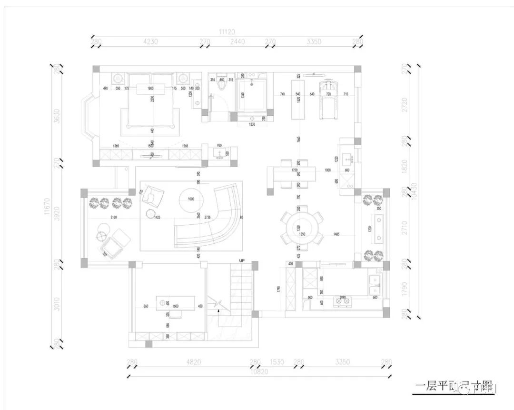
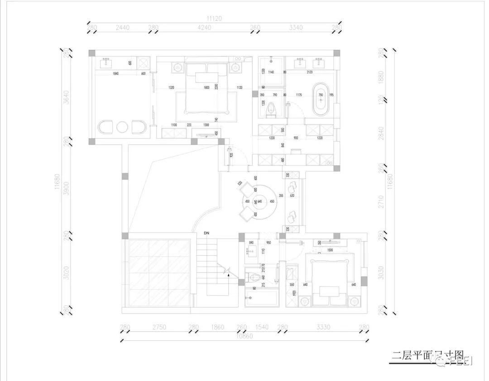

*House 1st floor*

但想想以后住进去还是很舒服的，整体按照简约现代风格设计的，有自己的健身房、西厨房、阳光书房、游戏间、能放下大浴缸的卫生间和独立衣帽间，全屋智能也是必不可少的。大部分周末都会去看一眼，小区车太多了车位难寻，于是购置了一个固定车位。以后的生活幸福感会提升一个档次，这是19年最贵也是最值得的一个消费。

为平凡的生活加点盐，把生活活成一道色香味俱全的菜。去朋友酒吧学习调制鸡尾酒、和堂弟一起玩玩机车、和朋友学习游泳和唱歌，还有一直没什么效果的健身。

在过去的2019年里，有星辰也有尘埃、有欢喜也有悲伤，无论工作还是生活，2019注定是生命中浓墨重彩的一年。2020年朝着新目标继续努力拼搏，希望每年回顾以往时，没有虚度光阴浪费这美好的时光，不会懊悔也不想着再来一次。
