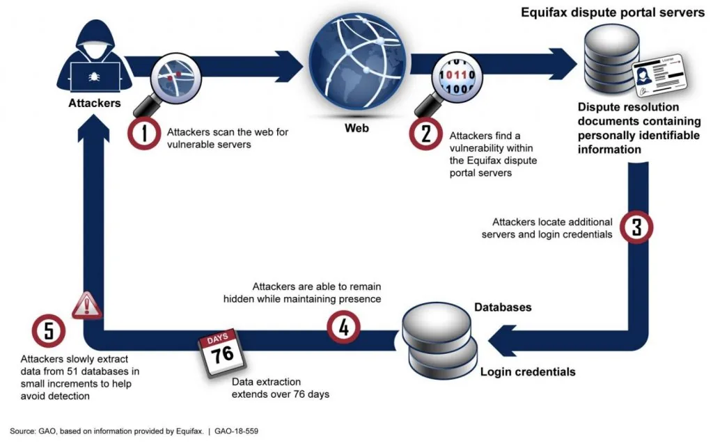
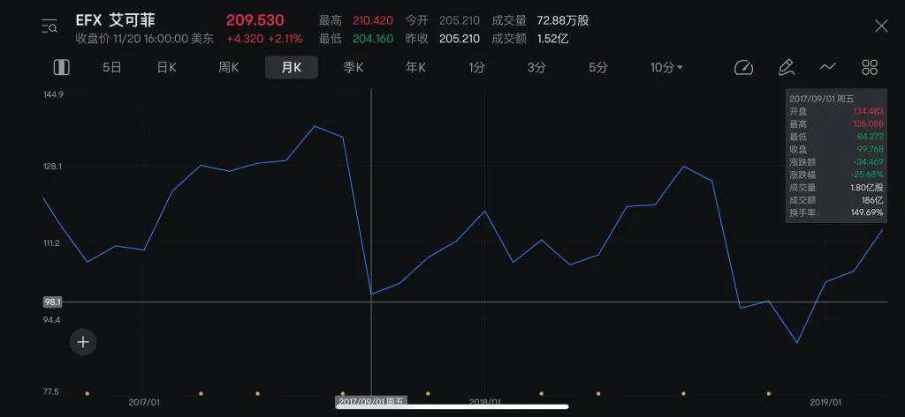
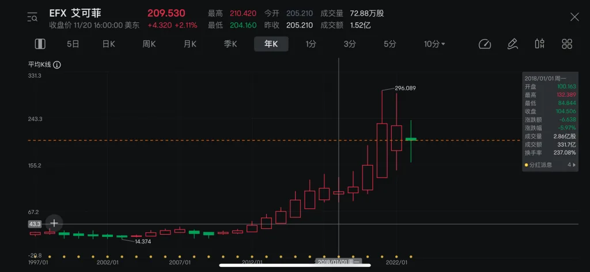

2017年，美国最大的信用评级机构Equifax（艾可菲）遭到黑客入侵，导致1.47亿用户个人敏感数据泄露。通过美国众议院监督和政府改革委员会、美国政府问责办公室（GAO）以及美国公共事务办公室等机构发布的相关调查文件，可以看到入侵关键过程，非常难得的公布了完整情况。从真实安全事件中学习经验是成本最低的方式，整个行动中有很多环节能够给甲方安全建设带来一些启示。

{/* truncate */}

*入侵Equifax盗取数据的主要步骤*

- **2017年03月02日，[Apache Struts发布S2-045（CVE-2017-5638）漏洞预警](https://cwiki.apache.org/confluence/pages/viewpage.action?pageId=68717735)** 。该漏洞由安恒的Nike Zheng发现并提交，Apache Struts 2 2.3.x（2.3.32 之前）和 2.5.x（2.5.10.1 之前）中的 Jakarta Multipart 解析器在文件上传尝试期间存在不正确的异常处理和错误消息生成，这使得远程攻击者可以通过精心设计的Content-Type、Content-Disposition 或 Content-Length HTTP 标头执行任意命令。CVE评分为满分10.0，解决方案建议大家尽快升级到新版本。
- **2017年03月07日，[漏洞发现者在Metasploit的GitHub上公开提交漏洞利用代码](https://github.com/rapid7/metasploit-framework/issues/8064)。**
  - **安全启示：应具备及时监控第一手漏洞情报源的能力。** 很多团队的漏洞应急还停留着看朋友圈、国内倒手后的公众号文章等，从漏洞情报阶段就有较大滞后性，导致风险窗口变大。应建立针对各大漏洞情报源（不仅仅是CVE，还包括各种常用的组件、框架、软件的官方安全通知，甚至各种顶级安全大会的议题以及各种顶会的安全研究）的监控告警能力，并能在第一时间判断危害等级和受影响情况。
- **2017年03月08日，Equifax公司收到漏洞情报但未正确处置。** 在2017年3月8日接到US Cert关于漏洞的通知后。3月9日，Equifax的全球威胁和漏洞管理（GTVM）团队认为该漏洞非常严重，通过电子邮件向400多人发送了漏洞情报，要求各方要在48小时内修复Struts2 RCE漏洞，并在16日专门就该漏洞开了个会。后来发现接受消息的人中并不包含真正负责修复漏洞的人，也就是唯一知道该站点使用了Struts2的人。（事后CEO将根本原因归结为人为错误和未能传达应用补丁的必要性，因CIO未转发漏洞邮件导致被最先解雇）
  - **安全启示** ：**建立及时有效的nday应急流程。** 最可惜的一步，也是解决成本最低的一步。可以看到事件中有情报团队在跟进处理，也认识到了漏洞的危害程度，但却仅仅是通知各方，并没有人为完整的应急去负责。至今可能多数公司还是无法有效解决利用nday来攻击的威胁。
- **2017年3月10日，有攻击者发现Equifax在线争议门户网站受该漏洞影响。** 不明身份的人员扫描探测了Equifax公司的在线争议门户系统（ACIS），通过执行`whoami`发现该系统存在RCE漏洞。此时并未盗取数据。
  - **安全启示：在流量、应用以及主机层面建设对于异常探测行为的感知能力** 。可以看出来在有人探测该网站漏洞时，其毫无感知能力。对流量、应用以及主机等层面，可以先进行一些黑名单攻击特征的监控，并逐步分析出正常的行为基线数据，进一步可以逐步精细化策略，做到可信行为感知甚至拦截。
- **2017年03月14日，安全团队尝试多种方式均未发现受影响的站点。** 2017年03月14日，新型威胁团队针对Apache Struts2漏洞发布了Snort检测规则，未能在入侵层面发现异常。03月15日，收到McAfee针对该漏洞扫描规则，对全部IP资产进行扫描，也没有发现漏洞。2017年03月15日，安全部门针对Apache Struts2漏洞进行开源组件扫描，但因为扫描是在根目录进行的而非项目子目录，导致没有发现网站受影响。
  - **安全启示：安全资产不全。** 可以看到该安全团队尝试了基于组件依赖、黑盒探测和流量识别多种排查方式，都因为各种原因导致没有排查出受影响的站点。Apache Struts2作为应用框架，应该作为安全资产的一部分，日常就需要建设好，并维护好资产质量，在排查过程中能大幅提升应急效率。出现问题后通过对线上的实时采集和探测等行为应作为校验方式，而非唯一方式。
  - **安全启示：安全有效性不足。** 出问题的点非常多，针对每个安全工具甚至每条安全策略，在面对其对应要解决的真实威胁时是否能保持持续有效，是需要有对应的验证手段的，比如BAS。否则，就会需要通过高昂成本的真实安全事件来发现（哪怕红蓝演练，成本也是非常高的）。
- **2017年5月13日，攻击者开始陆续盗取数据。** 攻击者拿到命令执行权限后，6月16日，上传了30多个Webshell（jquery1.3.2.min.jsp、ss.jsp、css.jsp、boxover.jsp、six.jsp）。开始读取应用的配置信息，获取到了三个数据库的的账号密码，通过连接数据库遍历数据表结构以及行数，并在各个表中搜索敏感信息，采样了部分数据。找到了一个包含用户敏感信息以及未加密的数据库用户名和密码的库。此时可访问的数据库从3个增加到48个。整个过程一共运行了超过9000个SQL操作，其中只有一部分的SQL返回包含了用户敏感数据。使用标准加密的网络协议将这些盗取行为伪装成正常的网络流量，开始小批量的查询数据库的数据，并存在临时文件中。为了更快的下载以及降低被发现的风险，将大文件压缩并分割成600MB的小文件，放入web目录中，使用wget进行盗取，并删除了压缩包以及部分日志。
  - **安全启示：**
    - **提升大马识别能力** ：看上传的Webshell都是大马，在静态特征、文件创建、进程行为等方面都能做一定的识别。
    - **数据库仅允许有需要的应用访问** ，同时数据库账号密码应通过Mesh Sidecar等方式传递应用身份获取，而非硬编码在文件中，避免拿到数据库账号密码就可以在任意机器连接。
    - **数据库敏感信息应加密存储** 。这其实是最基础但又非常有效的事情，但往往得不到有效的推动。
    - **对于数据库查询异常应建立告警** ：包括异常连接、批量SQL、敏感SQL等。
    - 针对小批量数据转移，在禁止外联基础上，应建立对抗机制持续提升发现能力。
    - wget的正常网络状态的访问、生产环境的打包以及删除操作等行为的感知能力
- **2017年7月29日，两个半月后安全工程师发现入侵痕迹。** 攻击者从2017年5月13日开始盗取敏感数据后的2个半月（76天），负责常规检查IT系统运行状态和配置的安全工程师在在线争议门户上发现了入侵行为。流量监控的设备（SSL Visibility）在正常情况下会将证书卸载后的流量发送给入侵检测系统。流量监控设备上的SSL证书已经过期了19个月，由于配置错误，导致证书过期的情况下流量就不会经过该设备，导致入侵检测无法发现异常情况。上传了正确的证书后，反入侵团队就立马发现了盗取数据的行为，并使用Moloch进行了简单的分析。当天就发现该站点存在Struts2漏洞，并进行了升级修复。
  - **安全启示：这还是一个安全工具有效性问题** 。这个案例中当证书过期后，最小的影响是这个站点的所有流量无法解密，最大的影响是Equifax所有站点的流量都无法解密。最开始配置证书的人可能已经离职了，作为入侵检测的唯一流量来源，应对其所依赖的关键数据源应做好监控。其次使用BAS对该类场景进行检验时，应自动模拟真实入侵行为并检验是否产生日志以及最终告警是否得到有效处理的完成过程。
- **2017年7月30日，下线争议门户网站。** 针对在线争议门户网站进行了专项安全评估测试，还发现了SQL注入和IDOR（越权等问题）。在信息安全部门观察到更多持续发生的恶意行为后，就将在线争议门户下线掉了。第二天，CSO和首席法务官以及相关人内部沟通后，通知了CEO门户遭受的攻击的情况。
  - **安全启示：CSO/CISO只能向CIO/CTO/CEO汇报。** 该公司CSO因为和CIO观念不合，导致CSO的汇报对象调整为了首席法务官。但安全本质是技术工作，如果CSO和CIO之间合作不好，安全就不可能做好。
- 2017年8月1日，三名高管卖掉了价值180万美元的股票。2019年，CIO因内幕交易被判入狱4个月。
- **2017年8月2日至2017年10月2日，邀请外部安全公司Mandiant协助调查。** 为了进一步评估泄露的范围并确定原因，Equifax邀请外部安全机构Mandiant协助调查。调查工作在2017年8月2日至10月2日进行，通过未被攻击者损坏或擦除的日志信息（包括网络请求与响应、数据库SQL等）。通过分析这些日志，Equifax重现攻击者的行为，从而确定哪些具体数据被泄露。泄露的数据总量在1.455亿，包括个人姓名、社会安全号码、出生日期、地址和驾驶执照号码等字段（由于许多记录不完整，并非每个人的所有字段都被泄露），以及209000条信用卡号码，182000条附件文件（含有水费账单等信息），2400000条姓名和部分驾驶证信息。除了启动其内部调查外，Equifax还在2017年8月2日通知了联邦调查局（FBI）泄露事件。
  - **安全启示：保存好完整日志至少半年以上，关键日志至少保存一年以上** 。可以发现这次定损基本靠着攻击者没碰到的日志进行的，下次攻击者清理了本地所有的日志文件怎么办？
- **2017年9月7日** ，正式通过Twitter向外公布数据泄露事件，建设了一个专门的网站（https://www.equifaxsecurity2017.com，后更换为https://www.equifaxbreachsettlement.com），以帮助个人确定他们的信息是否在泄露中被盗。该网站出现了多个故障，包括宕机以及数据不准确。
  - **安全启示：不要搞这种看起来就像是钓鱼网站的域名。**
  - **安全启示：未能及时上报和披露泄露事件。** 这个在国内好像挺普遍的，但在美国这次事件从发现风险到披露过了一个多月，还是比较慢的。对于这类极端场景的预案和演练还是应该准备好。
- **2017年9月，CIO、CSO、CEO陆续离职。**
  - **安全启示：出了事，老板们都跑不了。**
- **2020年01月13日，[法院最终批准和解令](https://www.equifaxbreachsettlement.com/admin/services/connectedapps.cms.extensions/1.0.0.0/1be77f52-dd4f-410e-8128-b3d636e66486_1033_Amended_Final_Approval_Order_(3.17.2020).pdf)。** 主要内容为Equifax 同意为 1.47 亿受影响个人支付高达 7 亿美元的罚款和赔偿。和解协议中的 3 亿美元分配给了在数据泄露期间个人信息被泄露的个人。如果需要的话，Equifax 还需要为额外的自付费用损失支付高达 1.25 亿美元的消费者赔偿。Equifax 向各州支付了 1.75 亿美元，并向 CFPB 支付了 1 亿美元的民事罚款 (FTC)。5年内至少花费10亿美元投入在网络和数据安全方面。截至2022年底，根据[Equifax官方信息](https://www.equifax.com/newsroom/all-news/-/story/equifax-statement-on-distribution-of-benefits-by-the-court-appointed-third-party-settlement-claims-administrator/)，实际支付和解基金4.25亿美金，过去五年已向安全和技术方面投入15亿美金。详细的关于每个人的赔付见[和解通知](https://www.equifaxbreachsettlement.com/admin/services/connectedapps.cms.extensions/1.0.0.0/5fd40de4-037d-4053-9790-ba92e85ef8eb_1033_EFX_Notice_ZH.pdf)。
- **2020年02月10日** ，[美国公共事务办公室的新闻稿](https://www.justice.gov/opa/pr/chinese-military-personnel-charged-computer-fraud-economic-espionage-and-wire-fraud-hacking)透露了一些关键信息（同时附件中有更多详细入侵行为），提到此次事件中攻击者使用了22个国家/地区的34台服务器作为跳板，并提到真正拖数据的IP是直连上来的。
- 根据最新的[2022年Equifax安全年度报告](https://assets.equifax.com/marketing/US/assets/2022-security-annual-report.pdf)中，可以看到自从出现数据泄露事件后，对安全的重视程度和投入达到了前所未有的高度。一万民员工中有超过600名专业的网络安全人员，号称“在过去五年中，我们建立了世界上最先进、最有效的网络安全计划之⼀。我们的安全成熟度水平超过了所有主要行业基准，并且连续三年位居所分析的科技公司前 1% 和金融服务公司前 3%。”。（Equifax禁止了来自中国的IP访问）
  - **安全启示：** 可以说由一个nday漏洞未及时有效应急导致的数据泄露事件，对企业造成了深远的影响，包括巨额的财务损失、市场信誉和品牌形象受损、股价下跌、替换管理层，以及各种法律诉讼和监管审查。从其它企业的数据泄露事件中学习经验是成本最低的方式，应该让所有企业的CEO和CTO都好好看看这次事件，认识到安全的脆弱性与影响。

*Equifax正式公开数据泄露事件当天，股价跌幅超过25%*

*Equifax在数据泄露事件的两年内，股价受到较大影响*

Equifax-Report-美国众议院监督和政府改革委员会

Download

Equifax-Report-美国政府问责办公室（GAO）

Download
