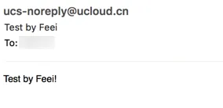
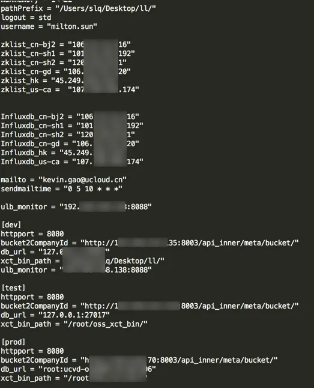
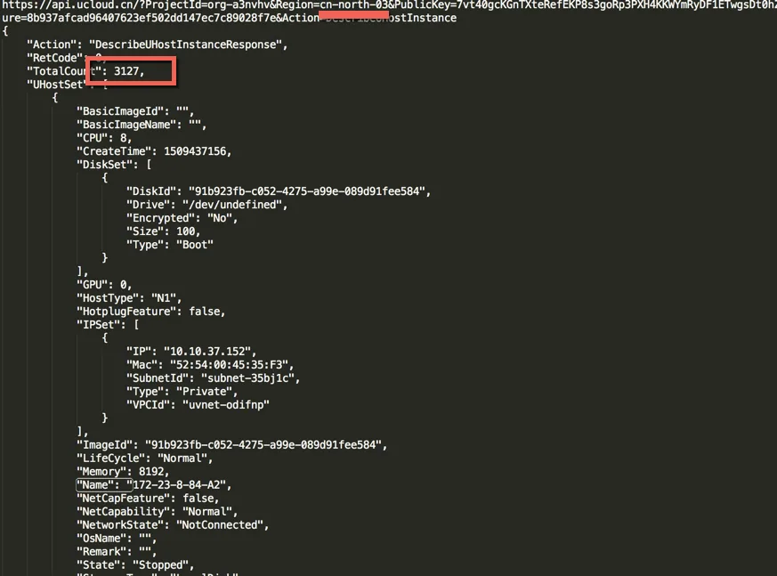
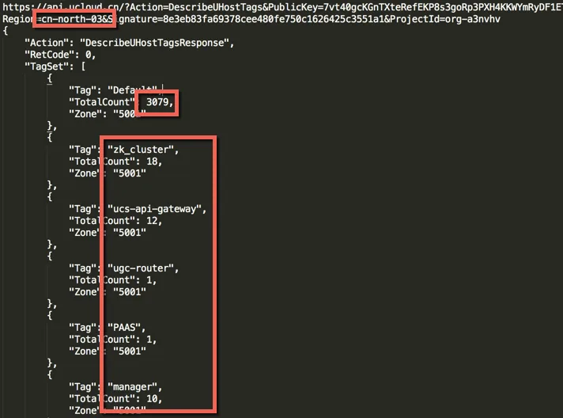
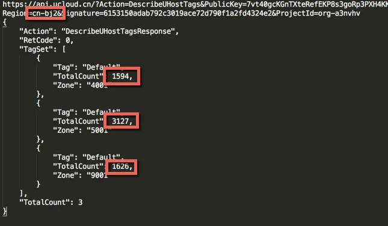
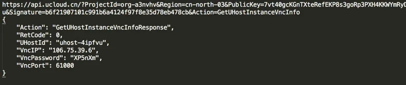
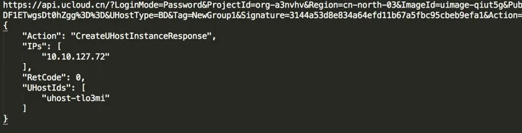
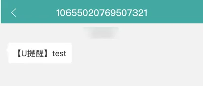
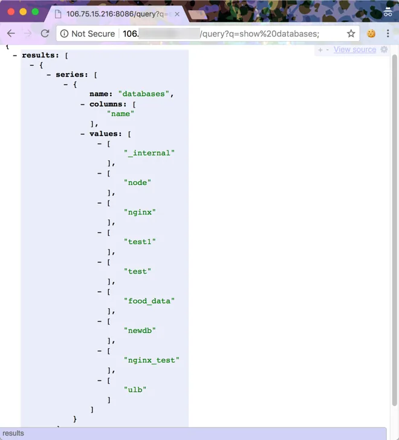
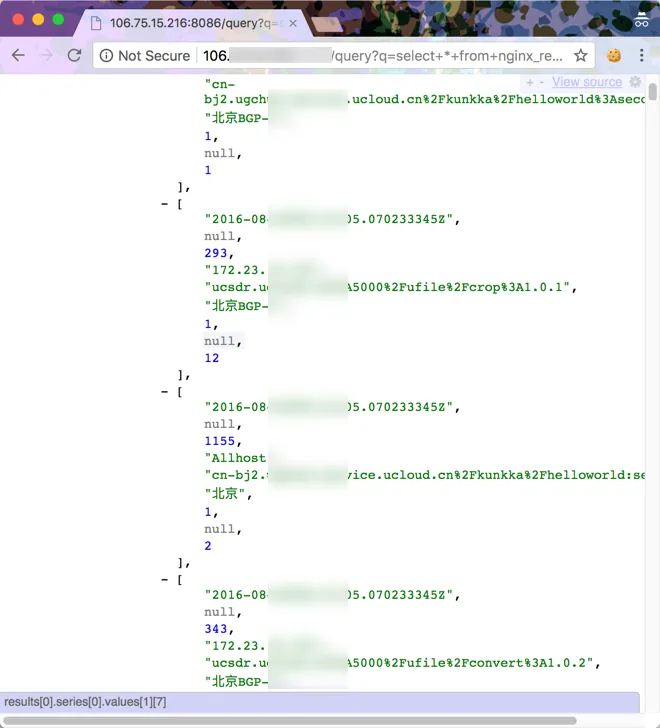

## 1 漏洞入口

[GSIL](https://github.com/FeeiCN/GSIL)监测到一处敏感信息泄露，涉及UCloud的一些系统（设计运营系统、General Compute Operation Support System、通用计算平台运营系统、UGC平台的运营管理系统）的代码泄露。

[https://github.com/s*******g/***](https://github.com/s*******g/***)

<!-- truncate -->

## 2 信息泄露

其中包含一些邮件账号密码

```go
send_account := "***-noreply@ucloud.cn"  
send_password := "U**********3"  
host := "smtp.qiye.163.com:25"
```

发送邮件验证测试



数据库账号密码及其他配置信息



## 3 扩大影响

通过[Cobra](https://github.com/WhaleShark-Team/cobra)扫描了下泄露的源码，发现了几处SQL注入。

入参就是SQL，很是明显，而且未做任何权限认证。

```bash
http://106.***.***.***:***/query?q=show%20databases;
http://106.***.***.***:***/query?q=select+*+from+nginx_request+limit+200&db=nginx
```




## 4 再次扩大

再次翻了下[Cobra](https://github.com/WhaleShark-Team/cobra)扫描报告，发现更严重的问题。

[Cobra](https://github.com/WhaleShark-Team/cobra)发现了三对公私密钥（这次经验告诉我们，[Cobra](https://github.com/WhaleShark-Team/cobra)中为什么对于注释了的风险代码也作为漏洞或风险点的原因），本来是没想到能利用的，一般这类密钥都是限制内网调用的。

赫然发现密钥下面的API变量`COMMON_API_URL = "https://api.ucloud.cn/?"`是个外网地址，去翻了下[UCloud API文档](https://docs.ucloud.cn/api/summary/overview)，发现确实是外网可调用的。

```go
var (
	//      吴**
	//      PublicKey  = "mq0fPub*************************OVK98eW+vNYrNQ=="
	//      PrivateKey = "f7a576d87fc2***********4083f78f"

	//      孙**
	//      PublicKey      = "D/ze2*********************************yer0YOAFPg=="
	//      PrivateKey     = "de17af******************************12ab6a1dadd"

	//      ucvd 公用
	PublicKey  = "7vt40gcKGnT************************DF1ETwgsDt0hZgg=="
	PrivateKey = "3c45fd62b9*********************16d1117"

	COMMON_API_URL = "https://api.ucloud.cn/?"
)
```

通过使用公私钥构造UCloud API接口调用([Python版本SDK](https://github.com/ucloud/ucloud-sdk-python))，测试验证得到以下信息（公私钥已失效，固图片不做打码处理）。

单个Region就有3000多台云主机。



可以管理地区数千台云主机。



意外的是，居然也有权限管理公有云上的服务器，拿了北京节点测试，能管理数千台机器。



挑了几个不影响业务的接口测试了下：

获取VNC密码



创建一台新主机



发送短信



理论上也能修改主机密码直至登录服务器；也可以让服务器关机使所有服务中断；还可以获取数据库权限拿到所有数据，并管理其他产品（镜像、容器、监控、CDN 等等）。

为避免影响，点到为止，不做进一步渗透，只是证明可以拿到数万台服务器的管理权限。

## 5 修复方案

- 查看仓库Clone情况来判断泄露的影响
- 删除仓库
- 重置泄露的公私钥
- 排查是否遭到他人恶意利用、种马等风险
- 修改我获取的那台VNC密码并删除我测试创建的那台服务器
- 修复SQL注入及增加权限认证

漏洞已报告给CNCERT/乌云/补天或厂商且已修复完成，感谢厂商的重视及现金奖励。
