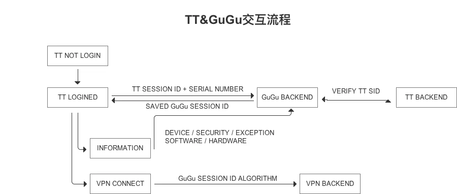
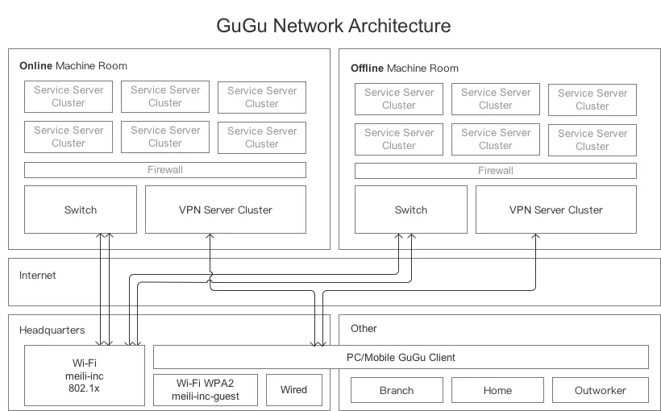
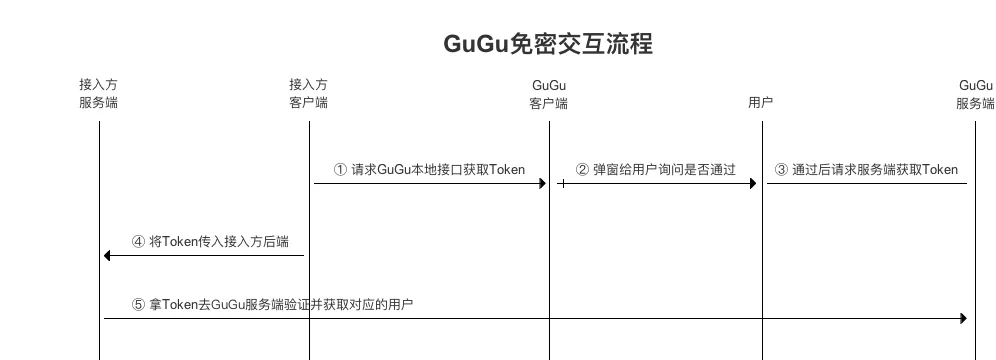
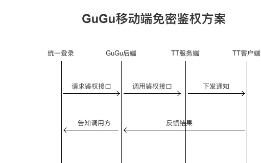
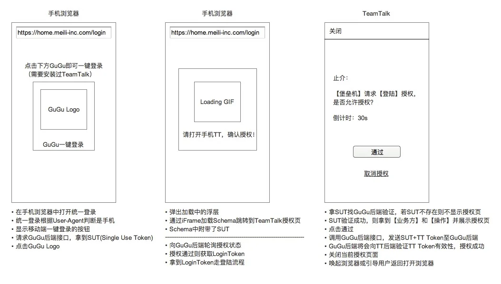
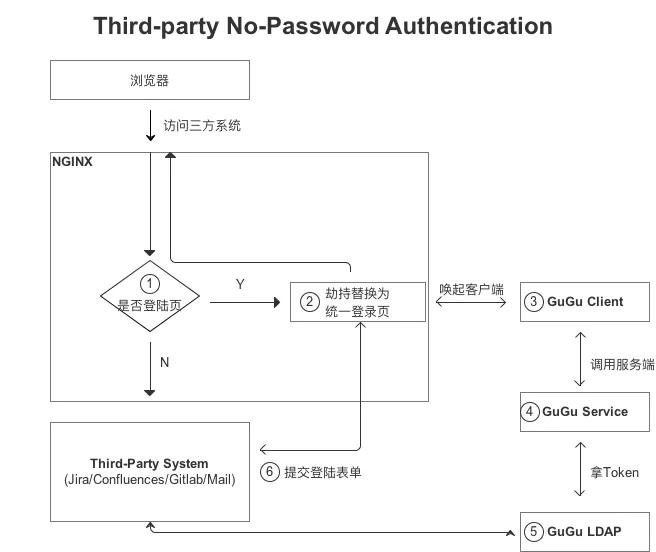
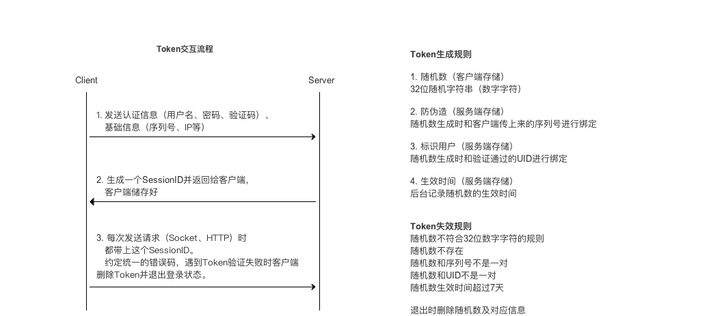

## 背景和思路

在整体入侵生命周期中的安全产品布局差不多的情况下，我们意识到人成为最大问题。

### 办公网络安全隐患

先看看我们早期的网络架构：

#### 网络拓扑

TODO 网络架构图

- 通过802.1.x认证账号密码通过后就进入内部办公网
- 办公网为了访问效率拉了一条专线到IDC机房
- 默认办公网和机房的网络是相通的，仅仅是通过账号认证来限制访问

#### 入侵手段

- 我们各类生产环境防御做的再好，但攻击者只需要潜伏进公司楼下咖啡馆，就可爆破办公室中的Wi-Fi网络；
- 甚至混入公司，一根网线就可以连入办公网络；

这样导致物理攻击渗透非常的容易，之前京东就出现过类似案例。这个风险的核心问题在于进入办公网就拥有了一部分访问权限了，而进入办公网的访问控制还只能是账号密码802.1.x。

然而回过头来看，办公网对于我们实际工作中的意义是否足够大呢？员工日常工作可以分为几部分

- 访问各种内网系统：内网门户、工单审批、数据平台、业务营销管理后台、行政办公系统等
- 访问服务器：通过SSH、FTP等方式访问服务器

而办公网对于我们的意义是通过专线从办公网到机房解决了访问机房资源的速度问题，也解决了局域网内的文件互传的速度问题。

那为什么授权范围从办公网再细化点，细化到每个人的电脑上呢？你的电脑是否有权限接入内网，而不是你连入办公网就有权限接入内网了。

如果不考虑任何历史包袱，我们希望能去掉办公网这个存在，每个人独立的连入内网，在任何地方都可以办公。

### VPN软件的安全隐患

- 在之前SRC曾收到白帽子报告一个漏洞，通过员工泄露的邮箱账号密码拿到邮箱权限，翻看邮箱邮件内容发现附件中存在VPN配置文件和Google二次验证的配置文件，从而直接用账号密码+Google二次验证连接VPN进入内网。
- 原先我们的VPN是基于Tunelblick，每次连接需要输入账号密码+Google验证码。会经常断掉需要重新输入密码重连非常影响工作效率，而线上和线下环境是区分开的，研发同学开发调试时需要经常切换VPN配置文件来连入线上或线下，非常繁琐。

第一个案例中，我们通过强制所有员工邮箱绑定微信，后续每次登录邮箱都必须微信扫码，以减缓邮箱被盗带来的风险。但邮件只是一个泄露配置文件的渠道，员工下次可能把配置文件传到 GitHub 或网盘上。根源问题仍是 VPN 配置文件和 Google 鉴权配置文件的泄露。

第二个案例则是由于安全要求需要每次连接时输入Google验证码，鉴权虽然安全但体验非常糟糕。

如果不考虑任何历史包袱，我们希望能做一套自己的鉴权协议并包一层VPN使其更方便和安全。

### 账号密码安全隐患

- 各类网站使用同一密码、密码长期不变等等问题都是非常普遍的，虽说对外的系统都有两步验证。但如果存在类似SSRF漏洞可以打进内网，就能畅通无阻了。
- 除此之外，在局域网络下想知道某个员工密码的方法还有很多，知道账号密码就能登录其所有有权限的内部系统。

除了我们能在密码策略上增强一些，比如强制定期更改、密码强度验证、不允许使用相同相似密码等等外，还是无法彻底解决密码所带来的各类问题，比如内部系统全部增加二次验证非常影响效率。

如果不考虑任何历史包袱，我们希望的是去掉密码这种古老的验证方式，设计一套更方便、更有效的鉴权方案。

### 员工客户端安全

- 当获取到组件类型漏洞（比如Struts2、FastJSON某个版出现本反序列化漏洞等）或常规代码安全漏洞（比如SSRF、新型SQL注入等）的安全情报时，安全团队可以通过Cobra扫描集团项目来判断漏洞影响范围，并做好应急响应。 但当获取到客户端软件的安全情报时，安全团队无法及时主动的排查受影响的范围。
- 一些同学离开座位不锁屏、电脑不设置密码甚至关闭一些安全设置。

我们全员都是Macbook，所以在终端安全上能少很多Windows上的各种风险。

但之前还是出现过几次风险较高的事件，比如之前macOS端出现的几次影响较大的漏洞。

- SourceTree
- XCodeGhost嵌入恶意后门的XCode版本
- JetBrains PyCharm、IDEA、PHPStorm、WebStorm全家桶都存在远程命令执行

而对于一些电脑的不安全配置，我们没办法仅仅依靠意识手段去做好，必要的技术检测还是要并行的。

所以理想状况下我们希望能一个终端软件能将软件和版本信息以及安全配置信息收集上来，当出现威胁事件时以便于进行风险影响判断。

<!-- truncate -->

## 技术方案

### 入网管控

通过GuGu控制密钥，使内置的VPN软件更加安全和方便，随时随地一键即可连入内网。杜绝从办公网入口渗透进入内网的可能性，也不会再出现VPN配置文件泄露导致内网漫游。 同时为了提升开发工作效率，在原有的VPN基础上增加了科学上网功能，方便开发过程中查阅资料和学习。

#### 全平台VPN方案

TODO 各VPN产品功能对比

OpenVPN、IKEv1(IPSec)、IKEv2、

最终选型方案

- Windows/macOS/Android => OpenVPN
- iOS => IKEv2

TODO 中间遇到的坑

- 下发路由表
- 下发DNS

#### VPN认证方案



#### VPN Auth Code

将上面计算的最终的结果当成密码去连接VPN。 VPN验证服务判断密码中有四处gu/ug，且密码长度为89位的话则走GuGu SID验证逻辑。

```markdown
 # 【拼接原始数据】拼接sessionID（会话ID）、serialNumber（序列号）、timestamp（时间戳）、分隔符（gu/ug）
original = gu + sessionID(32) + ug + serialNumber(34) + gu + timestamp(10)

# 【统一平台数据交互】转换为小写
original = tolower(original)

# 【防止请求重放攻击】取original sha1的前五位，并和original拼接
result = original + ug + sha1(original)[:5]# len = 892*4 + 32 + 34 + 10 + 5 = 89
```

#### 入网架构



####科学上网

### 一键免密

GuGu 登录过程中集成了多重安全策略，确保了账号的安全性。其他软件可以信任 GuGu 的账号登录状态，从而形成一个信任链。登录和使用大部分日常系统时，都会唤起 GuGu 的授权框，实现一键免密鉴权。当所有系统的免密鉴权全部覆盖完成后，就不存在仍需密码的系统了。届时 GuGu 就可以接管全部系统，将密码替换为随机 Token，而员工将不用记住任何密码。

#### Web端免密技术方案



#### GuGu启动HTTP Server

- 默认监听127.0.0.1的51273端口
- 若51273端口被占用，则监听51274端口
- 若51274端口被占用，则放弃启动HTTP Server服务，并上报信息给GuGu服务端

#### GuGu处理获取Token请求

- 不存在的接口将一律返回403状态码
- 不存在的HTTP Method将一律返回405
- 参数格式错误将返回1002
- 提供的为JSONP接口
- 只允许固定User-Agent和固定的域名（Referer）调用
- 一切正常将返回1001

#### 接入方客户端请求GuGu客户端接口

- 【判断是否安装GuGu】先请求127.0.0.1:51273上的获取GuGu版本接口，超时设为1s，若超时则使用51274端口进行重试，若还超时则说明GuGu未安装，返回告知用户使用备选方式登录
- 【获取Token】若安装了GuGu，则请求127.0.0.1端口上Token接口，超时设为33s（弹窗询问时间为30s）。

#### App端免密技术方案




#### 三方系统免密方案



### 终端安全

鉴权的 GuGu 登录体系和信任设备机制保障了 GuGu 的基础安全；通过预先收集电脑已安装的软件、版本号和安全配置信息等，在出现软件安全情报时可以快速确认影响范围；通过开启自动锁屏功能缓解离开电脑时未锁屏的风险。

#### 信息收集

#### 可信设备

### 自身加固

#### 登录限制

预警信息包含规则名、用户名、错误次数、IP、序列号及电脑名称

- 预警单电脑爆破账号密码
- 预警多电脑单IP爆破（序列号可伪造的情况下，使用IP预警）
- 预警账号被爆破（在IP和序列号都被破解的情况下，预警账号爆破）

以下信息可在metabase动态配置

- 各规则的错误次数及封禁时间阈值（调优最佳参数）
- 公司IP白名单（为防止公司IP变动）
- 序列号白名单（为防止紧急情况下用户无法连接内网）

#### Token签名算法

将所有需要提交的参数的key取出来进行顺序排序，并拿到value 比如要提交k1=v1&k2=v2，则将k1,k2提取出来，拿到v1，v2

将所有value拼接成字符串，计算sha1，并附带在最终需要提交的数据中。 sign = sha1(v1+v2) 最终提交的数据k1=v1&k2=v2&sign=sha1(v1+v2)

```python
import hashlib

def generate_sign(params):
    """
    Generate sign by params
    :param params:
    :return:
    """
    if not isinstance(params, dict):
        raise TypeError
    values = '#%$'.join(str(params[x]) for x in sorted(params))
    sha = hashlib.sha1()
    sha.update(values.encode())
    return sha.hexdigest()

params = {
    'k2': 233,
    'k1': '.cn',
    'a': 'feei',
}
sign = generate_sign(params)
assert sign == '7344da1feae2faa432c2fa8aa70839d6bedde142'
```

```java
import java.util.List;
import java.util.Map;
import java.util.Objects;
import java.util.Set;
import java.util.stream.Collectors;

public static final String SEPERATE_CHAR = "#%$";
public static String generateSign(Map<String, Object> param) {
    Set<String> keys = param.keySet();
    //过滤掉sign
    List<String> sortedKeys = keys.stream().filter(key -> !Objects.equals(key, "sign")).sorted().collect(Collectors.toList());
    String calcSign = sortedKeys.stream().map(param::get).map(String::valueOf).collect(Collectors.joining(SEPERATE_CHAR));
    calcSign = DigestUtils.sha1Hex(calcSign);
    return calcSign;
}
```

#### Token交互流程



## 3 项目成型

在项目起始，我们也调研了几家大企业对于这些问题的解决方案，大都是常规单项解决方式。 大多数问题都是密码导致的，所以提出了一个大胆的想法，去密码。将所有密码都去掉，交由可信设备处理。 于是GuGu的雏形出来了，用一个客户端，解决上面遇到的所有问题。 整个项目涉及安全、运维、内网、IM四大团队；Mac、Windows、Android、iOS四大平台。

#### 项目场景

- 在家/公司办公：macOS/Windows 入网管控
- 外出旅游：Android/iOS 入网管控
- 查阅资料：科学上网
- 不用密码登录各类系统：一键免密鉴权
- 离开座位锁屏：自动锁屏
- 新型高危软件漏洞应急响应：软件版本情报信息收集


*GuGu项目组*
