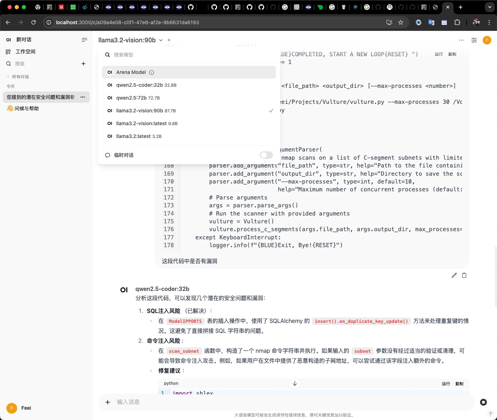
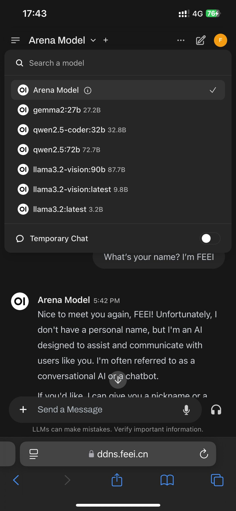

We can use Ollama to simplify various installation and configuration LLM (Llama/Qwen) steps on local computer, just download the DMG installer from the official website, run it, and start using it.

<!-- truncate -->

## Devices

| Tokens/S | Macbook Pro M1 Max + 64 GB CPUx10 / GPUx32 / NEx16 | Mac Studio M3 Ultra + 512 GB CPUx32 / GPUx80 / NEx32 |
| --- | --- | --- |
| qwen3:235b 142GB | / | 10-20 |
| qweb3:8b 5.2GB | 44 | 54 |
|  |  |  |

## Models

[Download Ollama](https://ollama.com/download)

[Search models](https://ollama.com/search)

[LLM Leaderboard](https://www.vellum.ai/llm-leaderboard)

### Llama 3.2 3B

Answering questions very quickly, most questions can be answered within 1 second.

```bash
feei@MacBook-Pro:~% ollama run llama3.2
pulling manifest
pulling dde5aa3fc5ff... 100% ▕███████████████████████████████████████████████████████████████████████████████████████████████████████████████████▏ 2.0 GB
pulling 966de95ca8a6... 100% ▕███████████████████████████████████████████████████████████████████████████████████████████████████████████████████▏ 1.4 KB
pulling fcc5a6bec9da... 100% ▕███████████████████████████████████████████████████████████████████████████████████████████████████████████████████▏ 7.7 KB
pulling a70ff7e570d9... 100% ▕███████████████████████████████████████████████████████████████████████████████████████████████████████████████████▏ 6.0 KB
pulling 56bb8bd477a5... 100% ▕███████████████████████████████████████████████████████████████████████████████████████████████████████████████████▏   96 B
pulling 34bb5ab01051... 100% ▕███████████████████████████████████████████████████████████████████████████████████████████████████████████████████▏  561 B
verifying sha256 digest
writing manifest
success
>>> /show info
  Model
    architecture        llama
    parameters          3.2B
    context length      131072
    embedding length    3072
    quantization        Q4_K_M

  Parameters
    stop    "<|start_header_id|>"
    stop    "<|end_header_id|>"
    stop    "<|eot_id|>"

  License
    LLAMA 3.2 COMMUNITY LICENSE AGREEMENT
    Llama 3.2 Version Release Date: September 25, 2024
```

### Llama 3.2 Vision 11B

Answering questions very quickly, most questions can be answered within 1 second.

```bash
feei@MacBook-Pro:~% ollama run llama3.2-vision

pulling manifest
pulling 11f274007f09... 100% ▕██████████████████████████████████████████████████████████████████████████████████████████████████████████████████ ▏ 6.0 GB/6.0 GB  607 KB/s      0s
pulling ece5e659647a... 100% ▕███████████████████████████████████████████████████████████████████████████████████████████████████████████████████▏ 1.9 GB
pulling 715415638c9c... 100% ▕███████████████████████████████████████████████████████████████████████████████████████████████████████████████████▏  269 B
pulling 0b4284c1f870... 100% ▕███████████████████████████████████████████████████████████████████████████████████████████████████████████████████▏ 7.7 KB
pulling fefc914e46e6... 100% ▕███████████████████████████████████████████████████████████████████████████████████████████████████████████████████▏   32 B
pulling fbd313562bb7... 100% ▕███████████████████████████████████████████████████████████████████████████████████████████████████████████████████▏  572 B
verifying sha256 digest
writing manifest
success
>>> /show info
  Model
    architecture        mllama
    parameters          9.8B
    context length      131072
    embedding length    4096
    quantization        Q4_K_M

  Projector
    architecture        mllama
    parameters          895.03M
    embedding length    1280
    dimensions          4096

  Parameters
    temperature    0.6
    top_p          0.9

  License
    LLAMA 3.2 COMMUNITY LICENSE AGREEMENT
    Llama 3.2 Version Release Date: September 25, 2024
```

### Llama 3.2 Vision 90B

It’s a bit like using ChatGPT-4o, but it feels noticeably slower. Each question takes serval seconds to tens of seconds to wait for a response. At the same time, the CPU/GPU runs at full load, making it impossible to perform other operations on the computer.

```bash
feei@MacBook-Pro:~% ollama run llama3.2-vision:90b

pulling manifest
pulling da63a910e349... 100% ▕███████████████████████████████████████████████████████████████████████████████████████████████████████████████████▏  52 GB
pulling 6b6c374d159e... 100% ▕███████████████████████████████████████████████████████████████████████████████████████████████████████████████████▏ 2.0 GB
pulling 715415638c9c... 100% ▕███████████████████████████████████████████████████████████████████████████████████████████████████████████████████▏  269 B
pulling 0b4284c1f870... 100% ▕███████████████████████████████████████████████████████████████████████████████████████████████████████████████████▏ 7.7 KB
pulling fefc914e46e6... 100% ▕███████████████████████████████████████████████████████████████████████████████████████████████████████████████████▏   32 B
pulling f6e93f58717d... 100% ▕███████████████████████████████████████████████████████████████████████████████████████████████████████████████████▏  573 B
verifying sha256 digest
writing manifest
success
>>> /show info
  Model
    architecture        mllama
    parameters          87.7B
    context length      131072
    embedding length    8192
    quantization        Q4_K_M

  Projector
    architecture        mllama
    parameters          926.49M
    embedding length    1280
    dimensions          8192

  Parameters
    temperature    0.6
    top_p          0.9

  License
    LLAMA 3.2 COMMUNITY LICENSE AGREEMENT
    Llama 3.2 Version Release Date: September 25, 2024

feei@MacBook-Pro:~% ollama ps
NAME                   ID              SIZE     PROCESSOR          UNTIL
llama3.2-vision:90b    2ba4f038aab3    60 GB    15%/85% CPU/GPU    4 minutes from now
```

### Qwen2.5 72B

```bash
feei@MacBook-Pro:~% ollama run qwen2.5:72b
pulling 6e7fdda508e9... 100% ▕██████████████████████████████████████████████████▏  47 GB
pulling 66b9ea09bd5b... 100% ▕██████████████████████████████████████████████████▏   68 B
pulling eb4402837c78... 100% ▕██████████████████████████████████████████████████▏ 1.5 KB
pulling b5c0e5cf74cf... 100% ▕██████████████████████████████████████████████████▏ 7.4 KB
pulling b842e4a4351a... 100% ▕██████████████████████████████████████████████████▏  488 B
verifying sha256 digest
writing manifest
success
>>> 你叫什么，有什么能力
我是Qwen，由阿里云开发的大规模语言模型。我能够生成各种类型的文本，如文章、故事、诗歌和代码等，并能回答问题、提
供信息查询和参与对话交流。我的目标是通过自然语言处理技术为用户提供高效、准确和有创造性的帮助。如果您有任何问题
或需要协助，请随时告诉我！
>>> /show info
  Model
    architecture        qwen2
    parameters          72.7B
    context length      32768
    embedding length    8192
    quantization        Q4_K_M

  System
    You are Qwen, created by Alibaba Cloud. You are a helpful assistant.

  License
    Qwen RESEARCH LICENSE AGREEMENT
    Qwen RESEARCH LICENSE AGREEMENT Release Date: September 19, 2024

>>> Send a message (/? for help)

feei@MacBook-Pro:~% ollama ps
NAME           ID              SIZE     PROCESSOR    UNTIL
qwen2.5:72b    424bad2cc13f    48 GB    100% GPU     4 minutes from now
```

### Qwen2.5-coder 32B

```bash

```

```bash
feei@MacBook-Pro:~% tree ~/.ollama
/Users/feei/.ollama
├── history
├── id_ed25519
├── id_ed25519.pub
├── logs
│   └── server.log
└── models
    ├── blobs
    │   ├── sha256-0b4284c1f87029e67654c7953afa16279961632cf73dcfe33374c4c2f298fa35
    │   ├── sha256-11f274007f093fefeec994a5dbbb33d0733a4feb87f7ab66dcd7c1069fef0068
    │   ├── sha256-34bb5ab01051a11372a91f95f3fbbc51173eed8e7f13ec395b9ae9b8bd0e242b
    │   ├── sha256-56bb8bd477a519ffa694fc449c2413c6f0e1d3b1c88fa7e3c9d88d3ae49d4dcb
    │   ├── sha256-66b9ea09bd5b7099cbb4fc820f31b575c0366fa439b08245566692c6784e281e
    │   ├── sha256-6b6c374d159e097509b33e9fda648c178c903959fc0c7dbfae487cc8d958093e
    │   ├── sha256-6e7fdda508e91cb0f63de5c15ff79ac63a1584ccafd751c07ca12b7f442101b8
    │   ├── sha256-715415638c9c4c0cb2b78783da041b97bd1205f8b9f9494bd7e5a850cb443602
    │   ├── sha256-966de95ca8a62200913e3f8bfbf84c8494536f1b94b49166851e76644e966396
    │   ├── sha256-a70ff7e570d97baaf4e62ac6e6ad9975e04caa6d900d3742d37698494479e0cd
    │   ├── sha256-b5c0e5cf74cf51af1ecbc4af597cfcd13fd9925611838884a681070838a14a50
    │   ├── sha256-b842e4a4351abd55957e0b5560d21c5a7580d380d1c30b9b436a5439d51cba90
    │   ├── sha256-da63a910e34997d50c9f21cc7f16996d1e76e1c128b13319edd68348f760ecc7
    │   ├── sha256-dde5aa3fc5ffc17176b5e8bdc82f587b24b2678c6c66101bf7da77af9f7ccdff
    │   ├── sha256-eb4402837c7829a690fa845de4d7f3fd842c2adee476d5341da8a46ea9255175
    │   ├── sha256-ece5e659647a20a5c28ab9eea1c12a1ad430bc0f2a27021d00ad103b3bf5206f
    │   ├── sha256-f6e93f58717d93b58e123eaf6ef85321589a731533711682371123aadc0a72c6
    │   ├── sha256-fbd313562bb706ac00f1a18c0aad8398b3c22d5cd78c47ff6f7246c4c3438576
    │   ├── sha256-fcc5a6bec9daf9b561a68827b67ab6088e1dba9d1fa2a50d7bbcc8384e0a265d
    │   └── sha256-fefc914e46e6024467471837a48a24251db2c6f3f58395943da7bf9dc6f70fb6
    └── manifests
        └── registry.ollama.ai
            └── library
                ├── llama3.2
                │   └── latest
                ├── llama3.2-vision
                │   ├── 90b
                │   └── latest
                └── qwen2.5
                    └── 72b

9 directories, 28 files
```

### Change Ollma Models Directory

```bash
# Temporarily Change the Model Directory
launchctl setenv OLLAMA_MODELS /path/to/new/models

# Permanently Change the Model Directory
ln -s /path/to/new /path/to/models/
```

## Using Ollama with Open-WebUI

[Open WebUI](https://github.com/open-webui/open-webui)is an[extensible](https://github.com/open-webui/pipelines), feature-rich, and user-friendly self-hosted WebUI designed to operate entirely offline. It supports various LLM runners, including Ollama and OpenAI-compatible APIs.

```bash
feei@MacBook-Pro:~% docker run -d -p 127.0.0.1:3000:8080 --add-host=host.docker.internal:host-gateway -v open-webui:/app/backend/data --name open-webui --restart always ghcr.io/open-webui/open-webui:main
```

Wait a moment…



*Ollma-with-Open-WebUI*

## Access Using an Internet Domain Name

### Obtain SSL Certificates Manually Using Certbot with DNS Verfication

```bash
feei@MacBook-Pro:~% sudo certbot certonly --manual --preferred-challenges dns
Saving debug log to /var/log/letsencrypt/letsencrypt.log
Please enter the domain name(s) you would like on your certificate (comma and/or
space separated) (Enter 'c' to cancel): ddns.feei.cn
Requesting a certificate for ddns.feei.cn

- - - - - - - - - - - - - - - - - - - - - - - - - - - - - - - - - - - - - - - -
Please deploy a DNS TXT record under the name:

_acme-challenge.ddns.feei.cn.

with the following value:

9xGUnb0Ooj-lKv1UUlE-C5zb_7fOYArjAFyYhAXgvCE

Before continuing, verify the TXT record has been deployed. Depending on the DNS
provider, this may take some time, from a few seconds to multiple minutes. You can
check if it has finished deploying with aid of online tools, such as the Google
Admin Toolbox: https://toolbox.googleapps.com/apps/dig/#TXT/_acme-challenge.ddns.feei.cn.
Look for one or more bolded line(s) below the line ';ANSWER'. It should show the
value(s) you've just added.

- - - - - - - - - - - - - - - - - - - - - - - - - - - - - - - - - - - - - - - -
Press Enter to Continue

Successfully received certificate.
Certificate is saved at: /etc/letsencrypt/live/ddns.feei.cn/fullchain.pem
Key is saved at:         /etc/letsencrypt/live/ddns.feei.cn/privkey.pem
This certificate expires on 2025-02-28.
These files will be updated when the certificate renews.

NEXT STEPS:
- This certificate will not be renewed automatically. Autorenewal of --manual certificates requires the use of an authentication hook script (--manual-auth-hook) but one was not provided. To renew this certificate, repeat this same certbot command before the certificate's expiry date.

- - - - - - - - - - - - - - - - - - - - - - - - - - - - - - - - - - - - - - - -
If you like Certbot, please consider supporting our work by:
 * Donating to ISRG / Let's Encrypt:   https://letsencrypt.org/donate
 * Donating to EFF:                    https://eff.org/donate-le
- - - - - - - - - - - - - - - - - - - - - - - - - - - - - - - - - - - - - - - -
```

### Configure Nginx with SSL and Proxy Requests to Open WebUI

```bash
feei@MacBook-Pro:~% brew install nginx
feei@MacBook-Pro:~% vim /opt/homebrew/etc/nginx/nginx.conf
feei@MacBook-Pro:~% sudo brew services restart nginx
```

Nginx Example

```nginx
#user  nobody;
worker_processes  1;

#error_log  logs/error.log;
#error_log  logs/error.log  notice;
#error_log  logs/error.log  info;

#pid        logs/nginx.pid;

events {
    worker_connections  1024;
}

http {
    include       mime.types;
    default_type  application/octet-stream;

    #log_format  main  '$remote_addr - $remote_user [$time_local] "$request" '
    #                  '$status $body_bytes_sent "$http_referer" '
    #                  '"$http_user_agent" "$http_x_forwarded_for"';

    #access_log  logs/access.log  main;

    sendfile        on;
    #tcp_nopush     on;

    #keepalive_timeout  0;
    keepalive_timeout  65;

    #gzip  on;

    server {
        listen       3000 ssl;
        server_name  ddns.feei.cn;
	ssl_certificate /etc/letsencrypt/live/ddns.feei.cn/fullchain.pem;
	ssl_certificate_key /etc/letsencrypt/live/ddns.feei.cn/privkey.pem;
	ssl_protocols TLSv1.2 TLSv1.3;
	ssl_ciphers HIGH:!aNULL:!MD5;
	ssl_prefer_server_ciphers on;

        #charset koi8-r;

        #access_log  logs/host.access.log  main;

        location / {
	    proxy_pass http://127.0.0.1:8080;
	    proxy_http_version 1.1;
	    proxy_set_header Upgrade $http_upgrade;
	    proxy_set_header Connection 'upgrade';
	    proxy_set_header Host $host;
	    proxy_cache_bypass $http_upgrade;
            #root   html;
            #index  index.html index.htm;
        }

        #error_page  404              /404.html;

        # redirect server error pages to the static page /50x.html
        #
        error_page   500 502 503 504  /50x.html;
        location = /50x.html {
            root   html;
        }

        # proxy the PHP scripts to Apache listening on 127.0.0.1:80
        #
        #location ~ \.php$ {
        #    proxy_pass   http://127.0.0.1;
        #}

        # pass the PHP scripts to FastCGI server listening on 127.0.0.1:9000
        #
        #location ~ \.php$ {
        #    root           html;
        #    fastcgi_pass   127.0.0.1:9000;
        #    fastcgi_index  index.php;
        #    fastcgi_param  SCRIPT_FILENAME  /scripts$fastcgi_script_name;
        #    include        fastcgi_params;
        #}

        # deny access to .htaccess files, if Apache's document root
        # concurs with nginx's one
        #
        #location ~ /\.ht {
        #    deny  all;
        #}
    }

    # another virtual host using mix of IP-, name-, and port-based configuration
    #
    #server {
    #    listen       8000;
    #    listen       somename:8080;
    #    server_name  somename  alias  another.alias;

    #    location / {
    #        root   html;
    #        index  index.html index.htm;
    #    }
    #}

    # HTTPS server
    #
    #server {
    #    listen       443 ssl;
    #    server_name  localhost;

    #    ssl_certificate      cert.pem;
    #    ssl_certificate_key  cert.key;

    #    ssl_session_cache    shared:SSL:1m;
    #    ssl_session_timeout  5m;

    #    ssl_ciphers  HIGH:!aNULL:!MD5;
    #    ssl_prefer_server_ciphers  on;

    #    location / {
    #        root   html;
    #        index  index.html index.htm;
    #    }
    #}
    include servers/*;
}
```



*Using Local LLM Everywhere*
