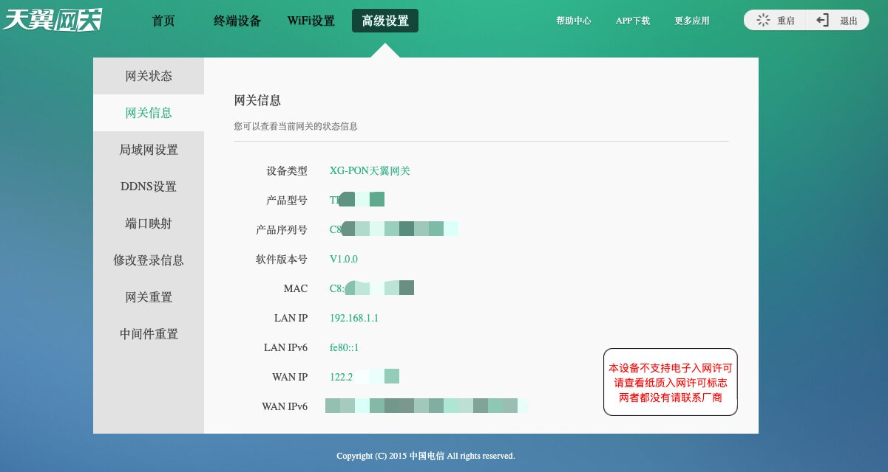
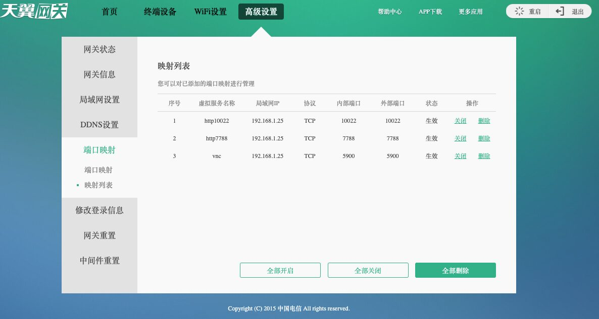
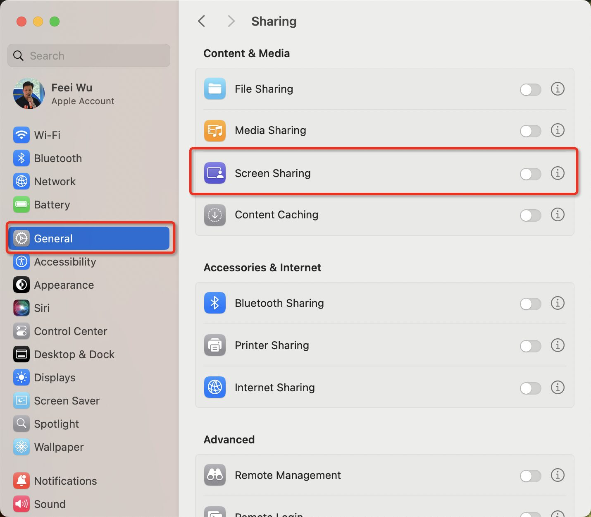
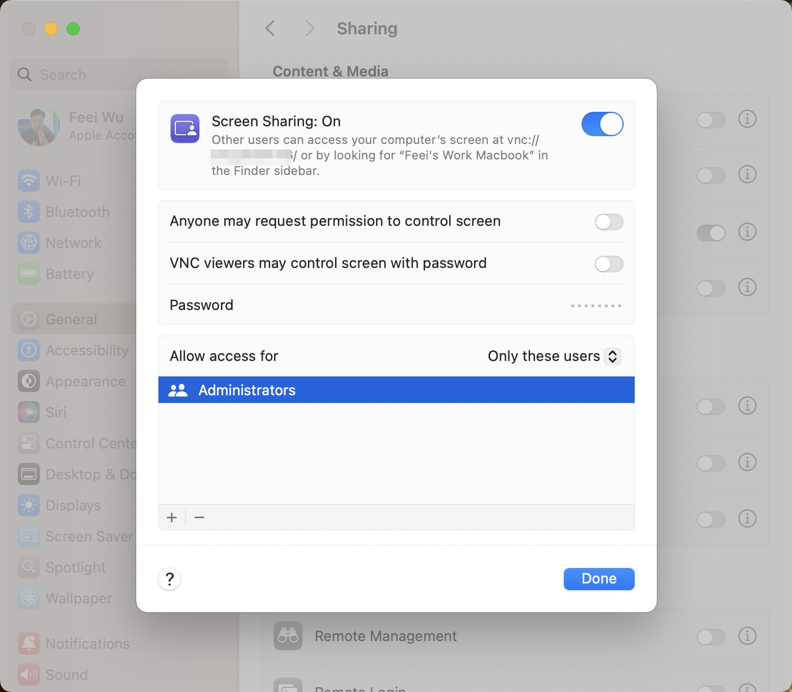
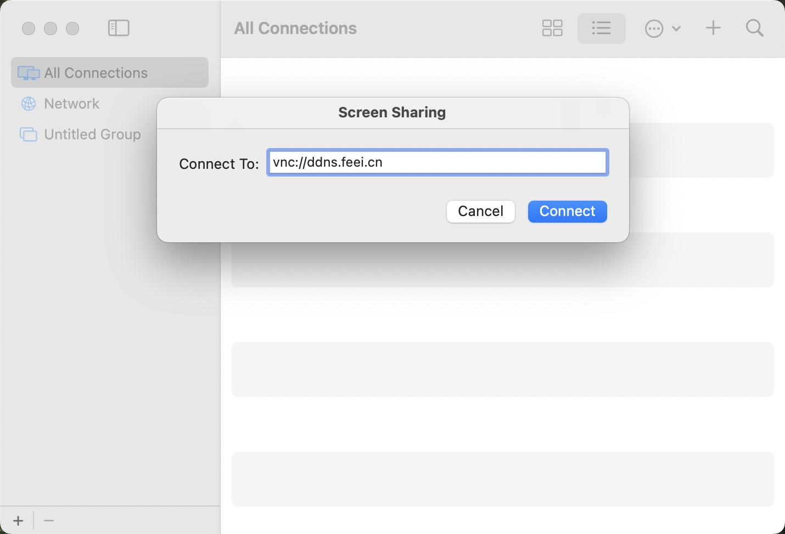
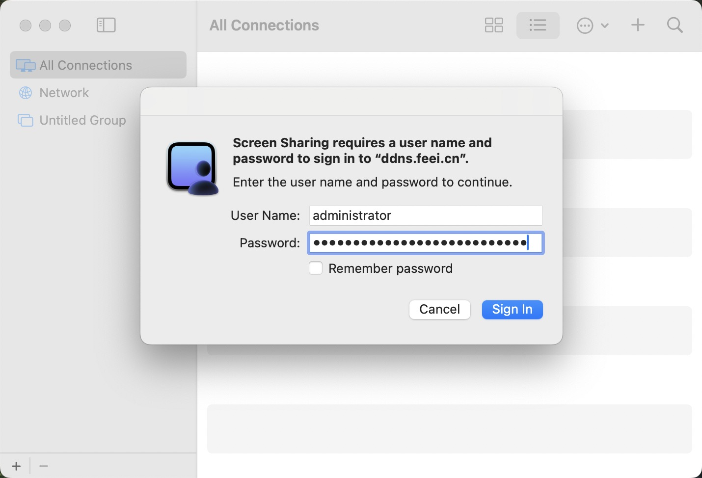
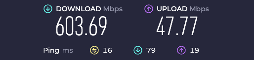
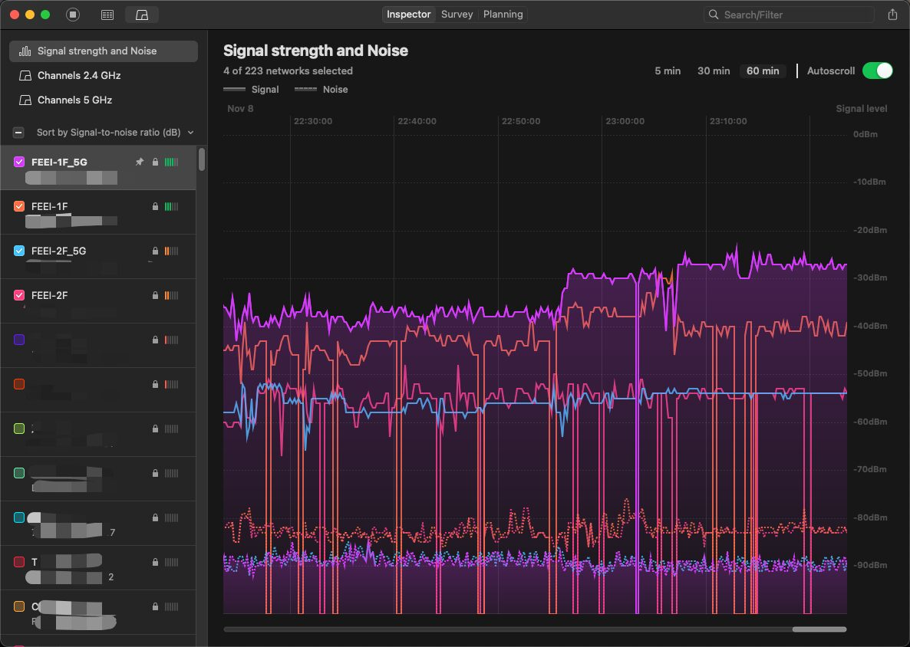
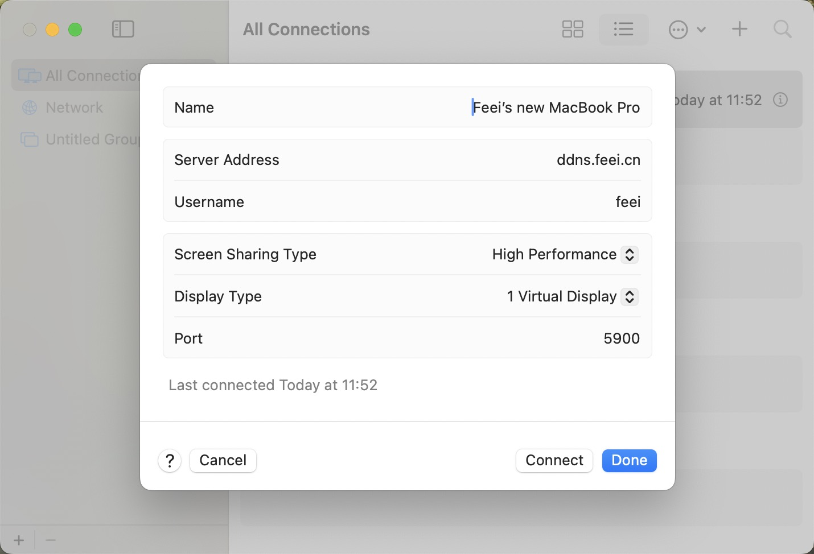

By using home broadband public IP, configuring port forwarding and DDNS, you can achieve accessing and controlling your home computer from anywhere. This includes accessing NAS, databases service, and smoothly controlling your home computer to access pictures, files, and use various software.

<!-- truncate -->

## Apply Internet IP

杭州电信正常情况下，不会给你分配公网IP，你可以通过浏览器登陆光猫管控地址（一般为`192.168.1.1`，账号密码写在光猫背面），登陆后可以查看网关状态，里面有具体的IP信息。如果IP是`100.`开头的，则没有分配公网IP地址。



此时可通过打给电信客服（10000号），转人工客服服务，直接说要公网IP，对方就会立刻答应，10分钟后重启光猫，再登陆光猫查看IP地址就变成正常的独享公网IP了。

此时通过命令行访问`curl -4 ip.sb`可以看到，出口IP地址也变成入口一样的IP地址了。

```bash
feei@Feeis-Work-Macbook ~ % curl -4 ip.sb
122.xxx.xxx.xxx
```

## Map a Internal Service Port to a Public IP

你的公网IP是指向你的光猫的，而你的光猫并没有开启任何服务，甚至ICMP也是禁用的。因此你如果尝试`ping`你的公网IP地址，会发现无法联通。

```bash
feei@Feeis-Work-Macbook ~ % ping 122.xxx.xxx.xxx
PING 122.xxx.xxx.xxx: 56 data bytes
Request timeout for icmp_seq 0
Request timeout for icmp_seq 1
Request timeout for icmp_seq 2
Request timeout for icmp_seq 3
Request timeout for icmp_seq 4
^C
--- 122.xxx.xxx.xxx ping statistics ---
6 packets transmitted, 0 packets received, 100.0% packet loss
```

需要登陆光猫，使用端口映射功能，将公网IP的端口映射到你具体家中局域网的某台电脑的某个端口上。

需要注意，大部分人是光猫（192.168.1.1）下接路由器（192.168.1.2），路由器（192.168.31.1）下接电脑（192.168.31.100）的网络架构。这种情况下，光猫往往和电脑不在一个网段上，如果直接在光猫上配置端口映射会提示不在一个网段无法配置。

可以通过让路由器变成中继模式，这时光猫（192.168.1.1）、路由器（192.168.1.9）、电脑（192.168.1.22）就都在一个网段内。

此时登陆光猫配置将7788端口映射到电脑IP的7788端口上，即可实现通过互联网访问局域网内的某个端口服务。



要注意，电信运营商并不允许在家用宽带上搭建网站等服务，因此常见的80、8080、443等Web服务端口是被封禁了。

要注意将电脑的IP由DHCP更改为静态IP，以防止下次连接时自动分配新的局域网IP，导致端口转发失败。也可以通过UPnP（Universal Plug and Play，通用即插即用）来自动实现手动配置IP和端口映射的效果。甚至还可以通过将某台电脑IP加入到光猫中的DMZ配置中，实现将这台电脑全部端口开放到互联网IP上。

## Test the Connectivity Public IP’s Port

在光猫上配置完端口映射后，会有各种原因导致无法访问你想访问的端口。因此需要有个简便的方式验证端口连通性，以及更方便的排查是哪一层原因。

本地电脑Python开一个Web服务监听7788端口，使用浏览器分别访问不同层IP。

```bash
➜  ~ python3 -m http.server --bind 0.0.0.0 7788
Serving HTTP on 0.0.0.0 port 7788 (http://0.0.0.0:7788/) ...
127.0.0.1 - - [01/Nov/2024 20:21:24] "GET / HTTP/1.1" 200 -
192.168.1.25 - - [01/Nov/2024 20:21:35] "GET / HTTP/1.1" 200 -
122.xxx.xxx.xxx - - [01/Nov/2024 20:23:28] "GET / HTTP/1.1" 200 -
```

先在本地通过不同IP看看是否都可以顺利访问

- `127.0.0.1:7788`能访问则表示你的服务是正常运转的。
- `192.168.1.22:7788`能访问则表示光猫到你电脑的网络是正常的。
- `公网IP:7788`能访问则表示一切正常。不能访问的原因比较多。
  - **确认是否是公网IP** 。而不是100.开头的IP。
  - **确认光猫上的端口映射配置是正确的** 。包括源端口/目的端口是否一致，目的IP是否是你电脑局域网IP。
  - **更换端口再尝试下** 。常见的80/8080/443等Web端口会被电信封禁，尝试将端口改成五位的（比如10022）。
  - **尝试通过4G等其他网络访问公网IP和端口** 。不知什么原因，我这里就是局域网内访问公网IP是不通的，但通过4G访问公网IP和端口是可以的。

网络通了之后，把对应服务的端口映射出去，就可以在任何地方通过互联网使用家里电脑上的任何服务了，比如NAS、数据库等，也可以远程控制家中电脑，访问里面的文件、照片等，不用背着电脑到处跑了。

## Using DDNS to Automatically update the domain to the IP

因为家用宽带的公网IP不是固定的，经常会发生变化。一旦变了之后，在外部原来的IP就无法访问了，新的IP地址又不能及时知道。

因此需要在家里宽带的公网IP发生变化的时候能够知道，可以搞个域名解析过去，IP发生变化的时候更新域名解析记录。

这里写个简单的Python程序，主要逻辑是获取当前IPv4类型的IP地址，如果地址发生变化，则更新域名（`ddns.feei.cn`）的DNS A记录IP地址。

```python
#!/usr/bin/env python
# -*- coding: utf-8 -*-

"""
    DDNS
    ~~~~

    获取互联网IP并自动更新到DNSPod域名记录
    Get Internet IP and Automatically Update to DNSPod Domain Record

    :author:    Feei <feei@feei.cn>
    :homepage:  https://github.com/FeeiCN/DDNS
    :license:   GPL, see LICENSE for more details.
    :copyright: Copyright (c) 2024 Feei. All rights reserved
"""
import json
from tencentcloud.common import credential
from tencentcloud.common.profile.client_profile import ClientProfile
from tencentcloud.common.profile.http_profile import HttpProfile
from tencentcloud.common.exception.tencent_cloud_sdk_exception import TencentCloudSDKException
from tencentcloud.dnspod.v20210323 import dnspod_client, models

import subprocess
from datetime import datetime

def get_public_ip():
    try:
        result = subprocess.run(["curl", "-4", "ip.sb"], capture_output=True, text=True, check=True)
        return result.stdout.strip()
    except subprocess.CalledProcessError as e:
        return f"Error: {e}"

def modify_a_record(ipv4):
    try:
        # 实例化一个认证对象，入参需要传入腾讯云账户 SecretId 和 SecretKey，此处还需注意密钥对的保密
        # 代码泄露可能会导致 SecretId 和 SecretKey 泄露，并威胁账号下所有资源的安全性。以下代码示例仅供参考，建议采用更安全的方式来使用密钥，请参见：https://cloud.tencent.com/document/product/1278/85305
        # 密钥可前往官网控制台 https://console.cloud.tencent.com/cam/capi 进行获取
        cred = credential.Credential("AKIDZAgtest", "test2")
        # 实例化一个http选项，可选的，没有特殊需求可以跳过
        httpProfile = HttpProfile()
        httpProfile.endpoint = "dnspod.tencentcloudapi.com"

        # 实例化一个client选项，可选的，没有特殊需求可以跳过
        clientProfile = ClientProfile()
        clientProfile.httpProfile = httpProfile
        # 实例化要请求产品的client对象,clientProfile是可选的
        client = dnspod_client.DnspodClient(cred, "", clientProfile)

        # 实例化一个请求对象,每个接口都会对应一个request对象
        # # https://console.cloud.tencent.com/api/explorer?Product=dnspod&Version=2021-03-23&Action=ModifyRecord
        req = models.ModifyRecordRequest()

        params = {
            "Domain": "feei.cn",
            "RecordType": "A",
            "RecordLine": "默认",
            "Value": ipv4,
            "RecordId": 1879287601,
            "SubDomain": "ddns"
        }
        req.from_json_string(json.dumps(params))

        # 返回的resp是一个ModifyRecordResponse的实例，与请求对象对应
        resp = client.ModifyRecord(req)
        # 输出json格式的字符串回包
        return resp.to_json_string()
    except TencentCloudSDKException as err:
        return err

def last_record(content=None):
    filename = '/tmp/.last_record'
    try:
        if content is None:
            # 参数为空时，读取文件内容
            with open(filename, "r") as file:
                file_content = file.read()
            return file_content
        else:
            # 参数有值时，写入文件
            with open(filename, "w+") as file:
                file.write(content)
            return True
    except Exception as e:
        return None

if __name__ == '__main__':
    ipv4 = get_public_ip()
    current_time = datetime.now()
    if len(ipv4.split('.')) == 4:
        last_record_ip = last_record()
        if ipv4 == last_record_ip:
            print(f'{current_time} IP NOT Change ({last_record_ip} : {ipv4})')
        elif last_record_ip is None or len(last_record_ip.split('.')) == 4:
            modify_a_record(ipv4)
            last_record(ipv4)
            print(f'{current_time} IP Changed ({last_record_ip} -> {ipv4})')
        else:
            print(f'{current_time} error: last record format error ({last_record_ip})')
    else:
        print(f'{current_time} error: get public ip failed ({ipv4})')
```

并通过cron每分钟定时运行，并记录日志。

```bash
crontab -e
* * * * * /Path to you project/.venv/bin/python3.9 /Path to you project/ddns.py >> /Path to you project/ddns.log 2>&1
```

这样我就只需要记住`ddns.feei.cn`这个域名，就可以在任何地方通过互联网，访问家中电脑的任何服务了。

## Using VNC Remotely Control Home Computer

以远程控制家中电脑为例，在光猫上将VNC端口5900映射到自己的家中的MacBook电脑IP上。

将家中的MacBook电脑的Screen Sharing服务打开，该服务底层基于VNC协议的。




之后就可以在另外一个网络下的电脑上，打开Screen Sharing应用，填入`vnc://ddns.feei.cn`，输入账号密码后，即可连接并控制家中的MacBook电脑。




## Improves speed

### Network layer

#### Home Broadband

- >=500Mbps



*1000Mbps，实际下载能达到75MB/s，上传速度能达到5.8MB/s。*

#### Improves phsicis speed

- 使用光猫入户
- 使用>=CAT7e网线
- 使用支持>=Wi-Fi6路由器
- 优化电脑和和路由器的位置使得电脑端接收Wi-Fi信号强度>=30dBm



*通过调整路由器和电脑的位置，优化Wi-Fi信号强度在-30dBm以内*

#### Open 5900 UDP Port

In VNC protocol, TCP is responsible for control, UDP is responsible for screen transmission. So need to open both of TCP and UDP protocols, otherwise the transmission speed will be affected.

可以看到访问和控制速度还是非常不错的，日常远程控制完全够用。

### Open High Performance Mode

如果你希望进一步提升远程控制体验，且服务端和客户端都是Apple Silicon M芯片，可升级最新macOS系统，使用[High Performance模式](https://support.apple.com/zh-cn/guide/remote-desktop/apdf8e09f5a9/mac)，在色彩、帧率以及响应速度上会有大幅变化，将拥有非常高清和流畅的体验。



*Screen Sharing.app中将Screen Sharing Type改为High Performance*

再来看看效果，明显色彩上、动画效果上、流畅度上要好很多。

虽然苹果在Screen Sharing中集成了Apple ID的认证方式，不过该方式的访问只适用于在同一个局域网，否则速度会非常慢。另外需要注意，一般VNC是没有加密的，但[macOS中的Screen Sharing认证和通信过程是加密的](https://support.apple.com/zh-cn/guide/remote-desktop/apdfe8e386b/mac)，此外苹果还针对性做了很多性能和体验上的优化。

Now, you can remotely control home computer everywhere.
