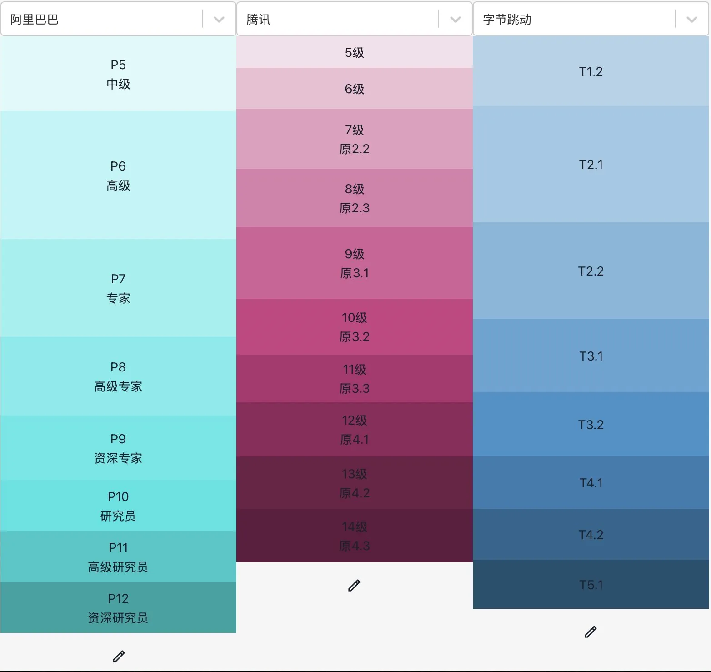

上一章节讲述了基础的安全从业者应具备的素质，如果你已经具备这些素质，那么已经踏入了安全行业的门槛。这一章将重点讲解下入门之上的能力分层，不同层级更重视怎样的特质。

能力分层是一件非标准的事情，很难用特定的标准方式去判断一个人的能力，而且随着时间的变化每个人的能力也不断在成长。看哪些方面能力、各方面能力如何衡量、最终层次划分到什么程度，这些都不是本文讨论的内容。以通过各大厂面试并顺利拿到offer为诉求，我们需要搞清楚能力分层，就需要先了解各大厂的层级情况。

和打怪升级时的等级上升有显著差异，公司内部的层级分布往往呈现明显的啤酒瓶形状的，有点像政府单位，绝大部分是科员（工程师）、科长（高级工程师）和处长（专家），是干活的主力，再向上人数就急剧减少。

#### 业余安全爱好者

人员画像：P4，脚本小子，熟练掌握各种安全工具使用，能够利用各种工具挖掘各类漏洞，刷刷SRC奖励。

#### 安全工程师

人员画像：P5，薪资20-40万。一般为应届211/985信息安全专业的研究生或优秀的本科生，安全技术功底扎实，能在别人带领下高效完成一些明确的任务，**偏执行** 。

#### 高级安全工程师

人员画像：P6，薪资数十万不等。一般为应届博士或优秀本科研究生或社招工作5年内，专业能力比较突出，能够在细分子领域**独当一面** ，能够辅导安全工程师进行工作。

#### 安全专家

人员画像：P7，薪资百万左右，一般不直接管人，少数管理数人到十来人团队。专业精深，属于某个安全方向的**领域专家** ，应届凤毛麟角或工作10年内，大厂某个安全细分方向负责人（小厂安全负责人），虚线带领一些同学解决某方面问题。比如SDL负责人、某个重要安全产品负责人。

#### 高级安全专家

人员画像：P8，薪资一两百万，一般管理十来人到数十人团队。一般某个安全领域工作十年以上，大厂下某个安全领域负责人，一般实线带人。比如应用安全负责人、移动安全负责人、基础设施安全负责人、威胁对抗安全负责人、蓝军负责人。

#### 资深安全专家

人员画像：P9，薪资小数百万，一般管理数十到上百人团队。一般为安全负责人、小CISO、小CRO等岗位，大部分安全岗位都做过，综合能力较强。

#### 安全研究员

人员画像：P10，薪资大数百万，一般管理数百人团队。在漏洞挖掘、漏洞利用水平世界顶级，华人的最高水平。或者大厂大安全领域（网络安全、数据安全、业务风控、内容安全等）负责人。

翻看简历时层看过一个2016年就被定义为P10的人，当时他32岁，年薪已经100万美金。

#### 安全领袖

人员画像：P11，薪资千万，管理千人团队。安全行业领路人。

*阿里、腾讯、字节层级对标*

- 以上仅代表个人观点，非官方标准。
- 各层级**薪资信息** 受入职/在职时间影响，范围较大。阿里系层级和其它公司**层次对照** 信息，可参照 SalaryFly &lt;[https://salaryfly.com>](https://salaryfly.com)或对标 &lt;[http://duibiao.info>](http://duibiao.info)。
