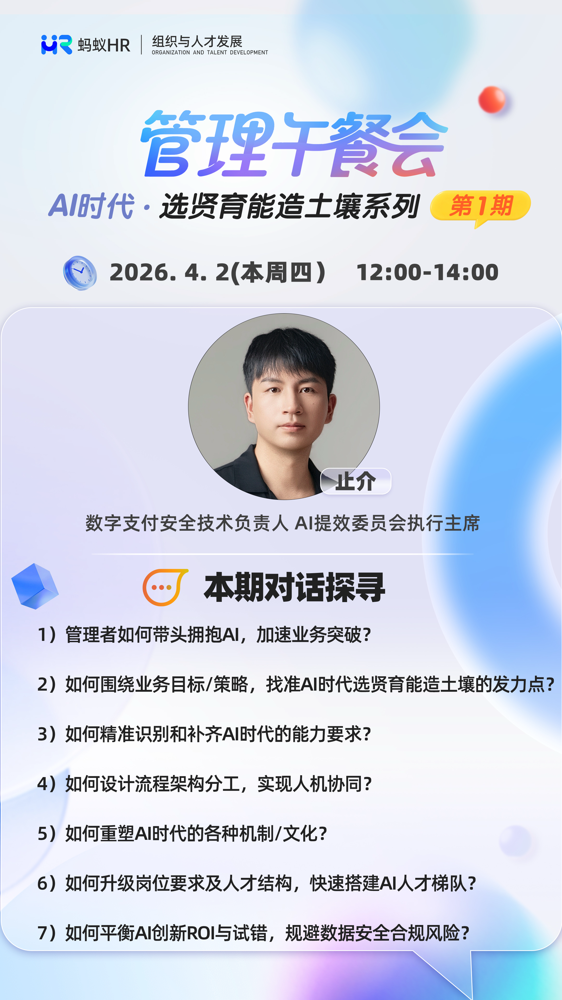

# AI组织转型分享

## 1. 为什么要成立AI效能委员会？

我们当时判断这事（AI提效）不太可能会自然发生。更大的可能性是，每个同学确实应用了AI，可能在coding或某些场景里面应用了，但最终整个组织其实不会发生大的改变。

这也是我们当前公司的一个现状。大家会发现我们公司的AI coding占比已经非常高了，现在差不多是65%，最近两周每周推进了10%，应该是整个蚂蚁里面也很高了。但是，我们发现最终需求端到端的交付周期，它的速度并没有太大的变化。这里面到底出现了什么问题呢？

我们觉得有些问题它不会被人主动解决，必须得有一个组织来牵引，让这些问题能够被解决掉。更多的可能是聚焦在这种跨角色的协同、原有工作流甚至流水线的重塑，这些是自然发生不了的。所以我们会聚焦在这部分事情，至于每个团队本身要做的一些AI提效的事情，我们就不会太多的去关注。

理清楚了AI委员会存在的价值之后，我们就会考虑我们的目标是什么。毕竟它还是一个组织，可能会长期存在。在这样的前提下，我们一定得在最开始想清楚我们这个组织到底打算往哪里走，以及我们怎么走到那个方向上去。

## 2. 委员会的愿景与使命

所以我们成立了一个公司 AI提效委员会，我作为执行主席。我们本质上在解一个什么问题呢？就是希望让每一个人都能以十倍的效能创造价值。

我们的路径，是通过AI重塑现在所有的工作方式，让我们的人专注于价值洞察和创新，其他的重复性工作，基本上都不需要他干了。这是一个全员性的组织，CTO牵头，各个技术域的一号位都参与进来。

- **愿景**：让每一个人都能以十倍的效能创造价值。这里的"每一个人"不只是技术同学，虽然我们现在主要聚焦在工程师的场景里面，但当我们把这一层解决了，一定会有向其他的岗位去推进的。"十倍"更多的是一个量级，而不是一个准确的数字定量。它的定义还是"创造价值"。很多人对AI提效的理解不太相同，我们觉得整体还是要围绕最终要做什么价值。
- **使命**：推动AI重塑我们的工作方式。这个非常关键，不是说让每个人把AI用起来，我们的目标就能达成。我们一定要把我们原先的工作流、角色岗位、职责、边界全部都要改掉。因为原先的这一套东西全部都是为原先那套生产关系所设计的，今天我们的生产关系可能都会发生改变。最终我们会让AI去做各种偏执行的事情，我们人可以专注于做价值洞见和创新相关的事情。

## 3. 问题与目标

我们的挑战在于几层：

1. **能力层**：我们发过全员问卷，发现绝大部分人当前最困扰的问题是AI的算力和工具保障（注：在集团提供外部模型前）。当你真的用过了最好的模型后，会发现和其它模型存在代差，这种差别体现在使用的幸福感以及真实效率上。必须能让大家用上外部工具和头部模型，只要用上了就回不去了，不用别人催，自己就不太会手写代码了。其次是安全合规风险的担忧，大家担心自己的代码使用外部模型会不会存在风险，我从一开始对这件事持有的态度是支持内部代码使用外部模型（具体原因见文末问答部分）。
2. **现有流程的AI赋能**：当解决了基本的工具和模型层面的障碍后，大家的AI Token消耗和AI Coding占比快速提升起来了，不需要催促大家使用，真正的效率提升是会自然传播的。但我们发现纯粹用AI写代码，虽然在"写"这个环节效率很高，但通盘看整个流程，整体效率提升有限。因为大量时间消耗在写代码前（跟产品开会对需求）和写代码后（发布、测试等环节）。
3. **流程与角色的重塑**：当我们在研发流水线的每个环节每个角色都充分利用了AI之后，效率一定会有明显提升。但过去的经验告诉我们，当纺织厂将蒸汽机改成了电击后效率并没有质的飞跃，反倒是福特改良了生产线，改变了生产效率。我们当前的研发流程和角色分工也是为传统软件工程设计的，这些不改变，最终的效率很难倍数级。

**三大目标（2026年年度目标）**：

1. **端到端需求交付周期缩短50%**：这是我们最核心的目标，用同样的人做更多的需求。我们觉得如果目标定成20%或30%，同学们的做法就会变形，可能会去加班或用其他方式做到提效结果，这不是我们想看到的。我们希望大家要想怎么样达成这个不可能的目标，你可能没有别的路子了，今天只有AI这条路。
2. **单位需求必要的人工介入、角色交接次数减少50%**：在原有的职责分工下，一个需求要涉及大量的角色和人员，就算每个人的效率都起来了，协同成本也非常高。我们希望能够按照理想状态去设计整个工作流程甚至角色分工。
3. **核心人员AI提效覆盖率100%**：这是一个从下到上的逻辑，我们希望每个人都能够真的把AI应用在自己的实际工作流过程中。

## 4. 委员会的组织架构与实践路径（"三步走"）

这件事不应该按照传统项目管理的模式，将目标抽象成几件事，然后各自认领去解决。这样非常容易出现每件事都做完了，但整体效率变化不大。我们的做法是，委员会层面要想清楚我们当前可预见的终态到底应该是什么样子，基于这个状态，我们反向的推导到底要做哪几件事儿。选调适合做这些事情的人组成执行小组，CTO D层面的作为顾问和Sponsor的角色，不应该做执行的角色。

我们的推导逻辑是：人人能力都能被AI放大 → AI能帮我沉淀技能，甚至做执行，人只需要做判断 → 改变原先的研发流程、重塑研发流 → 对应研发流的角色岗位也发生变化。

整体围绕这个逻辑，我们规划了三件事情：

1. **第一步：打造所有专业岗工程师的"数字分身"**。核心是把所有专业最核心的一些能力沉淀为可复用的技能（Skill），然后把这些技能组合起来，变成它的数字分身，让这些数字分身真的去替代他原先那些偏执行的工作。这个事儿我们不是凭空想出来的，在安全领域，我们已经可以做到这个程度了。这个事的逻辑，我们觉得还是应该从上往下推。你这个角色到底最重要的技能是什么？最重要的知识是什么？怎么把这些沉淀下来？你必须要按照这个目标去沉淀。在整个公司要统一按照这套逻辑去推进。
2. **第二步：探索AI原生的研发流**。我们发现很多其他的公司把后端研发工程师的角色做成了AI，让这个AI角色基于现有的工作流去找产品问需求、写代码。但你会发现这条路走下去，提效是有限的，你只有把最终的工作流给他重构掉。我们怎么重构？我们今天设立了几个"特区"实验田，让他们去探索不同复杂度类型的需求（如AI原生产品、面向B端、面向C端、面向支付复杂链路等），端到端的最终实现和技能的沉淀。它的解法不一定是一套方法论就能覆盖的。我们希望各个团队围绕课题探索出来，交付的是他们的最佳实践、沉淀出来的Skill以及过程中的规范标准。这些沉淀下来，我们那个平台就自然而然会产生了。这里也涉及到一个我们原先走的弯路：我们原先第一步就想把平台建起来，提供全流程一站式搞定。但发现这个事儿太理想了，落不下来，因为每个场景的差异性太大了。此外，基础模型以及上层通用Agent工具的能力变化非常大，我们的平台很可能做完就落后了。因此，我们应该要抓住那些不太会变化的部分。
3. **第三步：推动组织机制与角色进化**。假设这个事儿做成了，终态可能就是"少数的专家 + 大量专业Agent"来做协作。这意味着我们现有的非常多工程师，他不再需要做原先那些非常重复执行的工作了，就需要有其它的发展路径。
   - **专业岗工程师**：比如安全工程师，以前是参与大量的评估工作，现在工作模式已经变了，我们会维护好安全的"数字分身"，让他去把那些执行的工作都做好，而工程师更多地去维护我们这个能力的效果，怎么把它做得更好。随着AI对软件技术的革新，攻击者也会使用AI，导致两边需要不断对抗，不断要去面对新的风险。
   - **研发工程师**：他的发展路径可能是从后端研发演变成前后端通吃的研发工程师，甚至是再往后一步，演变成AI全栈工程师，要懂质量、懂安全，再往后可能还要懂产品。最终这个角色可能啥都会，有点像"一专多才"的角色，往"超级个体"去发展。

## 5. 核心实践案例：安全领域的"数字分身"

我们在安全领域基于Claude去做了一个7\*24小时的"数字分身"平台（蚁窝），核心是让所有的工作都能有一个虚拟的人真的在帮我们干活。

- **基础原子能力**：我们日常工作本质上就是基于上下文的原子能力的组合。这里的原子能力有很多层，包括最原始基础的API层（语雀/代码库/ODPS/开放接口等），上层是MCP/CLI/Tool（将API封装成可稳定调用的原子操作，比如dingtalk-bot、db-query-cli等）。我们会把非常多基础原子能力先给它做好，比如访问某个接口、拿到某个需求在Dima里的信息等。
- **沉淀Skill**：安全工程师也分不同角色，有做代码审计的，有做渗透测试的。他们的经验要基于自己的领域专业知识去操作那些原子能力，我们怎么样能把它沉淀下来（领域规则、测试集、单点经验、工作流SOP等）。这个平台的核心就是让你能够以非常低的成本来写一个新的Skill。
- **重塑工作流**：当你把工作完成AI化之后，会发现效果可能还是有限，因为你还是在原有的工作流中完成。我们之前重点做代码审计，做完后发现安全工程师确实不用做代码审计了，但大部分时间都去处理工单、沟通协作。我们后面就把整个安全工作的全链路全搬到这个平台上，并且重塑了。我们把安全依赖的各种上下文信息、事件、原始数据做一层统一收口，然后我们写技能的时候，就可以方便地拿到所需的数据和事件触发。整个安全工作的流水线就能快速的调整和复用。
- **数字员工的交互**：我们会为他申请一个拟人的钉钉账号（目前是机器人，后续可以是员工账号），这个人是真的可以复刻我们原先员工的所有的技能。你可以跟他聊天，让他干任何的事情。他在做各种事情的过程中，如果有什么需要信息澄清的，他就会主动的去联系对应的人。

## 6. 对未来组织形态与人才发展的思考

- **组织模式**：未来组织可能会变得比较扁平。之前推演过，未来中层纯管理角色将大幅减少，变成少数专家+大量agent模式。中层管理的原有个人竞争优势（知识广度、专业域能力深度）和管理能力（上传下达、协调、决策）都将被使用AI的超级个体快速抹平。
- **绩效与文化**：我们目前全员宣导，让所有的管理者和工程师把AI提效作为他最重要的一个目标。在今天这个时间节点，这件事已经是一件高度确定性的事情，不再是某一小部分人的事情，这不仅关系着组织的效率，更是每个人自身的竞争力。
- **人岗匹配**：
  - 从执行者到AI管理者：人必须还是要为AI的结果负责。虽然我们希望AI能更全地接管人的职责，但是你必须得为他设定一个负责人，那个负责人要为他的所有结果负责。
  - 从专才到通才：这是未来的发展方向。
  - 岗位安全感：当"数字分身"做好后，比如我们觉得今年就可以做到80%的安全领域任务都能够做到"数字分身"里面去，这意味着大量的人员变动，其实对我们安全核心的保障目标不会有太大的变化和影响。

## Q&A

### Q1：管理者如何带头拥抱AI，加速业务突破？

这个问题我做了一下拆解。首先要回答的是，管理者为什么要在其中发挥作用？核心是，如果你自己不用AI，你作为管理者的核心竞争力是否还在？

今天的这个技术革新跟以前不太一样，它不是某一个领域，而是在完全颠覆原先的整个技术模式。你不能再像对待以前那些技术的逻辑一样，觉得"先让他跑跑看，我等后面稳定下来再去学习也不迟"，那个时候就迟了。

AI能够放大我们每个人的能力，它会让强者更强。原先我们管理者为什么相对更强一些？因为在经验、技术能力、信息能力、判断力上都会比其他人更强。但是今天AI能快速的拉平你所谓的这些优势。知识层面是共识，当"数字分身"做好，你在技能和能力层面也会被快速拉平。当你的技能和知识都不是优势了，你还剩什么优势？

另外一层，团队的行为往往是主管行为的映射。如果你自己本身没有带头用AI，我相信你团队的同学不一定会对这个事儿有多么的积极。你自己动了，团队才会跟着动。

怎么带头拥抱？首先意识上要做转变。意识上改变了之后，再看怎么做。核心还是怎么样去结合你自身的工作，去放大你的能力，包括怎么样去提升团队的效率和效果。

举个决策质量的例子。原先很多主管的工作是下属做了一个方案提交给他，让他去判断。今天我们不需要这样的主管。因为我在做每一个决策之前，可以充分地让AI去模拟各种角色，模拟我的主管、我的客户、我方案里的所有角色，让他从不同维度去评价我这套方案和我做这个决策的合理性，我再去做最终的判断。我现在所有的事情，无论是委员会还是安全团队内部，都是按照这套逻辑在做。当你这么做了之后，你所有的方案再去跟别人讲的时候，别人提不出来太多问题，别人想不到的你都想到了。这也是一种提效，原先我们花了大量的时间在会议、对焦上，今天我们不需要再做这些事情。

### Q2：如何围绕业务目标，找准AI时代的选、贤、育、能的发力点？

我把这个问题转换成：我们到底应该怎么样创造一个土壤，让更多的AI人才长出来？按照我们目前团队的一些实践，有几个点：

1. 让大家能低成本地用上最先进的AI：你只有用上了最先进的AI，才能感受到这个效能的提升。你会发现笨模型和聪明模型真的差距很大。
2. 识别工作中耗时耗力的部分：所有的AI应用，还是要围绕我们最终能真实产生价值的那部分事情。我发现很多人在"养"AI，"创造"AI使用的提效需求，但这个需求对你到底真的有多大提升，要打一个非常大的问号。
3. 让大家敢用AI：要营造一个鼓励试错的氛围。
4. 让一部分AI先行者被看见和被认可：无论是在口头上的表扬，还是在实际的绩效、精神上，都让大家能够看到，这个才是对大家自己最有价值的。
5. 帮助大家转变认知：要让团队的每个同学都意识到，如果你不用AI，你的竞争力到底是什么。以及消除大家对AI协作的担心，比如觉得AI把活都干了，自己以后干啥。

### Q3：如何精准识别和补齐AI时代的能力要求？（个人如何在AI时代有更好的发展）

这个问题可以转化为：在知识和专业技能都不再是核心竞争力的前提下，什么才是我们最应该关注的？

我们不能用旧时代的逻辑来应对新时代的挑战。如果你要学习更多的知识，或者通过掌握更稀缺、短期不太被AI替代的技能，这条路线是走不通的。这就像以前的马夫，你就算把马训练得再好，也跑不过汽车。

我们判断有一点是比较确认的，就是判断力。这个点是几乎所有TL（技术负责人）的共识。今天的AI能给你一堆的分析信息、建议和思考选项，但他没办法告诉你哪个是真正重要的，也没办法帮你做取舍。所以判断力在目前是非常明确且确定的。

作为个人，应该怎么做好能力转型？

1. 借助AI快速吸收和迭代认知：AI的知识很多，但那不是你的。你应该做的是借助AI帮你更快速地吸收和学习知识，快速迭代自己的认知，然后用自己的语言内化成自己的知识，并应用到实践中。
2. 提升定义问题和创造方向的能力：当执行不再是壁垒时，最重要的反倒是你怎么样能敏锐地抓住各种机会，并能够快速落地，你就比别人先一步。
3. 向全才发展，成为"超级个体"：我们不用再限制说我们团队就只能干安全的活，研发、产品等各种领域的活儿我们都有可能干。从现在开始，我们就要以一个企业CEO的视角去看待各种事情，不用局限在我自己现在的岗位职责范围。

### Q4：有同学提到AI时代更忙了，业务不能停，又要组织转型，这种困局怎么解？

大家在定义问题的时候，就把"更忙"和"转型"定义成了一个冲突。但实际上，我们做转型的目的就是让大家可以不用那么忙。我们组织转型、搞提效的目标，就是让大家不用去做执行的活儿，大部分的活儿，你的"数字分身"都可以帮你干。

如果你按照原先问题的逻辑拆解，你可能就得加人，然后只让少部分的人去做转型，这样会陷入一个死循环，你会越来越忙，加人也只能解决短期问题。

实施上怎么做？可以一小部分人先开始，从那些高频、非常耗时间精力的事情上先开始。这里面还有一个关键点：今天大家可以选择不转型，可以天天去忙业务。但是，你如果不这么做，你自身的竞争力是会有限的。其他的同学用AI放大了他的能力之后，竞争力如果比你更强，那你到时候可能就要为你自己的这个选择承担后面的结果。这个点一定要认清楚。

用了AI更忙了。我自己也深有同感，有了AI之后，执行的事情都被接管了，脑海中各种想法都能快速的被落地，就会想着都实现掉，这时候我的注意力反而成为了瓶颈。我的休息时间反而是AI用量耗尽时或者执行复杂任务的等待时间。但这个更忙的背后，就是效率的飞升，只不过对于个人来说这种状态如何能够长期可持续，还需要再探索。

### Q5：在AI转型中，发现原有产研协同的组织惯性很强，不同业务团队都想自己搭建共性能力的平台，导致重复建设和争论，效率不高。应该如何解决？

我们原先怕出现这样的情况，所以才成立委员会。因为每个人都有自己的屁股和利益，他只会站在自己的视角讲"我做这个东西，我有成果"。

今天我们成立这个委员会，就是希望拉通，把那些应该大家一起干、效率最高的那一部分抽离出来。哪怕退一步讲，我们也有专业域的各种能力沉淀（Skill），别人要改也是可以基于原先已经干好的那部分快速复制过去，而不是重干一套，那个成本很高。

但今天你这个问题到底应该怎么解？你拉他们两方可能很难达成共识，我觉得你就可以上升一下，让委员会或者是他们的上层去做决策，让一个无利益相关的第三方来判断。我作为安全负责人，既不做业务，也不做研发，我是没有立场的，我让谁干什么事情，都是从毫无利益的最优解视角去出发的。需要有第三方客观一点，或者更高层来做判断。

### Q6：AI提效后，理论上不需要这么多人了，大家会担心裁员，这个问题怎么看？

这个问题我从个人立场来看。假设我们这个事儿做成了，要分两个大的逻辑去看：

1. **理想情况**：我们每个人的效率提升了，公司的效率也提升了，公司的业务发展找到了很多新的突破点，有了更好的发展。那个时候我们可能不是裁员，而是需要更多的人。
2. **现实情况**：我原先要十个人干的活，现在只要一个人干了，怎么办？我们目前的思路是，我要给大家留好一个口子，这个口子是告诉你我们需要什么样的人。
   - 一条路是成为"专家"：也就是我们前面讲的"少数的专家 + 大量的Agent"里的那个专家。我们希望现有的大部分工程师，尤其是后端、质量、前端，能够有机会往这个方向去走，这是他的一条可以成长的路径。
   - 另一条路是维护Agent：大量的Agent其实是要有人维护的，要不断迭代的，这也是需要一部分人力投入的。
   - 还有就是新的安全岗位：当防御者用AI提效，攻击者也用AI，安全就变成了对抗性质，会产生各种新的安全问题，我也要派一部分人去研究那样的事情。

我们会去考虑每个同学最终到底可以往哪个方向发展。当然，前面两部分一定会存在消化不了所有人的问题。我能做的是，我会告诉我团队的同学们，应该超那个最终的方向去努力，但一定有些人重视有些人走的快一些，剩下的事情不是我能决定的。

### Q7：主管的AI和员工的AI，在团队里职责分工和关系是怎样的？

我初步的想法是，你现在是怎么带真人员工的，到时候怎么带那个虚拟的员工，其实逻辑是可以衔接过去的。

实际上大家在使用AI时会觉得AI有很多问题，有些是认知没转换过来，有些是它确实不稳定，今天好明天就不好。这会导致大家不敢把更有质量要求的任务交给它。所以怎么去保证它产出的稳定性是一个非常重要的事。

我们委员会的策略不是说今天就要所有场景都深入去用。我们的目标是做了拆解的，比如今年先解决那50%偏人力投入比较小、不涉及跨系统、跨大量团队的需求，这一类我们的信心和确定性非常高。

在过程中，它还是会存在各种幻觉或模型本身的问题。这个问题要分层来看：

1. **定义清晰的能力边界**：我们做的Agent或者Skill，肯定不可能完全复制人所有的能力。我们要清晰地定义出来它的能力边界是什么，在当前阶段可能就是处理一部分偏执行和基础的事情，圈定好之后，其他的场景还是要交给人来处理。
2. **做好验证工作**：在安全领域，我们会去做非常多的验证工作，说白了就是测试集。我们要确保我们每一次Skill的迭代，真的能回溯发现历史上所有能发现的漏洞。研发视角可能也是类似的逻辑，无论是单元测试、回归测试，是不是能帮你去兜底前面的一些问题。

### Q8：我们现在大多关注用AI提效、改变工作方式，但对于人本身的判断力、创造力等特质的提升，委员会是怎么考虑的？

我们委员会里面有一块事情就是"角色进化"，它里面的命题就是要去解答"我这个人到底是怎么样的，AI如何协作，我的职责是什么，我怎么样能让我现在的这些人能够发展成为我们所期待的那个角色"。这里面就会包括你说的，我怎么样去激发他，或者怎么样定义他的职责。这个命题我们正在做探索，但还是比较早期。

这个问题其实也是在为未来的事情做准备。如果我们在这个阶段能一定程度回答这个问题，可能也会化解一些人当下的焦虑。现在的问题就是大家想不通，因为按照原先的逻辑，我有一堆"数字员工"替我干活了，那我最终应该往哪个方向发展，这个路径其实他完全不知道。所以这一层是应该要透传给大家的。

### Q9：组织变革：AI时代下，岗位、协同与梯队将如何演变？

1. **岗位要求发生根本性变化**：我们认为所有的岗位都需要被重新定义。
   - 安全工程师：从亲自执行代码审计，变成维护好自己的AI分身，确保其工作质量达到预期。
   - 前端与后端融合：我们已经有业务线在做融合。前端提供基础能力后，后端可以自己做前端的活；前端也要去做全链路的活，成为"全栈工程师"或"超级个体"。测试未来也可能走这条路。
2. **人机协同成为主流**：未来的组织形态就是"少数的专家 + 大量的AI Agent"。
3. **协同模式改变**：我们的目标是让参与一个需求的角色尽可能少，极致状态下可能就是一个人，甚至不是人，而是AI。因为角色越多，协同成本越高。

### Q10：如何看待AI替代人工作后的风险和责任问题？

1. **人不能完全放手**：我们的经验是，如果你期待把人完全解放出来，直接让AI接管所有流程，会带来非常大的风险。因为我们脑海里有很多隐性的知识，不一定都沉淀成了Skill。
2. **定义AI的边界，建立测试集**：人需要判断哪些是100%可以交给AI做的，哪些是自己必须把关的。同时，要建立完善的测试集，来评测AI能力的变化和影响。
3. **责任主体必须是人**：AI不能担责，责任最终一定得明确到人。AI干的活，背后是谁的AI，就由这个人对结果负责。

### Q11：在新的组织形态下，人才梯队建设会有什么变化？

1. **不再担心专家离职带走经验**：当我们把专家经验全部沉淀成Skill后，就不再担心人走经验失。新人不会从零再建一遍，他可以接手维护这些沉淀下来的Skill，备份机制反而更强了。
2. **组织层级将变得非常扁平**：未来的梯队不需要那么多层级。一线员工带AI干活，主管也从"带人"转型为"带AI"，一个主管带少量的人，每个人再带一堆AI。
3. **"全才"将成为主流**：未来的人才结构是"人+AI"的结构，而这个"人"需要是"全才"，原来我们程序员自嘲的螺丝钉情况将大幅减少，懂研发各岗位的同时，又懂产品和业务等将来也会成为主流，我们也在尝试挖掘和培养这样的人才。

### Q12：加速转型：如何克服阻力，让更多人拥抱AI？

1. **最大阻力是触碰到了很多人的利益**：因为可能会导致人员减少，工作范围融合，或者需要干更多的活，很多人会非常抗拒。
2. **最有效的方式是"残忍"一点**：当你的人减少，或者不给你加人，但要干更多的活时，你自然会被倒逼着去用AI。说再多其实没用，他不痛。就像之前老板在直播时说的，不给加人，但可以给加Token和算力预算，这就是一个非常好的方式。
3. **自上而下地强力牵引**：
   - 高层重视：我们从CTO层面就进行全员宣导，让大家感受到高层对这个事的重视。每周CTO都会过相关事情的进展和风险，各种激励、宣导相关配套工作也会围绕AI提效去建设。
   - KPI强压：每个人都有自己的认知和屁股，通过沟通对齐的成本非常高，我们给所有管理者定了KPI，明确AI提效是他们的第一责任，让所有人里往一处使。
   - 全员要求：我们给全员发信，要求每一位工程师，AI提效的成果必须作为个人绩效目标的重要组成部分。

### Q13：很多人担心使用AI工具的安全合规问题，比如内部代码外泄，你们怎么看？

1. **重新定义核心资产**：过去，代码和产品是我们的核心资产。但今天，做一个产品的技术壁垒几乎为零，你最重要的资产是你的创意灵感和用户洞察，落下来就是你的Prompt/Skill。
2. **区分场景，大胆使用**：大部分研发担忧的是内部代码能否用外部模型。我的看法是，只要你的代码里不包含硬编码的密钥、核心业务规则、有技术壁垒的实现，你就可以随便用。安全的作用就是让业务不用有这些担心，可以放心的向前跑，我们会在背后默默的去解决各种风险。不能因为合规的担忧，就放弃拥抱更强的生产力。
3. **外部模型的价值巨大**：当你真的用了外部的好模型之后，会发现跟内部模型的差距非常大。用一堆一般的模型，都比不上用一两个好的模型。

