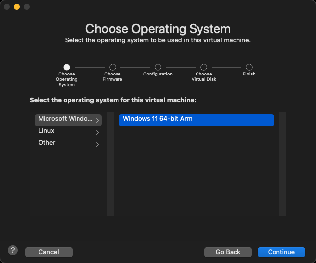
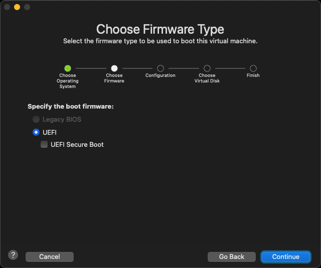
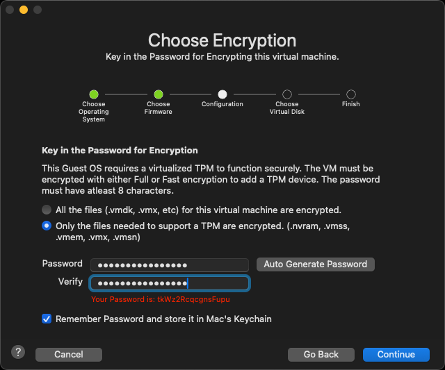
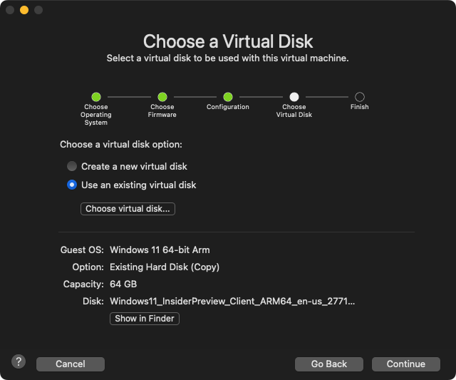
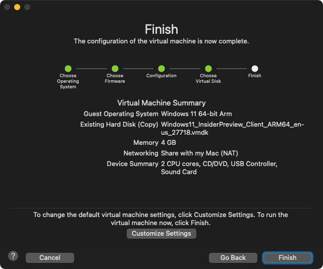
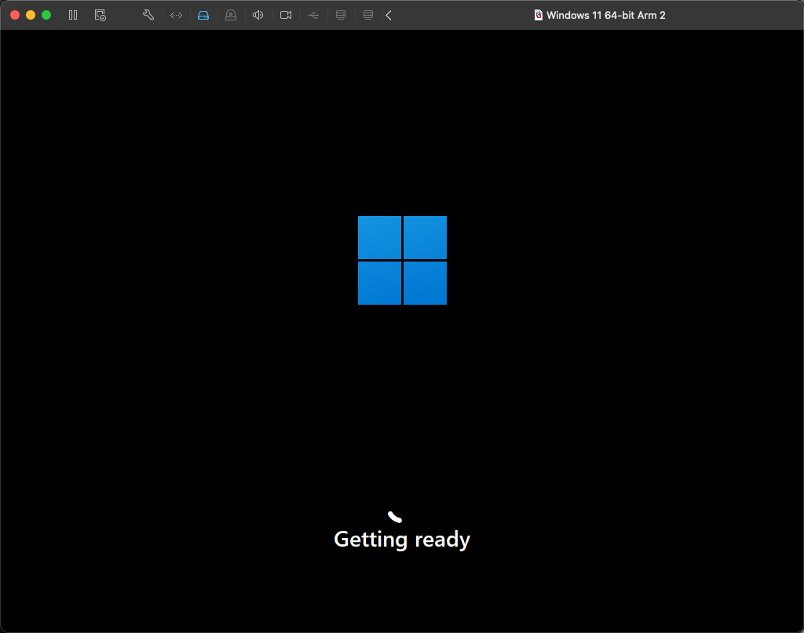
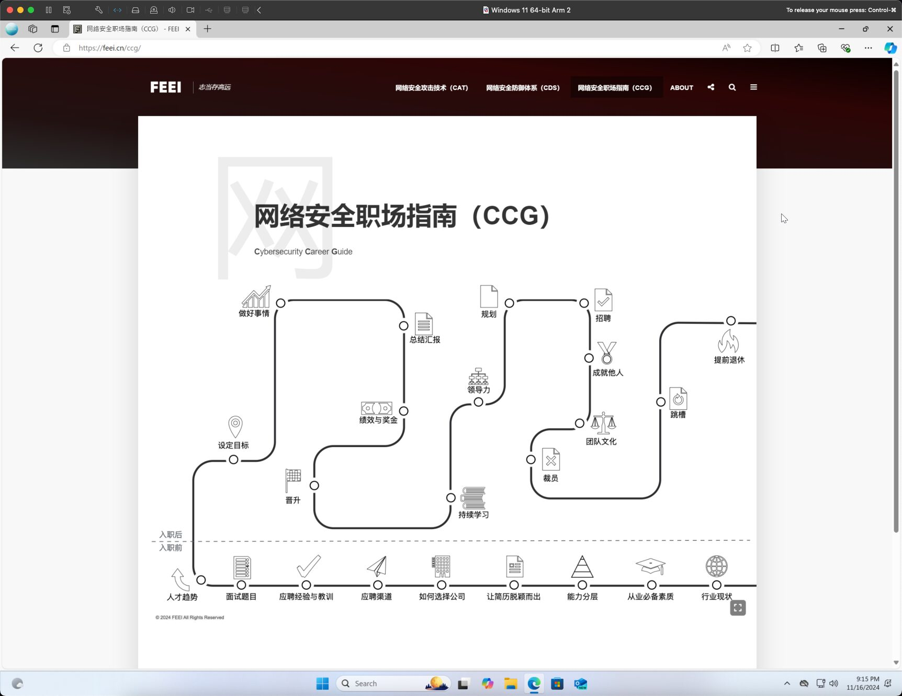

Parallels Desktop is too expensive, VMWare Fusion can be used as an alternative.

<!-- truncate -->

## Download ARM Windows11

[https://www.microsoft.com/en-us/windowsinsider/register](https://www.microsoft.com/en-us/windowsinsider/register)

## Download VMWare Fusion

[https://www.vmware.com/products/desktop-hypervisor/workstation-and-fusion](https://www.vmware.com/products/desktop-hypervisor/workstation-and-fusion)

[https://support.broadcom.com/group/ecx/productdownloads?subfamily=VMware%20Fusion](https://support.broadcom.com/group/ecx/productdownloads?subfamily=VMware%20Fusion)

### Change extension .VHDX TO .VMDK

```bash
brew install qemu

qemu-img convert -O vmdk Windows11_InsiderPreview_Client_ARM64_en-us_27718.VHDX Windows11_InsiderPreview_Client_ARM64_en-us_27718.VMDK -p
```

## Install Windows on VMware Fusion








## Active Windows 11

Activate Windows11 using[Microsoft-Activation-Scripts](https://github.com/massgravel/Microsoft-Activation-Scripts)script.

```bash
irm https://massgrave.dev/get | iex
```


