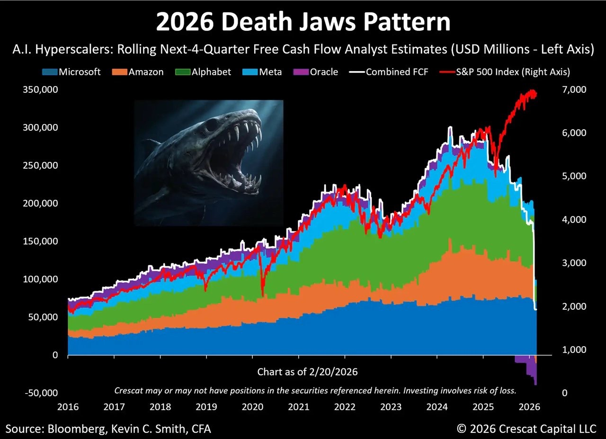
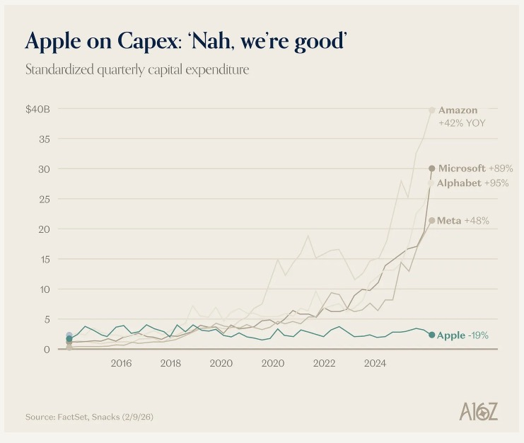

## 2026 Death Jaws Pattern

*来源：Bloomberg, Kevin C. Smith, CFA / Crescat Capital（2026年2月）*

图表展示了 AI 超大规模公司（微软、亚马逊、Alphabet、Meta、甲骨文）合计自由现金流（FCF）的分析师预测，与 S&P500 指数走势的对比。

2024-2025 年，这五家公司将天量资本砸向 AI 基础设施，FCF 被持续压缩；与此同时 S&P500 在 AI 叙事驱动下持续走高。图中白线（合计 FCF）和红线（S&P500）的背离被称为"死亡剪刀差"——市场估值建立在对未来盈利的极度乐观预期上，而实际自由现金流却在下滑。

这个图的逻辑：AI Capex 的回报需要时间兑现。如果广泛的生产率提升没有如期到来，或者竞争导致 AI 服务定价被压低，这批公司的盈利预期将面临重新定价，而当前估值没有为此留出足够缓冲。

反驳方向：AI 投资周期类似铁路时代和互联网基础设施扩张期，短期 FCF 下滑是必要代价，最终受益规模将远超投入。这张图是空头视角，值得参考，但不是结论。

## Apple on Capex：Nah, we're good

*来源：FactSet, Snacks（2026年2月）*

当其他科技巨头大幅扩张资本支出——亚马逊 +42%、微软 +89%、Alphabet +95%、Meta +48%——Apple 的 Capex 反而下降 19%，是图中唯一一条几乎走平的曲线。

苹果不需要争夺算力市场份额，AI 策略是设备端推理（Apple Intelligence）加上与 OpenAI 等合作，而非自建数据中心，这让它能在不烧 Capex 的情况下享受 AI 叙事的红利。

风险在于：如果设备端 AI 不足以支撑下一代竞争优势，苹果将面临追赶成本更高的处境。
