在开始这次穿越之旅之前，我花了好几个月时间去改装车，让其在安全性、通过性、睡觉舒适性以及吃喝上花了大量精力。为了让他在正式自驾时更适应真实情况，我们还在杭州周边实验了越野、户外煮火锅，过夜。

在国庆节的第二天办完婚礼后，我们就踏上了这次长途自驾之旅，算是蜜月之旅吧。

<!-- truncate -->

## 夜宿丹东镇

一路从重庆直达甘孜丹巴县丹东镇，天已经黑了起来，但还是能感受到这里已经很美了。

快进入丹东镇的时候，看到路中间握着一只鹿？

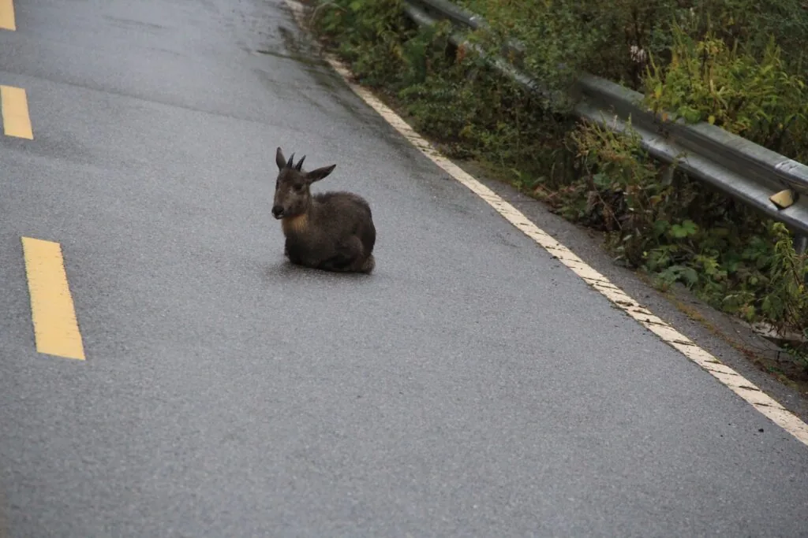
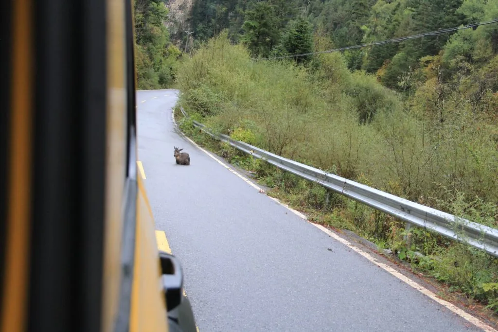

晚上就在丹东镇贸易中心（小卖部）旁，听着溪流声在车上睡了一夜。

## 云海旁火锅盛宴

接着开始向着牛肝马肺海进发，一路景色都很美。

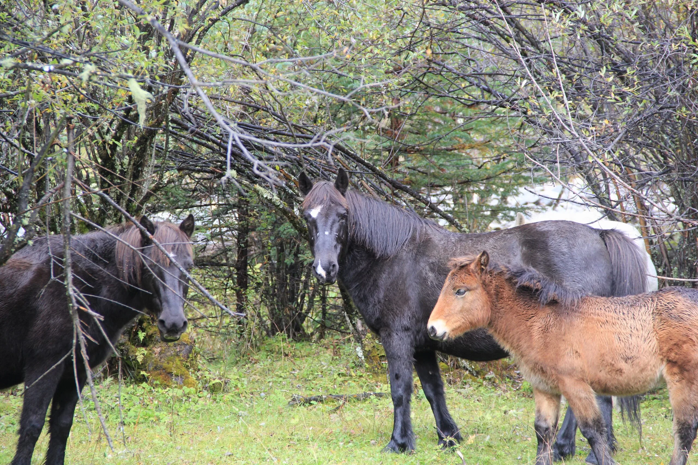
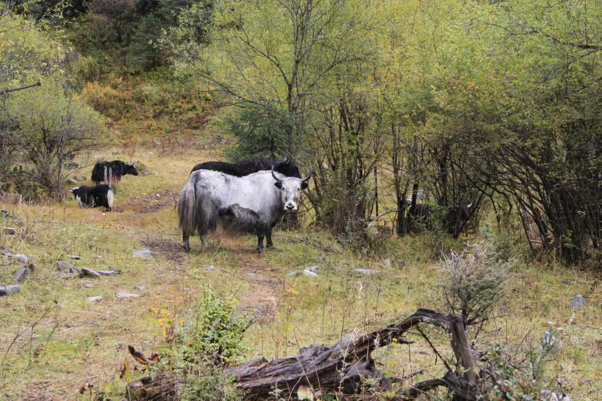
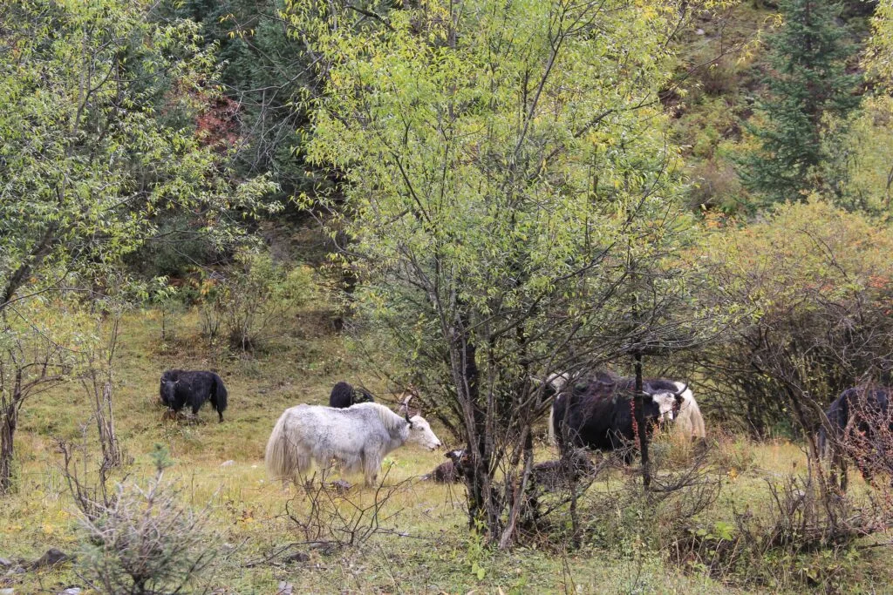
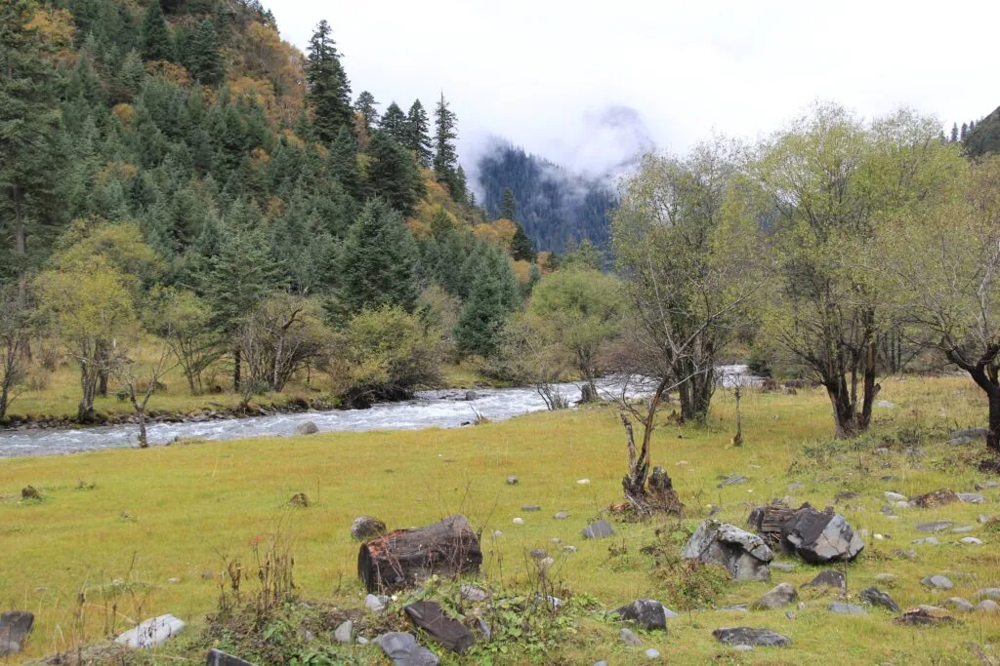
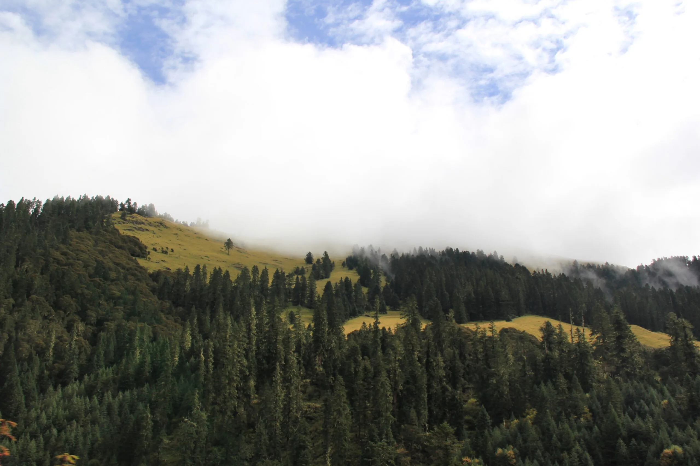
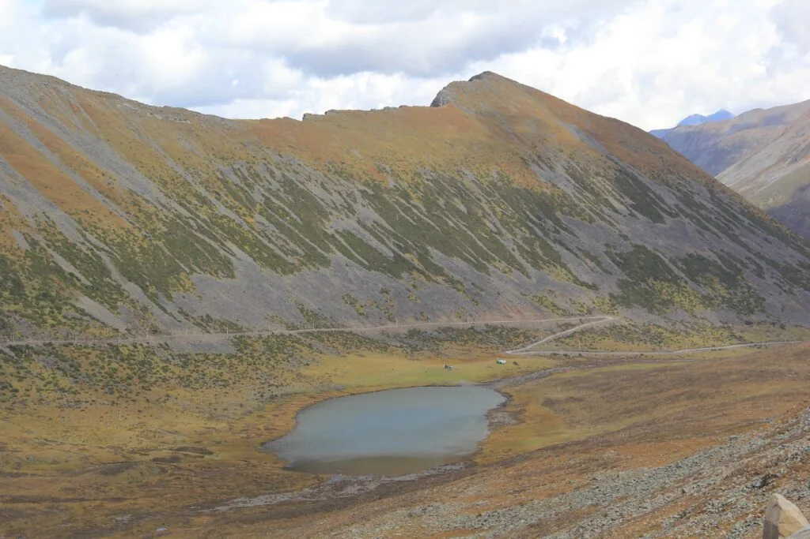
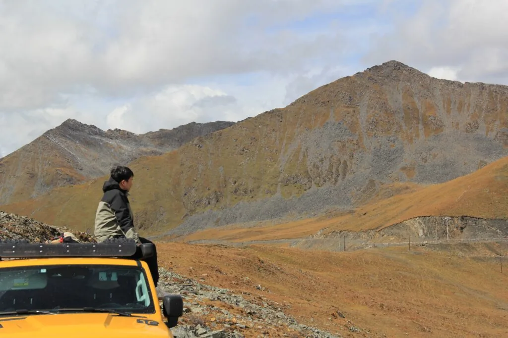

本打算去牛肝马肺海，结果经历了数个小时的颠簸，通过无人机寻路，发现走的这条路只能通到两个很靠近的海子（后来民宿老板说这叫双眼海子），而牛肝马肺海在山的另外一边。来都来了，决定继续硬着头皮向前。

到山顶后，天气也渐渐变得晴朗起来，天空非常蓝，白云就像在旁边悠闲地漂浮着。在这要是能吃上一顿火锅，那就完美了。于是赶紧支起了车侧边帐篷，摆上电磁炉和各种食材。

4000多米的海拔吃火锅，真是难忘的体验。

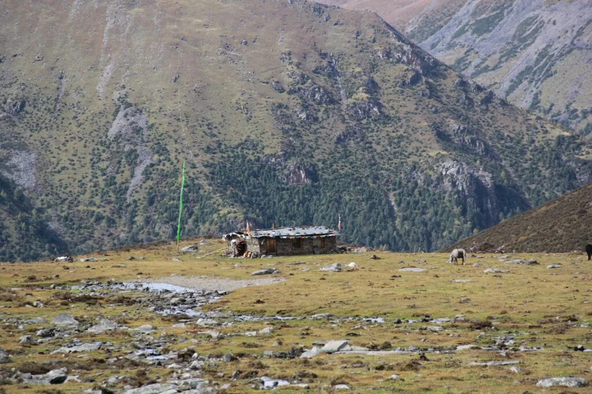
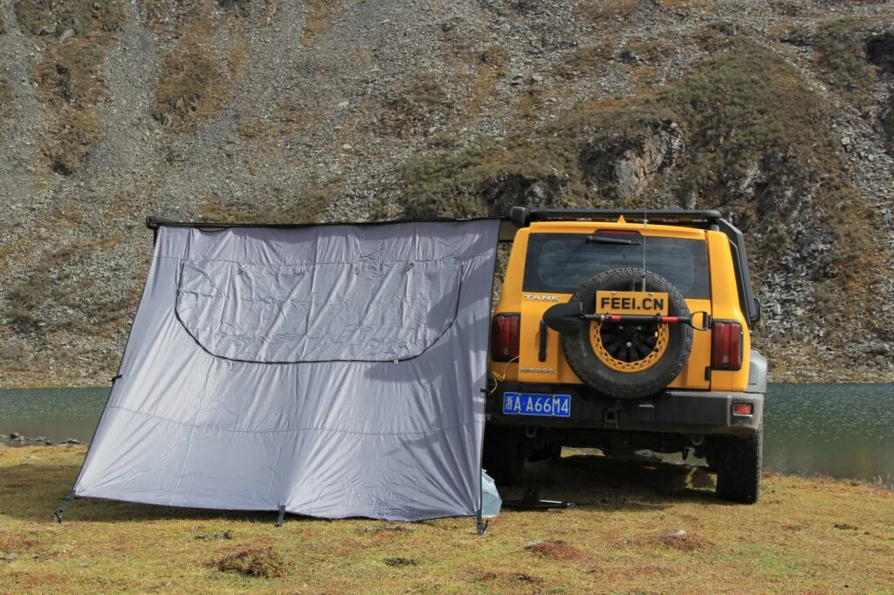

## 途径金川情人海

收拾好东西后，赶往下一个地点，金川情人海。

由于民宿条件有点差，我们决定把车停在院子里，只用它的卫生间，睡觉还是在车上。

土拨鼠派对：躺在没多久，院子里就传来了动静。一阵翻找的声音在黑暗中回荡。我迅速打开露营灯，朝着声音传来的方向望去，可因为黑暗一片，什么也看不清楚。于是我拿起手机，打开拍照模式，并放大画面。惊讶地发现几只可爱的土拨鼠正在垃圾堆中忙碌地寻找食物，它们忙碌的样子实在是太有趣了。

自恋鸟：第二天早上，我还在迷糊睡梦中，忽然感觉到后视镜上有什么东西。我定睛一看，竟然是一只鸟儿，它一次又一次地跑到后视镜前，仿佛在照镜子。然而，我的愉快时刻并没有持续太久。

顽皮牦牛：就在我把被子盖住头继续入眠时，突然一声巨响将我惊醒。我迅速打开车门，只见一只顽皮的牦牛正在院子里，撞倒了垃圾桶，眼神锐利地盯着我。我无法抵挡它那目不转睛的凝视，仿佛它在问我：“你在我地盘上干什么？”

起床洗漱后，立马驱车，途径金川情人海，没过多停留继续前行。

## 世外桃源阿科里

### 石头山

### 求援大货车

经过几十公里的颠簸与烂路，我们终于抵达了阿科里乡。

当我们到达乡时，发现乡里唯一的一条小路被一辆拖拉机拦住，只见一群人围绕在拖拉机和停靠在旁边的大货车旁。

原来是大货车没电了，他们正在用拖拉机给它搭电。然而，尽管他们尝试了很多次，却始终没有成功。我突然想起，我车上有一个应急电源，或许可以帮上一些忙。于是我取出应急电源，它的电量显示是100%。

我小心翼翼地将应急电源接到大货车上，希望能为它充电。在第一次尝试后，电量立即降至50%。再次尝试，电量迅速下降到15%。应急电源无法为大货车充电，显然是承载不了这样的负荷。

大家面对这种情况无奈地摇了摇头，没有更长的搭电线，也无法使用我的车电瓶进行搭电。于是，拖拉机开始倒退至路口，为我们让出道路。大货车司机对我微笑着表示感谢。

### 误入桃花源：阿科里村

再往前走了几公里后，开始被眼前的景象所震撼。这座世外桃源般的小村子展现在我们眼前。

阿科里村位于崇山峻岭之间，四周被茂密的树林环绕。小村的房屋以木质结构为主，散落在绿草如茵的山谷之中。村里的居民和善且友好，他们用纯朴的笑容迎接我们的到来。我感受到了这里的宁静和和谐，仿佛时间在这里静止了一般。这个小村子没有繁华的城市喧嚣，没有忙碌的都市生活，只有宁静与自然的美好。

在这座世外桃源的小村子里，我们感受到了生活的本真与简单。远离尘嚣和喧嚣的城市，我们重新连接了与大自然的纽带。在夜晚的宁静中，我们数星星、聆听蛙鸣，仿佛回到了童年的时光。

## 穿越阿科里-莫斯卡

### 油料危机

我和老婆焦虑地站在阿克里村的小卖部前，接下来的穿越之旅将充满挑战。我们的车的油量已经不多了，而这段路上却没有加油站。我们开始寻找解决办法，希望能够找到散油来继续前行。

我们询问了附近骑摩托车的人，得知有一家小卖部卖散油。我们迅速赶往那家小卖部，希望能够购买到足够的散油来继续我们的穿越之旅。

当我们抵达小卖部时，看到柜台上放着几瓶散油，上面标着价格。卖油的店主告诉我们，每壶散油的价格是50元，每壶有5升。我们算了一下，我们的车辆剩余油量并不多，我们需要至少四壶散油才能确保足够的燃料供应。

尽管价格有些高昂，但我们知道这是我们继续前行的唯一选择。我们购买了四壶散油，支付了200元。随着散油放进我们的车辆，我们感到一股安心，至少现在我们不再为油量不足而担心了。

随着车辆驶离阿克里村，向着未知驶去。

### 单车极限穿越之路

此时，才算正式开启了这次穿越路线中难度最高的阶段。

路途中充满了崎岖的山路、陡峭的峡谷和泥泞的道路。野兔子、土拨鼠、老鹰以及牦牛伴随着他们的旅程，增添了一份与大自然亲密接触的奇妙感受。

我们驾车缓慢穿越着这片壮丽的高原风光，心情渐渐地放松下来。随着我们车辆行驶在路边，我们开始留意周围的自然生态。

突然，我们注意到路边一群牦牛都停下了吃草，看向我们的方向。它们的目光充满了好奇和惊讶，仿佛从未见过这个黄色的东西。我们停下车，陷入了一种尴尬的注目礼，与这些巨大的牦牛静静地对视着。继续前行，我们看到一片草地上有一大群土拨鼠在忙碌着。它们来回奔跑，不时地互相追逐和争斗。我们停下车观察着这些小动物们的生活，被它们的活力和顽皮所感染。

然而，我们的注意力被一对土拨鼠的激烈争斗吸引住。它们用前爪挥舞着，发出尖锐的叫声，似乎在为领地或食物展开激烈的战斗。又看到一只灰色的野兔，它在草丛中跳跃着。我们决定使用无人机来跟拍这只野兔的活动。我们将无人机起飞，追随着野兔的每一个跳跃，记录下它矫健的身姿和灵敏的反应。然而，正当我们沉浸在无人机的操控和拍摄中时，突然一只巨大的老鹰从天空中飞来。我们意识到无人机可能会引起老鹰的注意，可能导致无人机被炸机。我们赶紧将无人机收回，以免干扰到这只壮观的猛禽。

我们继续驾驶，穿越这片壮丽的高原风光，心中充满了对未知道路的期待。随着路线的转变，我们开始面临各种不同的路况和难度。

开始穿越雪山，上山的路还是比较容易的。

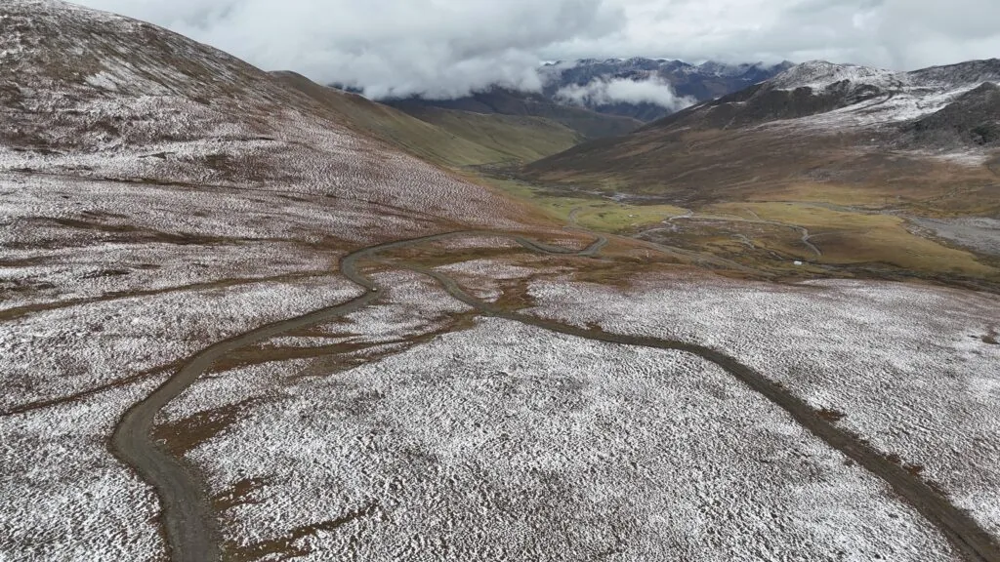

*default*

### 接二连三的挑战

翻过4700米的垭口后，马上给我来了第一个下马威。下山由于坡度较大，加上刚下过雪路特别滑，在泥泞的车辙走的话，打滑严重。于是走在车辙旁边的草地上，但还是发生了打滑，车尾向左侧滑90度。

下来观察了下，好在这个位置和角度哪怕溜坡，应该也不会翻车。于是回到车上，尝试了各种姿势，不仅没能往前，还在继续往下溜坡。由于第一次走这种类型路，还是非常紧张的，把老婆叫到一旁，真有什么不测，还能有人救援。

开始用石头、铁锹、脱困板，在折腾了一个多小时后，满手脚泥，终于脱困。

没走多远，山上雾气变得非常严重，只能看到眼前十来米，由于这条路走的车非常少，这时候已经难以分辨路了。担心走错后，再想回头就很难了。于是拿着无人机，向前一直探了几公里的路。

*路太滑了，没有防滑链，车都是斜着开的*

好家伙，怪不得说这里是川西拆车厂。淹没大半个轮子的泥泞路、巨石路、涉河路。难度高是高了点，但至少还是成功过来了。

已经能看到牧民的房子了，正当以为困难已经过去时，突如其来的危机再次出现。车辆在上一个向右侧斜的坡时，为了陷入中间巨深的泥泞车辙，选择了靠右边的草地。由于坡度较大，在草地上还是发生了侧滑，这个坡度侧滑问题也不大，但侧滑撞上了牧民的铁丝围栏上。整个车的右边重重的嵌在铁丝围栏上，铁丝被崩的非常紧。

尝试了前后挪动，由于向右侧滑，导致铁丝被崩的更紧。下车想把围栏给扒开，根本弄不动。再一次尝试了垫石头、铲泥巴、用脱困板，都没用。最后只能选择，牺牲车了。开始大油门前后撞击，整个车的侧面全部被挂伤，后视镜、轮眉都刮掉了，前后金属保险杠都勒出很深的痕迹。但还是没能出来。

真的绝望了，已经在这耽误太久了，天已经快黑了。冷静下来，开始想出不出去怎么办，车上的油料、电池电量、吃的和喝的能维持两个人几天没有问题。但这条路一辆车都没有看到，也没有手机信号，等救援不太可能。想到可以通过无人机带着求救纸条飞到最近的村庄，最差的情况就是徒步下山。

想好最坏的打算后，我还是有点不愿意放弃，决定再加大油门试试。也许是车抖动的太厉害，又或者老婆坐在副驾距离铁丝和车辆摩擦的声音太近，已经开始哭泣。

再一次铲好泥巴，垫好石头和脱困板后，加大油门在巨大的摩擦声中，终于往前开动了几米，到了没有泥坑的草地上。我激动的拍打方向盘，如释重负。

下车后，看到被车轮挠出的深坑、深陷泥里的脱困板、已经被撞歪的铁丝围栏，顿觉不易。将铁丝围栏摆正，简单收拾了下，又启程出发。

随着天色逐渐变暗，接下来的路程开始非常谨慎的选择路线，我遇到了攀岩大石头、深半米的泥坑。过了一段涉水半米的河道后，在地图上看到有路了，没开多久就看见了让我爱死的土路。这个时候，我真的太爱土路了！我知道，只要我一直坚持下去，离柏油路就不会太远了。

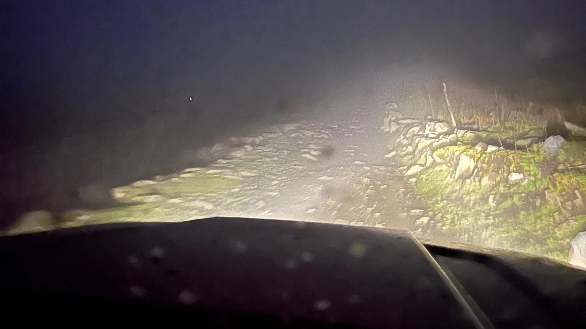

## 莫斯卡：土拨鼠和猴子的天堂

到了莫斯卡村已经是夜深了，我们找到了一家民宿，在用餐的过程中，老板好奇地询问我们为什么这么晚才到达，于是我们详细向他描述了我们的经历。听完后，老板告诉我们，在那条路上，即使是在晴天干燥的时候，也要最少两三辆车一起行动。而下雪时，几乎是不可能通行的，更别说一辆孤零零的车了。回过头想想，真的有点后怕。

*莫斯卡村一家民宿洗手间*

在莫斯卡村，接下来都是柏油路了，我又要开始下次穿越自驾的准备了。

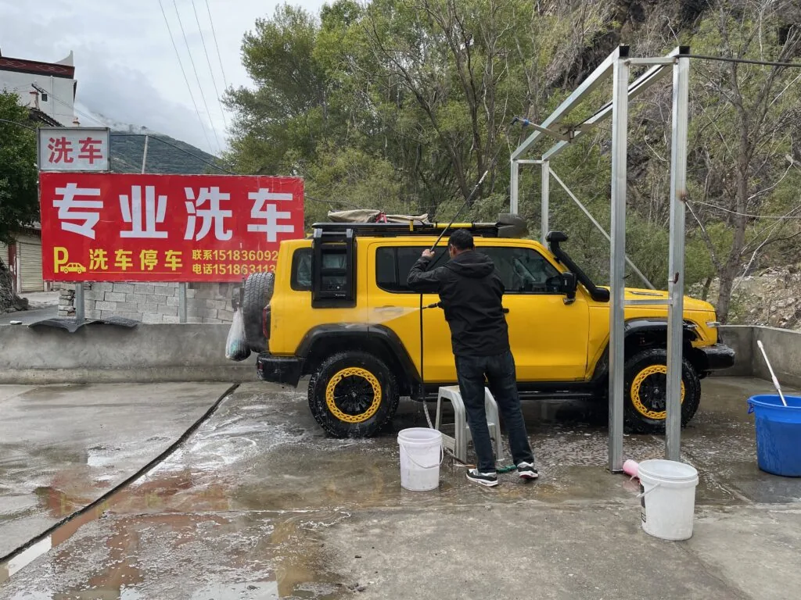

*之后从莫斯卡回到丹巴县城，将车洗干净*

*整个车右侧全部划伤了*
