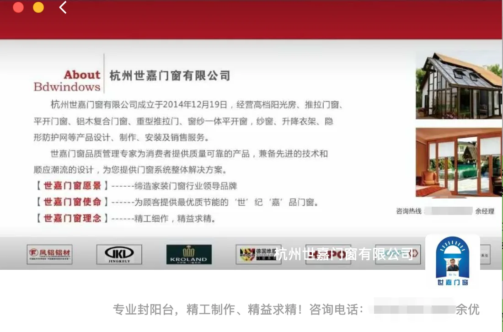
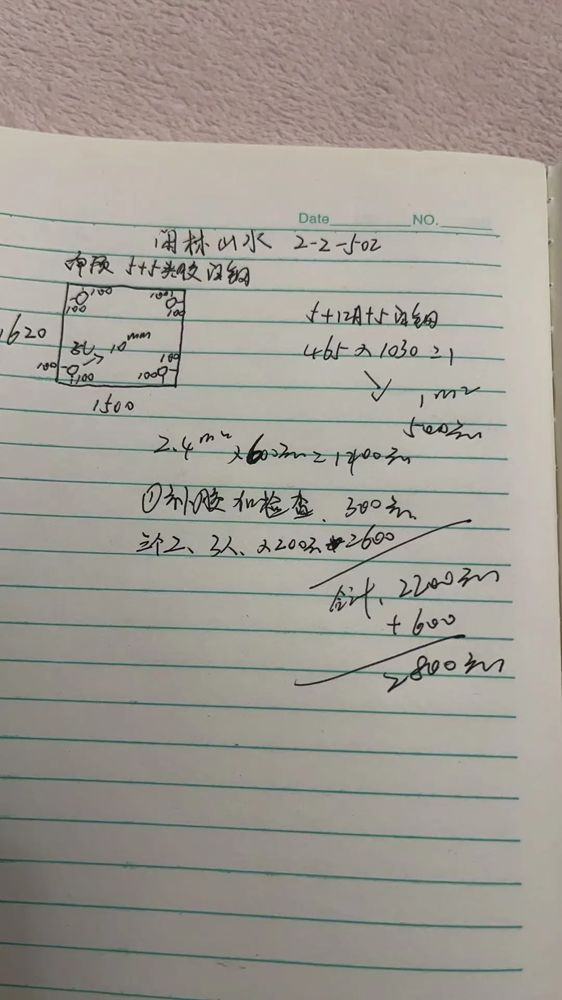

*关于杭州世嘉门窗有限公司*

当时家里装修，为了省心，选了一家规模大一点的门窗公司，也就是杭州世嘉门窗有限公司，当时价格还是很高的，四五万块。

做完就发现蛮多问题的，包括阳光房侧面居然没有做隔断，而是直接搭在邻居家，公用邻居家的隔断窗，这也导致后来在阳光房养猫时，臭味飘到邻居家，导致两家有矛盾。另外一个问题是，另外一面居然是直接架在墙上，中间很大缝隙，导致灰尘和噪音进到阳光房。我实在搞不懂，到底是多没有责任心的公司，能够这样不顾后果的施工。

除了阳光房，家里的很多窗户设计都有问题，包括洗手池等三四个地方的窗户没做推拉窗，而是一整块玻璃导致没办法清洗外侧玻璃，靠近空调外机的窗户居然做成了左右推拉而不是像其他所有窗户一样用前后推拉，导致隔音不好，外机声音会传进来。

还有一块景观玻璃专门设计用来做装饰的，结果却做了一个铝合金边框进去。

等等问题，也没计较让他去改。

而且整个工期也延后很多，按照合同是要扣钱的，也没去计较。甚至还没到要付款的时候，因为余经理说过年了怎么怎么困难，我也一句多余话没说，立刻就把尾款给结掉。

后面让我后悔的事情来了，原本冲着找贵一点的供应商质量会靠谱一点。结果，家里陆续开始出现各种问题，一开始是阳光房漏水，需要放四个盆才能接住。后来阳台也漏水，再后来有个窗户玻璃自己裂开了，再后来又有一个窗户玻璃裂了。

这时候我去找这位余经理，每次跟他沟通发个消息，你必须要几天后再发一条催他，他才有可能回复。每次约时间来看，总是答应的好好的，结果就没下文了。跟他沟通我都有PTSD了，特别的内耗。

后来家里阳光房需要住人，没办法必须得把问题解决。我就各种催，终于在今年安排人上门来看了，还说会给我成本价（注意这里说的成本价），我也问了上门师傅大概要多少钱，说没多少钱的。上门检查完，又没消息了，又催了几次。

结果给我了一个账单，一块2.4平米普通玻璃（纯玻璃没有铝合金边框）1400块，另外一个0.5平不到铝合金窗户500块，补胶检查300块，人工600。一共2800块，这是把我当日本人宰。我想知道这就是他口中的成本价？

*杭州世嘉门窗报价单*

然后就各种理由说这不贵，什么施工难度大、什么人工贵、什么要是别人找他做他肯定不做，这些人生意就是这么做的，我都不想辩解了。

现在看着余优朋友圈个人签名上写着“专业封阳台，精工制作，精益求精！”，真是讽刺！

我对以上内容真实性做保证，愿意承担一切不实责任。

与这种价值观完全不同的人沟通起来非常费劲，逻辑不通、清理不明、做事拖拉、言而无信、完全没有为客户着想，我奉劝大家一定要远离这样的人和公司。当然如果你喜欢体验这样的感觉，请电话联系杭州世嘉门窗有限公司！
