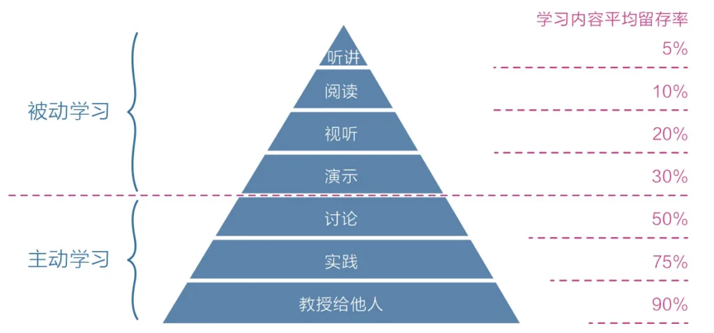

在2018年最后一个月，坐在从深圳TSRC峰会回杭州的飞机上，我思考了这些年的工作、梦想、不足和未来，旁边哥们的呼噜声和后面阿姨从坐上飞机就开始持续不断的喋喋不休，以及飞机引擎的轰鸣声和颠簸让我有点头痛之外，我的思路还是很清晰，我认定这是一件好事，一件对安全行业有点微薄贡献的好事。

回到2014年，安全还是我的业余爱好，那时除了几家大的互联网企业和传统安全公司，其他公司几乎没有安全岗位，而我则以高级研发工程师入职蘑菇街无线团队，负责蘑菇街APP后端开发。业余则持续心中那份黑客梦，研究漏洞和开发自动化扫描工具，那一年乌云大热，利用自己开发扫描工具做到乌云排行榜十天前进十页，心中的安全热情得以体现。那时的乌云上多数人的目的很纯粹，为了帮助企业发现安全漏洞不被恶意利用、为了网络和平，现在听起来有点虚头巴脑，但很多人还一直在践行。

一年不到公司开始涉足金融业务，安全从可选项变成了必选项，于是自然而然转做第一个正式安全岗位，开始主导一些业务强需求安全产品，陆续自研客户支付数字证书、堡垒机和用户安全中心，后面开始陆续进来安全专岗同学，然后开始了后面的漏洞管理平台、黑盒漏洞扫描、白盒代码审计、主机监控和防御、安全风险情报、漏洞修复组件的调研等几乎所有企业的安全产品的调研、设计、研发和落地，发挥出了自己安全+研发的优势，也把自己的爱好做成了工作。

不像现在有安全会议、安全沙龙、安全群和组织等等那么多交流渠道，那些年的安全甚至都找不到学习路径，一切都是自己摸索，当时真希望有个地方能和其他经历过的人交流下，羡慕现在可以轻易的和阿里安全同学交流线下打击黑产方法、和百度安全同学交流机器学习在安全产品的应用、和腾讯安全同学交流安全运营实践。但回过头来看所有问题都经历过就能让自己在未来处理都未知问题更加得心应手。所以特别希望能把这些总结出来，能给后来的人乘乘凉。

另外由于很早就接触安全的原因，发现太多太多暴露的安全问题，也可能是从小受到身边人的影响有一颗善良的心愿意去帮助别人，看到各种能被轻易恶意利用的漏洞，就像是别人家门没关好，你特别希望能去告诉一下房主，甚至去帮他把门关一下。

作为白帽子时，写自动化漏洞扫描工具来帮助各家发现漏洞，避免被恶意着利用导致损失，但后来发现这其实不是一条可持续发展的路，太多太多人家里的门没关好，你根本发现不过来，与其不断发现各种问题不如提升其安全能力，告诉大家怎么样关好门防止小偷。

于是我开始把内部安全能力通过开源方式对外输出，我们把Cobra开源让那些没有白盒能力的企业能够发现代码中最显著的问题，能够对新漏洞进行应急排查。我们也发现各家企业GitHub敏感信息泄漏很严重，开始主动出击，监测各家泄漏情况并报告给对方，各家有能及时发现并删除的，也有我们报告后又重复出现的，我希望通过开源GSIL帮助他们提升发现能力，但却发现完全不够，也许能帮助行业提升这个漏洞的认知，但这只是几百个漏洞中的一个。

我尝试将每一个细节研究透彻并写上详尽的文章发在博客上，通过知道信息到关联信息，到做出行动和改变实现持续优化。我发现以教他人知识的总结是自己最好的学习方式，可以极大提高站在受众角度的看法，并帮我们更加深刻全面的理解内容。

我开始频繁参加各种安全会议，在 QCon、KCon、EISS和各种沙龙进行分享，希望能让更多的人少走弯路，但和很多公司的安全负责人交流后，发现一个明显的问题，安全管理者素质直接影响企业安全建设偏向，白帽子出身的侧重搞攻击和防御、审计出身的喜欢合规内审、研发出身的喜欢自研，大企业喜欢威胁感知和各种新安全技术、传统企业喜欢买商业产品，这就导致在企业安全建设的过程中往往是不全面的、不是最优的。我希望把蘑菇街五年从零到一的经验以及来蚂蚁金服后从一到十的安全建设经验总结分享出来，能给有需求的企业在网络安全建设上提供一些帮助。

开源安全产品、漏洞分析文章、安全会议分享这些受众都还远远不够，要么不能很好的表达我的想法，要么不能将我的想法更快分享给更多人。

2016年出版社找到我希望我能写一本安全方向的书，基于当时的想法，我选择写和道哥一个系列的《白帽子讲漏洞修复和防御》，希望通过讲解每一个漏洞的成因、原理、利用方式、危害影响以及修复方案，写了几章后我发现这个选题写的特别难受，漏洞类型过多、讲鱼的意义让我太累了、而白帽子角度讲修复又是一个太偏颇的事情，而当时的我对于企业安全建设的认识还不够全局，无法以企业安全建设的视角来做。但现在，我觉得时机到了，可以把自己和团队所有的经验以《企业信息安全建设最佳实践》为大目标，将所有的项目经验、采坑、重难点技术分享出来，最大化的发挥自己对于网络安全行业的贡献。

由于要考虑内容时效性和成本覆盖问题，希望能先在博客上创作，待积累到一定程度再出版为实体图书。