So many things happened in November that made me feel happy.

<!-- truncate -->

## Do the Best at Work

**The organizational survey** . This year, the company launched its first organization-wide survey. Collecting anonymous feedback from employees anonymously on the company, business, leadership, and teams, with a high participation rate required. All members of our team engaged in the survey. Our team’s score significantly exceeds that of the BU and BG, especially concerning the team, leader, and work aspects. This makes me feel a deep sense of accomplishment.

## Deepening Knowledge and Enhancing Cognitive

**Thought of a new idea of structuring website content** . I used to like the tree structure of Yuque’s article directory, which allowed me to organize various disorganized articles into multiple levels of categories. Later, when I migrated the content to my website, I always wanted to achieve that effect. However, recently I came up with an idea better way to organize the content, which is by using diagrams. In the past, during our PPT presentations, we always used diagrams (such as architecture diagrams, flowcharts, and charts) to make various texts more intuitive and easier to understand. Now it’s possible to display diagrams using HTML and JavaScript, with clickable interactions. This method is just as applicable to websites focused on textual content. Example:[Cybersecurity Career Guide](https://feei.cn/ccg/).

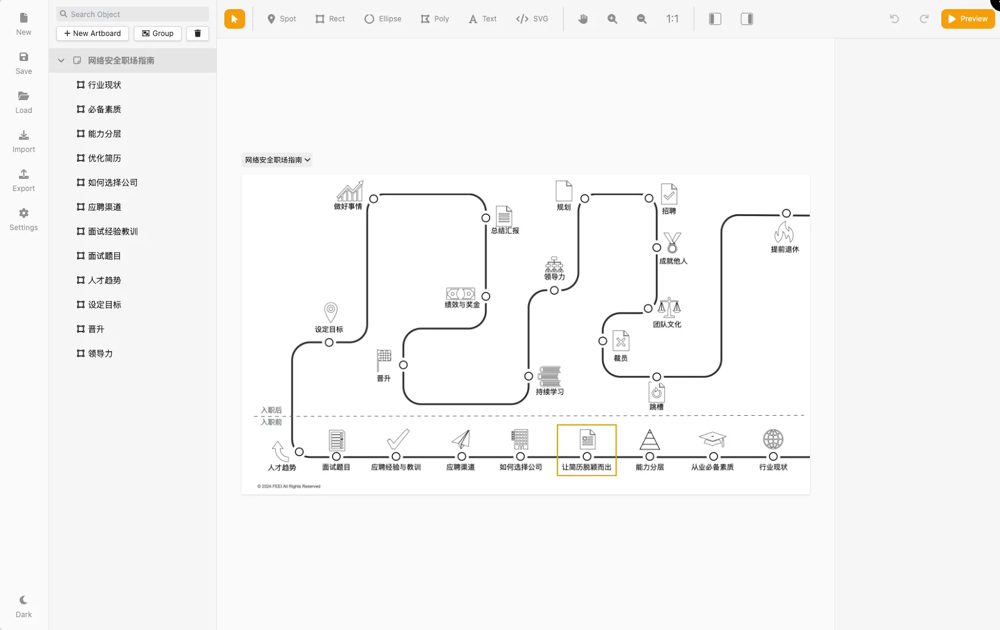
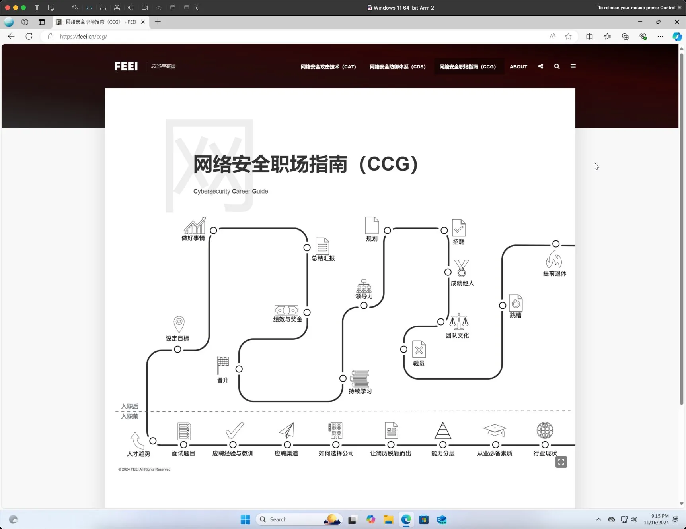

*Used diagrams to structure of website’s content*

[Using LLM installed on local computer](https://feei.cn/install-llm-on-macos/). Originally, I was planning to buy a PC for gaming and considered getting a better graphics card to run local LLMs. Unexpectedly, my high-end computer bought a few years ago turned out to be useful, running most open-source models smoothly. This will make it easier for me to conduct experiments in cybersecurity scenarios, and I won’t have to endure ChatGPT’s slow speed for simple questions anymore. If the internet were to disappear in the future, I hope that what remains on the computer are these LLMs with extensive knowledge, allowing me to thoroughly explore and learn about various fields of interest.

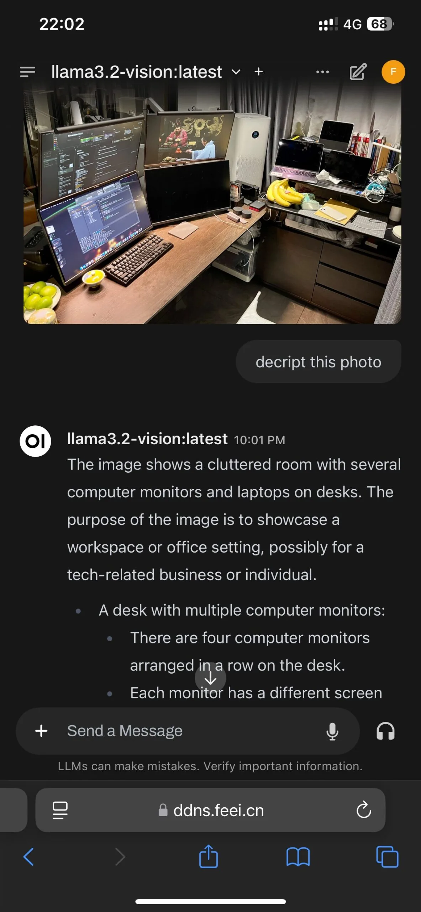

*Install multiple LLMs on local computer*

## The Most Comfortable Life

**Bought a Mac mini as a home server** . Since selling off the noisy and power-hungry Dell tower server, I’ve migrated my computing and storage services to run on my MacBook Pro. Although performance hasn’t been an issue, the need to frequently take the MacBook Pro out with me has disrupted those services. So, I’ve been considering buying a home server. Recently, Apple released the new Mac mini with the M4 chip, and with subsidies, the price is only slightly over 3400+. So, I decided to go for it, shopping can also bring happiness.

*The Mac mini is so small and light*

**Changed to a more comfortable chair** . There are so many types of ergonomic chairs, ranging in price from hundreds to thousands of yuan, and the online reviews vary widely. To make an informed decision, I went to a physical store to experience them firsthand. Initially, I was planning to buy an entry-level model, but the flagship version turned out to be much more comfortable, especially in terms of lumbar support and when reclining at 145 degrees. The materials used in the offline versions are also better compared to those available online, although they come with a higher price tag. Considering that I need to use the chair for long hours every day, I decided to splurge on the flagship model.

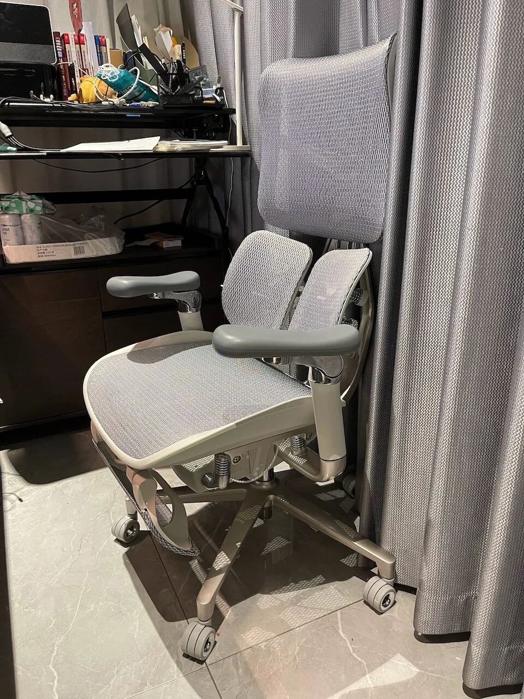
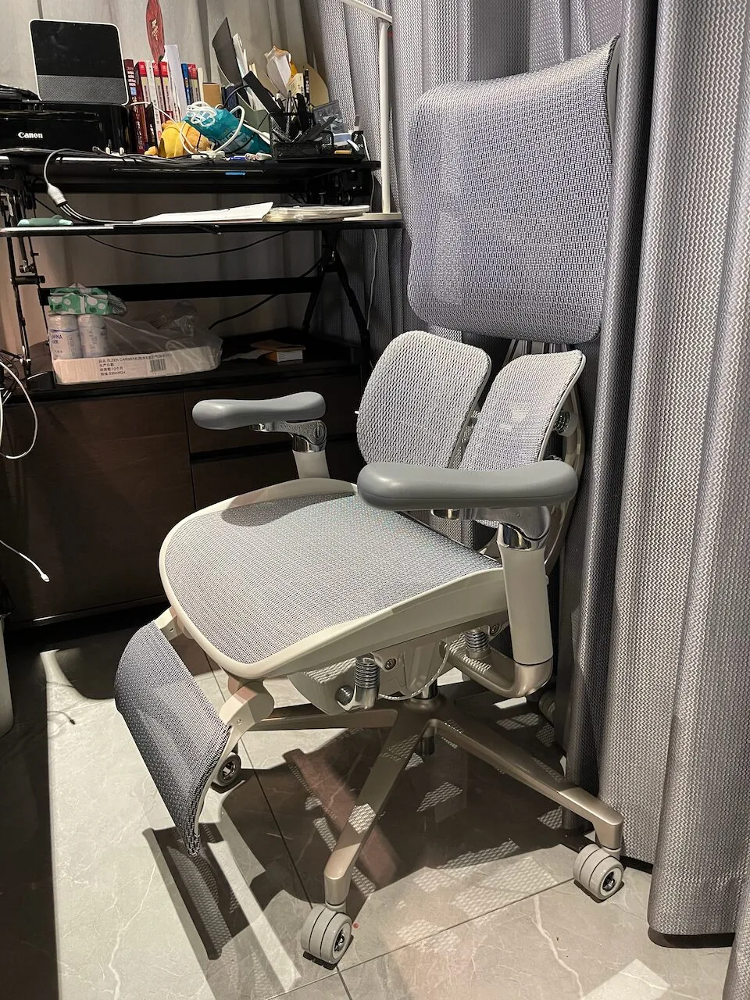
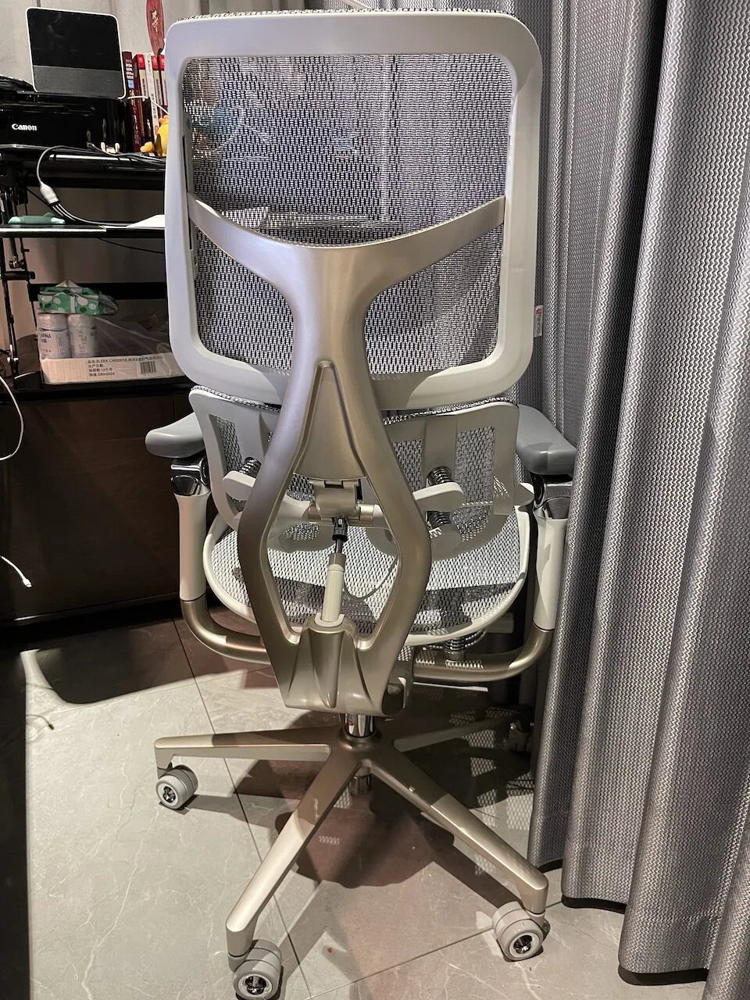
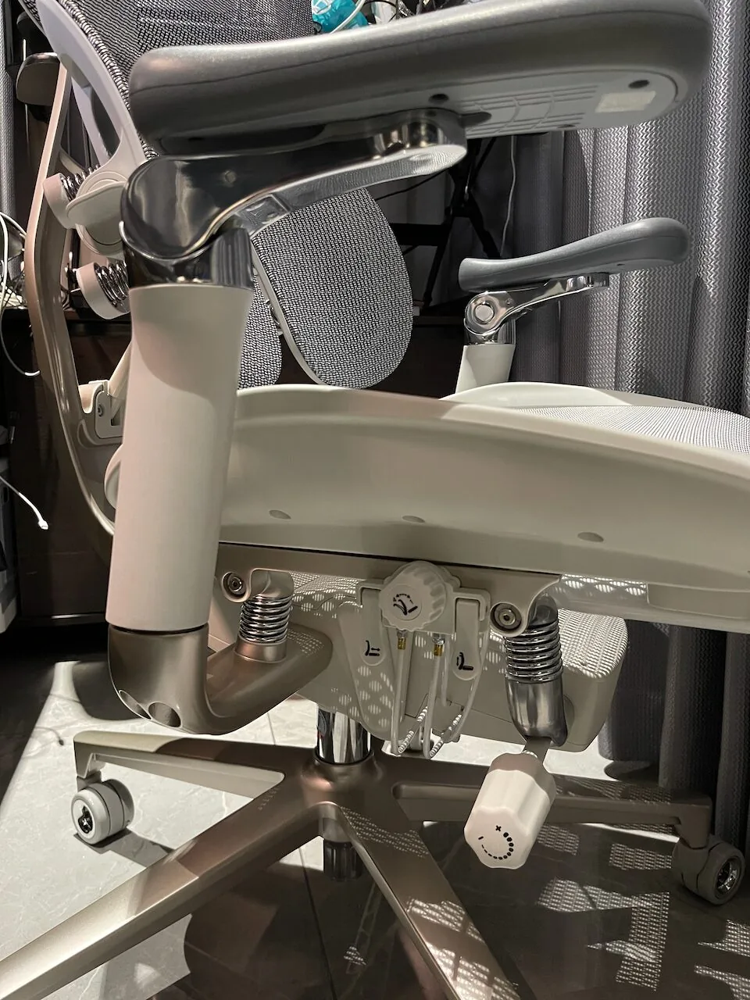
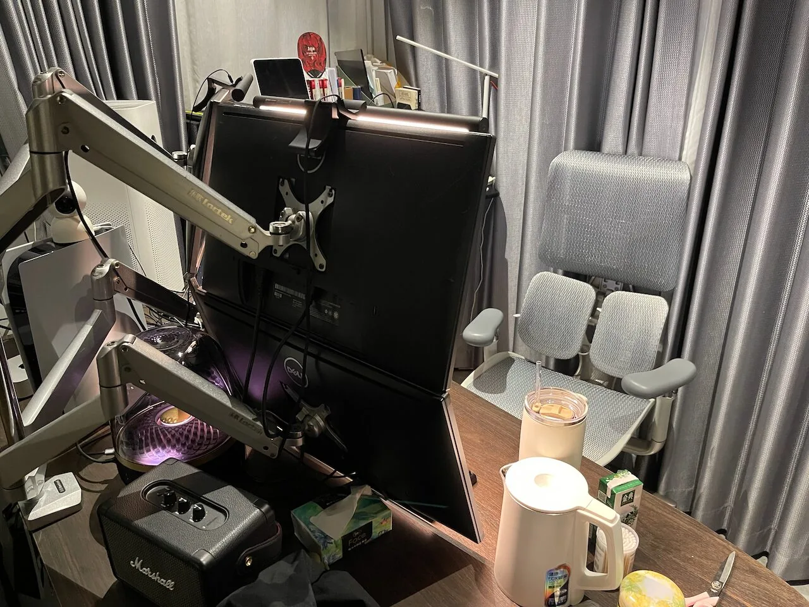

**Remote control home computer** . Recently, while trying to[remotely control my home computer](https://feei.cn/remote-control-the-home-computer/), I found that when using Screen Sharing.app between two Macs with the latest macOS and M-series chips, you can configure the[High-Performance mode](https://support.apple.com/zh-cn/guide/remote-desktop/apdf8e09f5a9/mac). This completely resolves the lag and color distortion issues that were present with the original VNC-based remote control. Allows me to control my home computer from anywhere with the same smoothness as using a local application. This has solved my frequent problem of needing to access files and tools on my home computer from the office, and my sense of happiness at work has noticeably increased.

**Keep the cats out to keep the workspace clean** . I like cats, but I don’t like cat hair. To keep the cats out of my workspace, I tried keeping the cats in their sunroom, but it was just too hot in there. I also tried blocking their entry into my workspace with various items, but all attempts failed. I installed a sliding glass door. Now, they can’t get in, I have a comfortable clean space.

*The cats can’t get in because the sliding glass door*

**Keep the workspace free of odors** . Afterward, every time it rains or is hot, there is always a strange smell in the corner of my workspace. By comparing the photos before the renovation, I discovered that there was a drainpipe in that location, and the pipe was bowl-shaped and not sealed. I also noticed that there were gaps at the bottom of the drywall, so I applied some foam sealant, which improved the smell but did not completely resolve the issue. I then scheduled an appointment with the property’s plumber, It took them two days to remove the drywall, and the stench immediately filled the room. They changed the pipe to a sealed one, and the smell was almost entirely gone. Later, I thought of an even better solution: I used a plastic bag taped over the pipe, which finally resolved the issue that had been bothering me for a long time.

**Comfortable temperature, humidity, and air quality** . Since I need a quiet environment while working, the window in my workspace is kept closed all year round. Working in a small space for extended periods leads to an increase in carbon dioxide levels. Opening the window not only causes noise issues but also brings in a lot of dust, which is difficult to clean up as the workspace is filled with electronic equipment. Therefore, I bought an air conditioner with a fresh air function and had it installed. I set it to automatically activate the fresh air function in strong mode every day at 6 PM. If it detects someone unlocking the door from outside during the next few hours, it switches to silent mode. By using it together with an air purifier, the PM2.5 levels in my workspace can consistently be maintained at &lt;= 5 µg/m³. Now, every day when I come to my workspace, I can smell the fresh air. In addition to air freshness, it can also keep the workspace at the most comfortable temperature and humidity levels.

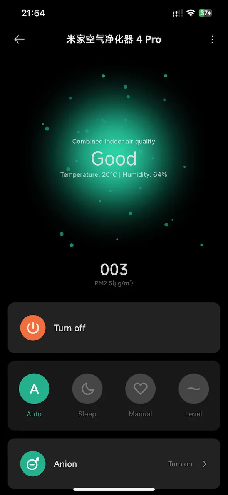

*Temporature 20.5℃ Humidity 57%*

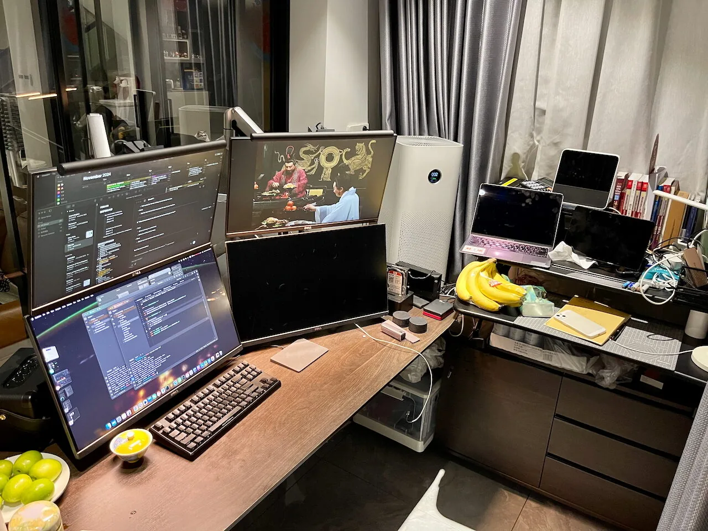

*My workspace*

**Hot tea in wintry weather** . In a workspace where the temperature, humidity, and air quality are perfectly comfortable. Lying on the chair, looking out at the wintry weather outside and the cats sleeping on the sofa, holding a cup of hot tea, listening to the sound of rain and my favorite music, there is nothing more happiness than this.

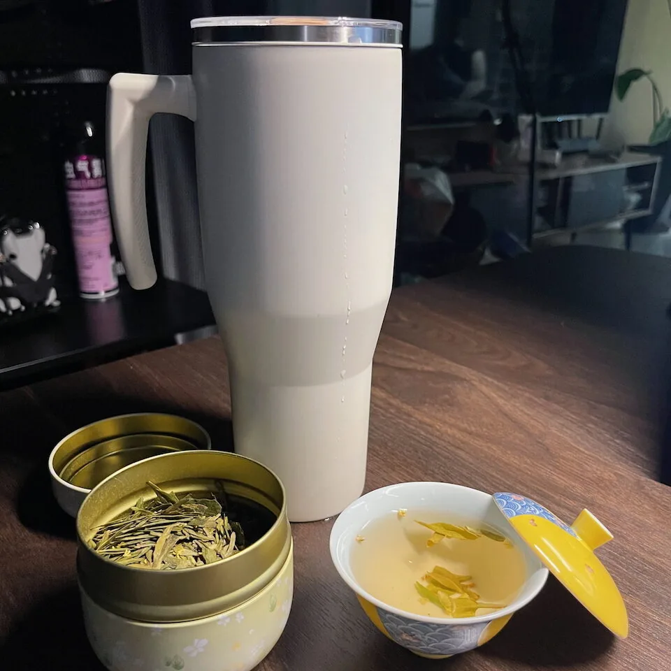

*The Osmanthus Longjing Tea*

Happiness is resolving the issues that cause unhappiness.

## Travel Around the World

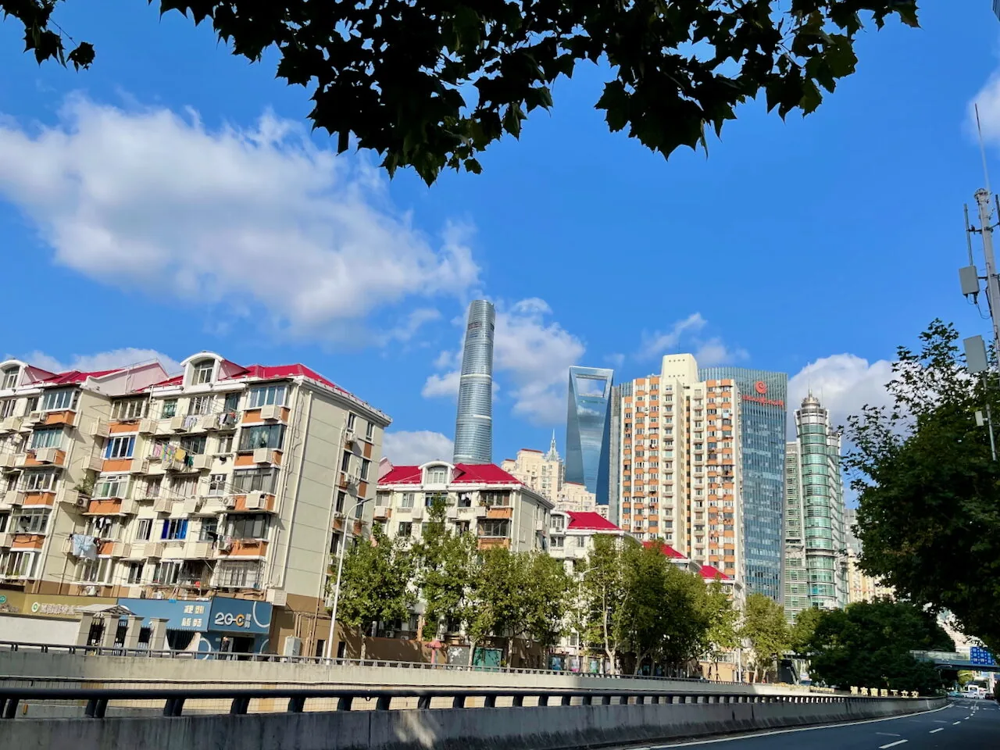

*Shanghai*

## Open Eyes

### English

**The best English teacher** . In the past, I had to use search engines for English-related questions, but the results were never quite satisfactory in terms of both effectiveness and efficiency. Now, I can use ChatGPT to ask**detailed** questions**anytime** and receive exactly accurate and**easy-to-understand** answers quickly, this method can enhance the happiness of learning English. Isn’t this the key function of those English teachers? By the way, I’ve been checking in on Duolingo for over a year! Duolingo scored level 42, 19/55 in the fourth stage.

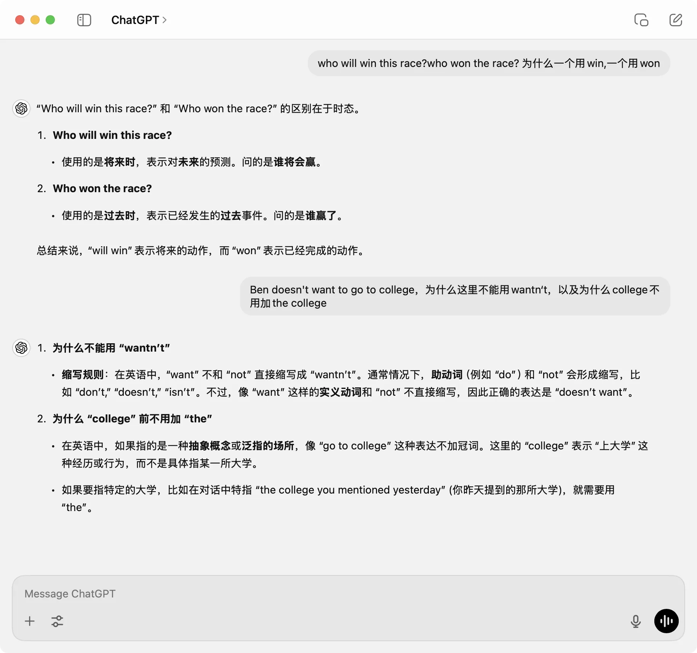

*Use ChatGPT to learn English*

### Books

- FACTFULNESS, Hans Rosling (45%)

### Movies

- 9-1-1, Season 8, 07-08.

## Financial Freedom

### Income and Expenses

Apart from daily expenses, the largest expenditures are the M4 Mac mini and SIHOO S300.

The mortgage on the last house was prepaid by 600,000 yuan on the last day of November. The last installment of the interest-free vehicle payment has been paid off. I’m getting closer to financial freedom.

### Investment and Wealth Management

**The Tesla stock I bought recently has increased over 80%** .

- 10/11, I bought 50% of my position after -2.99%.
- 10/11, I bought 100% of my position after -8.87%.
- 10/12-10/23, The price remained flat.
- 10/24, Tesla’s earnings report exceeded expectations, the price surged by 21.92%, then I sold 50%.
- 10/25-11/04, The price dropped from 269 to 242.
- 11/05-11/11, It rose from 242 to 358(+48%). On 11/11, there was a long upper and lower shadow, like 7/10/2024. Although I didn’t catch the peak, I sold my most position at the high points over several days.

*Tesla stock*

## Health of Body and Mental

I hardly exercise, yet my weight hasn’t changed, but my mental health has improved a lot.
