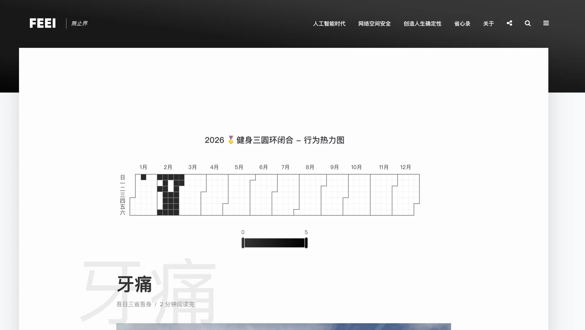

## Changelog

- **2012-02-24** ，注册feei.cn域名，并付费3年（2012-02-24至2017-02-24），348元。
- **2012-02-28** ，注册wufeifei.com域名，55元。
- **2012-08-16**
  - 注册grw.name，65元。计划用来做个人事物处理SaaS系统使用。20130717续费325
  - 注册canai.org，55元。计划用来做残疾人关爱（残爱）公益网站使用。20130717续费63
- **2013-02-28** ，注册wzjk.net，195元。计划用来做网站监控工具平台使用。
- **2014-02-13** ，wufeifei.com域名续期2年，110元。
- **2016-01-09** ，wufeifei.com域名续期1年，52元
- **2017-02-14** ，feei.cn域名续期5年（2017-02-14至2022-02-24），175元。
- **2018-01-09** ，wufeifei.com域名续期1年，60元。
- **2019-01-29** ，wufeifei.com域名续期6年，300元。
- **2021-03-24**
  - wufeifei.com域名从美橙互联转移至阿里云万网，49元。
  - feei.cn域名续期3年（2021-03-24至2031-02-24），351元。
  - 购买ECS.C6E（2C4G）云服务器5年（2021-03-24至2026-03-25），5091.6元。
- **2025-01-29** ，wufeifei.com域名续期3年（2025-01-29至2028-02-28），270元。
- **2025-10-25** ，为了更好的使用体验，将博客从阿里云迁移至小白的IDC托管主机。费用更低，配置更高。小白一年只要600，我觉得不太合适，按800一年给的。
- **2026-02-25** ，为页面（PAGE）类型文章，将编辑次数自动转换为版本号并显示在标题下。比如编辑325次最后更新时间为2026年02月25日，则版本号为v3.25-20260225。因为页面类型的文章会经常性更新，之后就可以根据版本号大小来确认文章的完善程度，根据版本号后面的时间可以知道文章的最新更新时间。
- **2026-03-01**
  - 增加栏目、标签、年月的搜索功能。
  - 当文章中出现📍蚂蚁A空间，这类地点时，自动搜索该地点位置并通过地图展示出来。
  - 在手机端，点击面包菜单时，无论点的是Icon还是文字，都可以展开子菜单。
- **2026-03-02** ，搜索页面增加全年日历热力图，方面检索各类事情的分布情况。



- **2026-03-03** ，分类页面增加日历热力图。方便在日记分类下，看到有哪些日子记了日记。
- **2026-03-04** ，自动增加点击图片时放大。方便在手机写日记时，无法手动设置图片放大效果。
- **2026-10** ，服务续费。

<!-- truncate -->

## 关于FEEI.CN的架构

- 用户访问网站
  - Internet –80/443–> LEDE —> Server (CentOS 9, NB, Zhejiang) —-> Nginx —-> PHP-FPM —-> WordPress —-> MariaDB/Redis
- 管理员访问后台
  - Zerotier —-> LEDE Manage Page
  - Zerotier —-> Server SSHD
- 网站技术选型：Wordpress
  - **语雀非常适合作为体系化知识管理，但并不适合作为博客** 。作为在公司每天都需要使用的软件，语雀确实非常适合我，优秀的编辑器体验、简洁的外观以及方便的多人协作，树形知识库更加适合知识类型的沉淀。我也使用了好几年，但最终还是回到了Wordpress。首先不支持自定义域名，导致在SEO上很吃亏，自然流量很少。自定义程度还是比较低，比如希望有一些特别的组件或者交互形式都无法实现。因为知识体系是需要不断更新的，微信公众号的文章发布后是无法进行大改动的。**成熟的才是最好的，大多数人选择的不会走弯路。** 和大多数人一样，建博客那些事就是一部血泪史，从最初的自己搭建、到后面的公共博客、再到基于GitHub托管，建了停停了建，也不知道是什么支撑着自己，如果减肥有这样的坚持就好了。只有都试过才知道哪个是最好的。博客是写文字的地方，所以这件事的核心是写文字和被浏览。写文字的核心是编辑器要方便、要能随时编写发布、能处理图片视频，而被浏览最关键的是要符合自己审美、大家打开速度快浏览舒服。作为技术人员对Markdown的那点坚持，总想有点技术性，写篇文章需要在本地客户端写好，把文章和图片上传到GitHub等待生成静态页面，确实不用自己搭服务器考虑稳定性问题，用Markdown写文章也确实挺好的，但真麻烦。最终回到了原点WordPress，打动我的是在Themeforest中WordPress有一个独立的菜单，里面有被大量售卖的模版，而其它CMS都在CMS一个菜单下，侧面反应了WordPress生态的成熟度。因此我挑选了一个博客模版，以前总是有点技术相轻的思想，一个模版卖几百块太贵了吧，以前自己尝试过扒一扒改改就可以自己使用了。有点类似软件的破解，钱是省了但带来但问题也很明显，他后续但迭代更新你都无法直接应用，你需要持续不断的跟进维护，这成本非常的高。不破解自己去买的话，被国内的破解产业搞的每个人潜意识就认为软件是不应该要钱的，要么破解要么靠广告或增值服务来赚钱，导致我们看到一个好软件最先想到的不是购买它而是找破解版，自己也写过很多年软件，很清楚专业和业余的差距。设计、交互、兼容性、安全、代码质量、可配置化等等，一个模版迭代了几年其中解决了多少小问题做了多少优化，再想想只卖几百块是不是很便宜了。就和一个日历软件一样，macOS中的日历可能有几十号优秀工程师维护，而各种市场上的日历可能是某个三人工作室的N个软件中的一个，短期表面使用起来可能还真体会不到区别，时间长了就会知道了。一个模版、一个软件都如此，WordPress的成熟就更显著了，在博客市场做了这么多年，你不需要担心需要自己去改造他，你将来会遇到的所有问题他都遇到并解决过，而且还有非常丰富的插件市场能让你轻松搞定SEO、表单、代码高亮、图片优化、社交分享甚至SSL。
- 服务器配置
  - 实例：ecs.c6e系列 V2核 4GB
  - I/O 优化实例：I/O 优化实例
  - 系统盘：增强型SSD云盘/dev/xvda40GBPL0
  - 带宽：10Mbps按使用流量
  - CPU：2核
  - 可用区：随机分配
  - 操作系统：Linux64位CentOS 7.9 64位
  - 内存：4GB
  - 地域：华东 1
  - 网络类型：专有网络
  - 按年（5年）
  - 2021-03-24 10:12:00
  - 2026-03-25 00:00:00
  - 官网价：¥ 13,020.00
  - 活动优惠：¥ -600.00
  - 活动优惠：¥ -7,328.40
  - • • 应付金额：¥ 5,091.60

## 关于FEEI.CN的安全性

| Layer | Threat | Protective Measures |
| --- | --- | --- |
| Network | DDoS/CC | Set DNS record to gov site |
|  | MITM | HTTPS（ SSLLabs Test Score A+）; HSTS; HSTS Preload |
| Application | XSS | Security Header(CSP/X-XSS-Protection) |
|  | iFrame | Security Header(X-Frame-Options) |
|  | MIME Sniffing | Security Header(X-Content-Type-Options) |
|  | Fronted Backdoor | Security Header(Permissions-Policy) |
|  | SQLi | Change Database Prefix; No sensitive data; |
|  | Brute-force login accound | Custom username; Strong password; 2FA ; Disable xmlrpc; Hidden login url; Automatic IP Blocking Brute-Force |
|  | Sensitive data leakge | DEBUG False; Disable PHP Error; Hidden PHP/Wordpress/Nginx Version; Automatic IP Blocking Vulnerability Detection |
|  | Trojan/Mining/Webshell | DISALLOW_FILE_EDIT; Separate user group for static/php files, read-only permissions, no write access except in upload directory; |
|  | 0day | Separate user WP-CLI mode for automatic updates of Core/Plugin/Theme to latest version; inotify www directory; Automatic IP Blocking When Web attack; |
|  | Ransomware | Daily Backup of files and database to remote server; Daily backup of ECS Image; |
| Server | Service Brute-force/Vulnerability | Only 80/443 ports opened; Automatic IP Blocking When Port Scan; Private IP Login with Key; Outbound Internet Access Restriction; |

## 关于FEEI.CN的访问速度

| Layer | Items | Company | Config/Version | Result |
| --- | --- | --- | --- | --- |
| Network | DNS | DNSPod |  | &lt;60ms |
|  | VPS | Aliyun | 4M, Hangzhou(South) + Beijing(North) | &lt;15ms |
|  | CDN | – | – | – |
| Base Application | Blog Software | WordPress | Automatic Update |  |
|  | Web Server | Nginx | 1.20.1+HTTP2 |  |
|  | Program Language | PHP | 8.0.30+OPCache+FastCGI Cache |  |
| Software Application | Theme | Typology | Text based with no image required |  |
|  | Text | Lighthouse | / |  |
|  | Compression/Text | Minify | / |  |
|  | Compression/Image | Webp | / |  |
|  | Compression/Transmission | GZip | All file type |  |
|  | Async/Text | async | Statis files |  |
|  | Async/Media | Lazy Load | / |  |
|  | Cache/Browser | HTTP Cache | no-cache |  |
|  | Cache/Application | FILE Cache | Page/Post |  |
|  | Cache/Database | Redis | 3.2.12 |  |
|  | Other/URL Redirect | / | 0 |  |
|  | Other/Other domains resources | / | 0 |  |
| Speed Test |  | PageSpeed Insights（Lighthouse） | Performance Score | 100 |
|  |  | Pingdom | Performance Score | 94 |

## Install

```bash
# Env
# System: CentOS 8

# Install PHP
sudo dnf install -y php php-fpm php-mysqli
sudo def install php-cli php-common php-curl php-mbstring php-mysql php-xml
php -v
service php-fpm start
service php-fpm status
sudo systemctl enable php-fpm

# Install MariaDB (Use MariaDB Server Repositories) https://mariadb.org/download/?t=mariadb
# Add /etc/yum.repos.d/MariaDB.repo
# Change to Aliyun mirror
# baseurl=https://mirrors.aliyun.com/mariadb/yum
sudo yum install MariaDB-server MariaDB-client

# Start MariaDB
service mariadb start
sudo systemctl enable mariadb

# Use MariaDB
mariadb -uroot -p (empty password)

# Change root password
ALTER USER 'root'@'localhost' IDENTIFIED BY 'this-is-test'

# Create database
create database FEEI;

# Create use for this database
create user "wp-feei"@"localhost" identified by "thisistest"

# Grant this user for this database
grant all privileges on FEEI.* to "wp-feei"@"localhost";

# Flush
flush privileges;

# Exit
exit

# SELinux httpd_can_network_connect_db
setsebool -P httpd_can_network_connect_db 1
getsebool -a | grep httpd

# Redis
sudo yum install redis
sudo systemctl enable redis
sudo systemctl start redis

# Install WordPress
cd /var/www/
wget https://wordpress.org/latest.tar.gz
tar -xzvf latest.tar.gz
mv wordpress/wp-config-sample.php wordpress/wp-config.php
vim wp-config.php
# Edit DB_NAME/DB_USER/DB_PASSWORD fields
# Edit Authentication unique keys and salts, use https://api.wordpress.org/secret-key/1.1/salt/
```

## Backup

```bash
# WordPress Folder
zip -r feei.cn.zip feei.cn/
unzip feei.cn.zip

# Nginx Conf

# Database
mysqldump -u feei -p feei_cn > feei.cn.sql

mysql -u root -p mydb < backup.sql
```

## Notify

```bash
inotifywait -m -r -e create,delete,modify /var/www/feei.cn > inotifywait.log&
```
