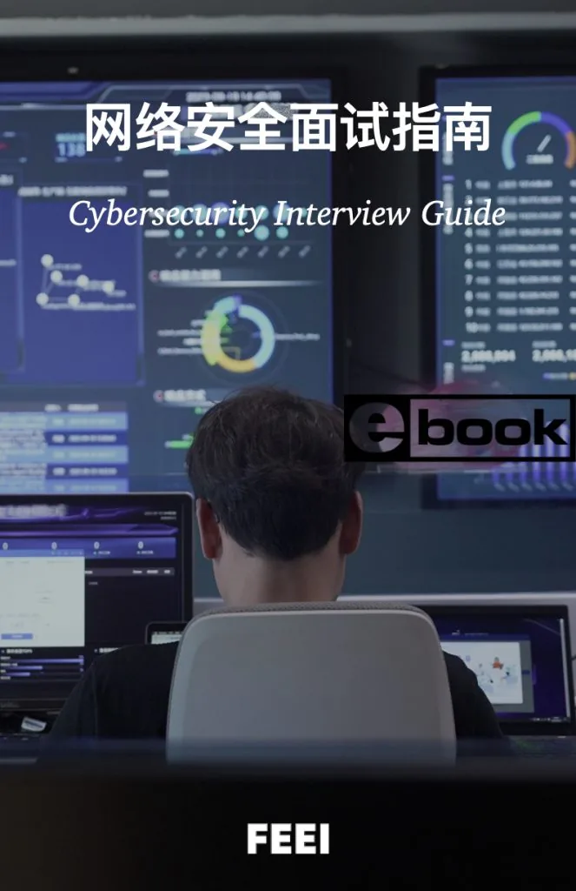
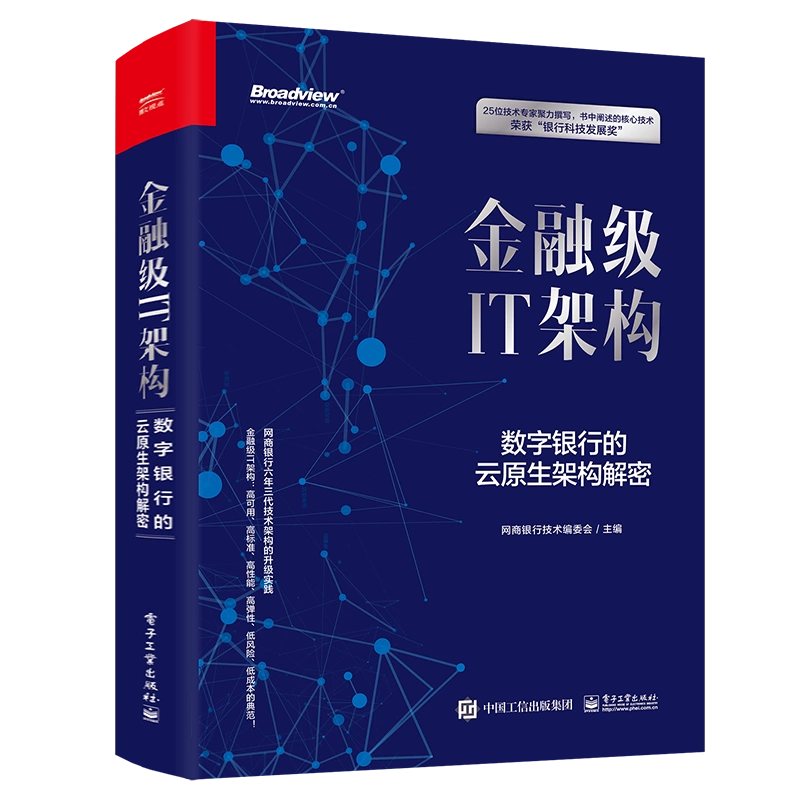
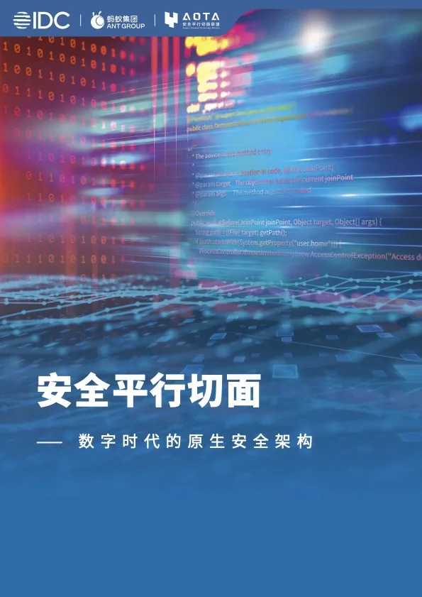
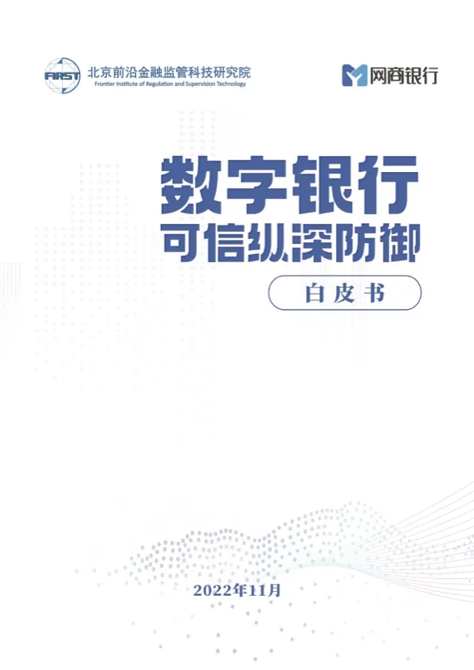
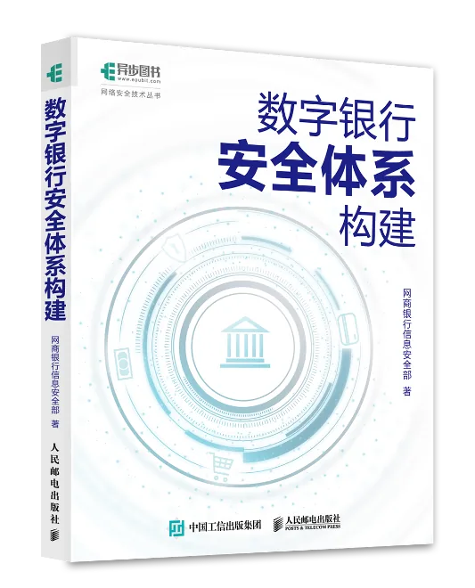

#### 《网络安全面试指南》

多年来筛选了数以千计的简历，为什么很多人连面试机会都没有？参与了数以百计应聘者的面试，为何如此多的人没有通过最终面试？在面试过程中，能力固然重要，但我也见过许多能力不亚于已经入职同事的人却未能成功应聘。那么，如何才能在面试中顺利通过呢？

本指南旨在为网络信息安全领域从业者提供一份全面的面试指南。我将从行业、企业和从业者的角度来介绍当前情况，分享面试和招聘经验。指南将围绕各个细分安全领域的体系、实用且高质量的题库和思路提示展开，以便你能够更加全面系统地理解和吸收各种经验。

在线阅读

#### 《金融级IT架构：数字银行的云原生架构解密》

网商银行技术团队出品

在线购买

#### 《安全平行切面：数字数代的原生安全架构》

蚂蚁集团安全团队出品

在线阅读

#### 《数字银行可信纵深防御》

网商银行安全团队出品

在线阅读

#### 《数字银行安全体系构建》

网商银行安全团队出品

查看详情
